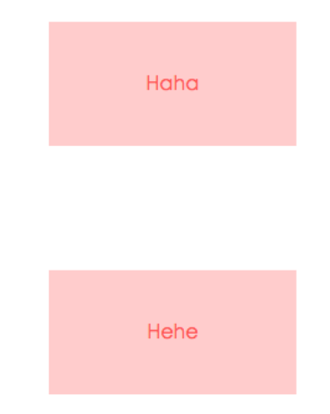
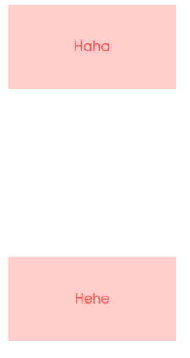
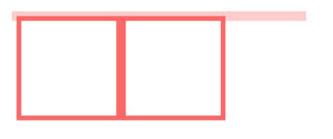
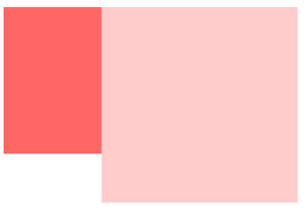

BFC
## 是什么
## 触发条件
## 应用场景

## 一、是什么

我们在页面布局的时候。
经常出现以下情况：

- 这个元素高度怎么`没了`？
- 这两栏布局怎么`没法自适应`？
- 这两个元素的间距怎么有点`奇怪`的样子？
- ......

原因是元素之间相互的影响。
导致了意料之外的情况。
这里就涉及到`BFC`概念。

`BFC（Block Formatting Context）`。
即块级 格式化 上下文。
它是页面中的一块渲染区域。
并且有一套属于自己的`渲染`规则：

- 内部的盒子会在垂直方向上一个接着一个的放置。

- 对于同一个`BFC`的两个相邻的盒子的`margin`会发生重叠。
与方向无关。

- 每个元素的`左外边距`
与
包含块的`左边界`相接触（从左到右）。
即使浮动元素也是如此。

- `BFC`的区域不会与`float`的元素区域重叠。

- 计算`BFC`的高度时。
`浮动子`元素也`参与计算`。

- `BFC`目的是形成一个相对于外界`完全独立`的`空间`。
让内部的子元素`不`会`影响`到`外部`的`元素`。

## 二、触发条件

触发`BFC`的条件包含不限于：

- 根元素。
即`HTML`元素。

- 浮动元素。
`float`值为`left`、`right`。

- `overflow`值不为
`visible`。
为
`auto`、
`scroll`、
`hidden。

- `display`的值为
`inline-block`、
`inltable-cell`、
`table-caption`、
`table`、
`inline-table`、
`flex`、
`inline-flex`、
`grid`、
`inline-grid`。

- `position`的值为
`absolute`或`fixed`。

## 三、应用场景

利用`BFC`的特性。
我们将`BFC`应用在以下场景：

**防止margin重叠（塌陷）**
```html
<body>
  <p>HaHa</p>
  <p>HeHe</p>
</body>

<style>
  p {
    color: #f55;
    background: #fcc;
    width: 200px;
    line-height: 100px;
    text-align: center;
    margin: 100px;
  }
</style>
```
页面显示如下：



两个`p`元素之间的距离为`100px`。
发生了`margin`重叠（塌陷）。
以最大的为准。
如果第一个`P`的`margin`为`80`的话。
两个`P`之间的距离还是`100`。
以最大的为准。

前面讲到。
同一个`BFC`的两个相邻的盒子的`margin`会发生重叠。

可以在`p`外面包裹一层容器。
并触发这个容器生成一个`BFC`。
那么两个`p`就不属于同一个`BFC`。
则不会出现`margin`重叠。
```html
<body>
  <p>HaHa</p>
  <div class="wrap">
    <p>HeHe</p>
  </div>
</body>

<style>
  .wrap {
    overflow: hidden; // 新的BFC
  }
  p {
    color: #f55;
    background: #fcc;
    width: 200px;
    line-height: 100px;
    text-align: center;
    margin: 100px;
  }
</style>
```
这时候，边距则不会重叠：



清除内部浮动。

```html
<body>
  <div class="par">
    <div class="child"></div>
    <div class="child"></div>
  </div>
</body>

<style>
  .par {
    border: 5px solid #fcc;
    width: 300px;
  }

  .child {
    border: 5px solid #f66;
    width: 100px;
    height: 100px;
    float: left;
  }
</style>
```
页面显示如下：



而`BFC`在计算高度时。
浮动元素也会参与。
所以我们可以触发`.par`元素生成`BFC`。
则内部浮动元素计算高度时候也会计算。
```css
.par {
  overflow: hidden;
}
```

实现效果如下：


**自适应多栏布局**

这里举个两栏的布局。

```html
<body>
  <div class="aside"></div>
  <div class="main"></div>
</body>

<style>
  body {
    width: 300px;
    position: relative;
  }

  .aside {
    width: 100px;
    height: 150px;
    float: left;
    background: #f66;
  }

  .main {
    height: 200px;
    background: #fcc;
  }
</style>
```
效果图如下：


前面讲到。
每个元素的左外边距
与
包含块的左边界
相接触。

因此。
虽然`.aslide`为浮动元素。
但是`main`的左边依然会与包含块的左边相接触。

而
`BFC`的区域不会与浮动盒子重叠。

所以。
我们可以通过触发`main`生成`BFC`。
以此适应两栏布局。
```css
.main {
  overflow: hidden;
}
```
这时候。
新的`BFC`不会与浮动的`.aside`元素重叠。
因此会根据包含
块的宽度。
和`.aside`的宽度。
自动变窄。

效果如下：



**小结**

可以看到上面几个案例。
都体现了`BFC`实际就是页面一个独立的容器。
里面的子元素不影响外面的元素。


在前端开发中，BFC 是块级格式化上下文（Block Formatting Context）的缩写。简单来说，BFC 是一种元素的渲染规则，它决定了元素如何布局、定位和与其他元素互动。

大白话来说，可以把 BFC 想象成一个盒子，里面的元素按照一定的规则进行排列和显示。BFC 的存在可以帮助我们解决一些布局问题，比如清除浮动、避免外边距重叠等。

当一个元素触发了 BFC，它会形成一个独立的布局环境，不会受到外部元素的影响。这样可以更好地控制元素的布局和定位，让页面显示更加稳定和可靠。

