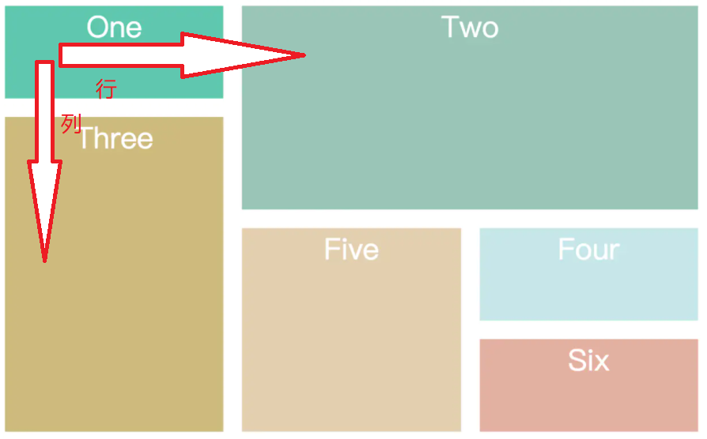
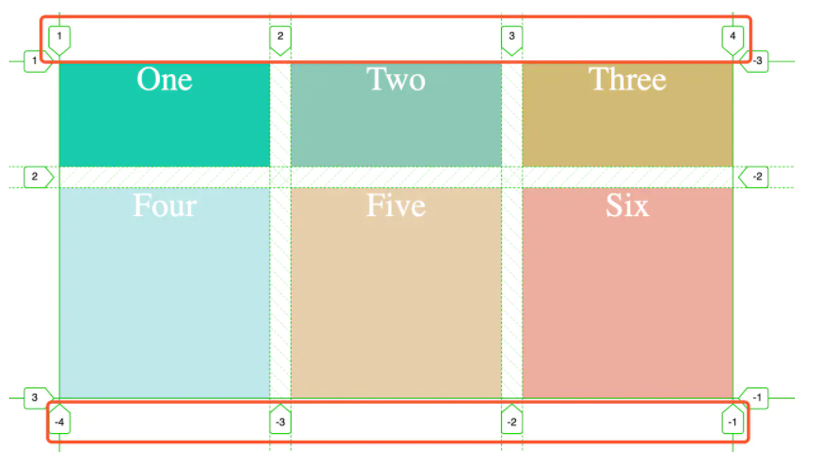
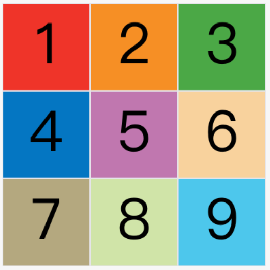
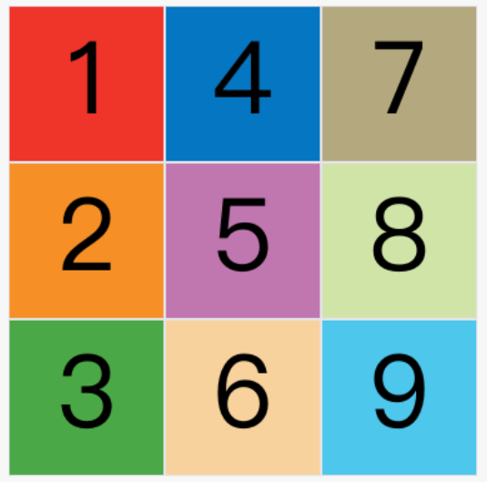
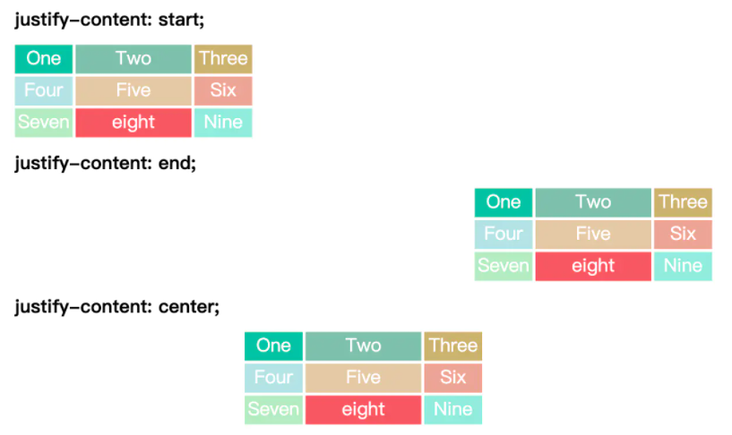
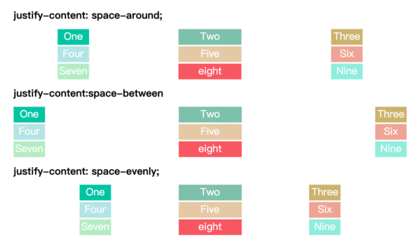
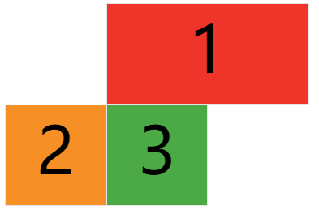
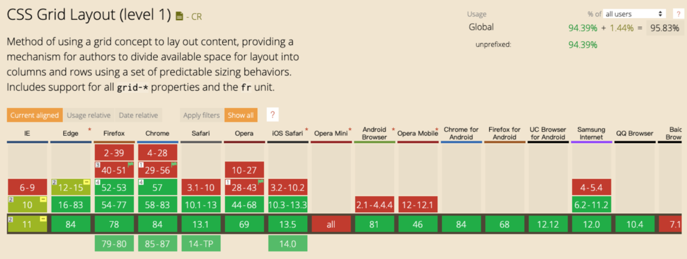

Grid网格布局

## 是什么
## 属性
## 应用场景

## 一、是什么

`Grid`布局即网格布局，
是一个二维的布局方式，
是`纵横相交`的`两组网格线`形成的框架布局结构，
能够同时处理`行与列`。

擅长将一个页面划分为几个主要区域，
以及定义这些区域的`大小`、`位置`、`层次`等关系。



这与之前讲到的`flex`一维布局不相同。

设置`display: grid / inline-grid` 的元素就是网格布局容器，
这样就能触发浏览器渲染引擎的网格布局算法。

```html
<div class="container">
  <div class="item item-1">
    <p class="sub-item"></p>
  </div>
  <div class="item item-2"></div>
  <div class="item item-3"></div>
</div>
```
上述代码实例中，
`.container`元素就是网络布局容器，
`.item`元素就是网格的项目，
由于`网格元素`只能是容器的`顶层`子元素，
所以`p`元素并不是`网格元素`。

这里提一下，
网格线概念，
有助于下面对`grid-column`系列属性的理解。

网格线，
即`划分网格的线`，
如下图所示：



上图是一个`2x3`的网格，
共有`3`根`水平`网格线和`4`根`垂直`网格线。

## 二、属性

同样，`Grid` 布局属性可以分为两大类：

- `容器`属性，
- `项目`属性

关于`容器`属性有如下：

**display属性**

文章开头讲到，
在元素上设备`display: grid`或`display: inline-grid`来创建一个网格容器。

- `display: grid` 则该容器是一个`块级`元素。

- `display: inline-grid` 则容器元素为行内元素。

**grid-template-columns属性，grid-template-rows属性**

`grid-template-columns`属性设置列宽，
`grid-template-rows`属性设置行高。

```css
.wrapper {
  display: grid;
  grid-template-columns: repeat(3, 200px);
  grid-gap: 5px;
  grid-template-rows: repeat(2, 50px);
}
```
除了上述的`repeat`关键字，还有：

- `auto-fill`：表示`自动填充`，让`一行（或者一列）`中尽可能的`容纳更多`的`单元格`。

> `grid-template-columns: repeat(auto-fill, 200px)` 表示列宽是`200px`，
> 但`列`的数量是`不固定`的，`只要`浏览器能够`容纳得下`，
> 就可以`放置元素`。

- `fr`：片段，为了方便表示`比例`关系。

> `grid-template-columns: 200px 1fr 2fr` 表示第一列宽设置`200px`，
> 后面剩余的宽度分为`两部分`，
> 宽度分别为`剩余宽度`的 `1/3` 和 `2/3`。

- `minmax`：
产生一个`长度`范围，
表示长度就在这个`范围之中`都可以`应用`到`网格项目`中。
第`一`个参数就是`最小值`，
第`二`个参数就是`最大值`。

> `minmax(100px, 1fr)` 表示列宽不小于`100px`，
不大于`1fr`。

- `auto`：由浏览器自己决定`长度`。

> `grid-template-columns: 100px auto 100px`
表示第一第三列为`100px`，
`中间`由浏览器决定`长度`。

**grid-row-gap属性，grid-column-gap属性，grid-gap属性**

`grid-row-gap`属性、
`grid-column-gap`属性、
分别设置`行间距`和`列间距`。

`grid-gap`属性是两者的简写形式。

`grid-row-gap: 10px` 表示`行间`距是 `10px`。

`grid-column-gap: 20px` 表示`列间`距是 `20px`。

`grid-gap: 10px 20px` 等同上述两个属性。

**grid-template-areas属性**

用于定义区域，
一个区域由一个或者多个单元格组成。

```css
.container {
  display: grid;
  grid-template-columns: 100px 100px 100px;
  grid-template-rows: 100px 100px 100px;
  grid-template-areas: 'a b c'
                       'd e f'
                       'g h i';
}
```
上面代码先划分出`9`个单元格，
然后将其定名为`a`到`i`的九个区域，
分别对应这`9`个单元格。

多个单元格合并成一个区域的写法如下。

```css
grid-template-areas: 'a a a'
                     'b b b'
                     'c c c';
```

上面代码将`9`个单元格分成`a`、`b`、`c`三个区域。

如果某些区域不需要利用，
则使用"点"（`.`）表示。

**grid-auto-flow属性**

`划分网格`以后，
容器的`子元素`会按照顺序，
`自动放`置在每个`网格`。

顺序就是由`grid-auto-flow`决定，
默认为`行`，
代表哦"先行后列"，
即先填满第一行，
再开始放入第二行。



当修改成`column`后，
放置变为如下：



**justify-items属性， align-items属性， place-items属性**

`justify-items`属性设置单元格内容的`水平`位置（`左中右`），
`align-items`属性设置单元格的`垂直`位置（`上中下`）。

两者属性的值完全相同。

```css
.container {
  justify-items: start | end | center | stretch;
  align-items: start | end | center | stretch;
}
```

属性对应如下：

- `start`： 对齐单元格的起始边缘。

- `end`：对齐单元格的结束边缘。

- `center`：单元格内部居中。

- `stretch`：拉伸，占满单元格的整个宽度（默认值）。

`place-items`属性是`align-items`属性和`justify-items`属性的合并简写形式。

**justify-content属性，align-content属性，place-content属性**

`justify-content`属性是整个内容区域在容器里面的`水平`位置（`左中右`），
`align-content`属性是整个内容区域的`垂直`位置（`上中下`）。

```css
.container {
  justify-content: start | end | center | stretch | space-around | space-between | space-evenly;
  align-content: start | end | center | stretch | space-around | space-between | space-evenly;
}
```
两个`属性`的写法完全`相同`，
都可以取下面这些值：

- `start` - 对齐容器的起始边框。
- `end` - 对齐容器的结束边框。
- `center` - 容器内部居中。



- `space-around` -
每个项目`两侧`的`间隔相等`。
所以，
`项目`之间的`间隔`比项目与`容器边框`的`间隔`大`一倍`。

- `space-between` -
`项目`与`项目`的间隔`相等`，
`项目`与`容器边框`之间`没有间隔`。

- `space-evenly` -
`项目`与`项目`的`间隔相等`，
项目与容器边框之间也是`同样长度`的间隔。

- `stretch` -
项目大小没有指定时，
拉伸占据整个网格容器。



**grid-auto-columns属性 和 grid-auto-rows属性**

有时候，
一些项目的指定位置，
在现有网格的外部，
就会产生`显示网格`和`隐式网格`。

比如网格只有`3`列，
但是某一个项目指定在`第5行`。
这时，
浏览器会`自动`生成`多余`的`网格`，
以便`放置项目`。
`超出`的部分就`是隐式网格`。

而`grid-auto-rows`与`grid-auto-columns`就是专门用于指定隐式网格的宽高。

关于项目属性，
有如下：

**grid-column-start属性、grid-column-end属性、grid-row-start属性 以及 grid-row-end属性**

指定`网格项目`所在的`四个边框`，
分别定位在哪根网格线，
从而指定项目的位置。

- `grid-column-start`属性：`左`边框所在的垂直网格线。
- `grid-column-end`属性：`右`边框所在的垂直网格线。
- `grid-row-start`属性：`上`边框所在的水平网格线。
- `grid-row-end`属性：`下`边框所在的水平网格线。

举个例子：

```html
<div id="container">
  <div class="item item-1">1</div>
  <div class="item item-2">2</div>
  <div class="item item-3">3</div>
</div>

<style>
  #container {
    display: grid;
    grid-template-columns: 100px 100px 100px;
    grid-template-rows: 100px 100px 100px;
  }
  .item-1 {
    grid-column-start: 2;
    grid-column-end: 4;
  }
</style>
```

通过设置`grid-column`属性，
指定`1`号项目的左边框是第二根垂直网格线，
有边框是第四根垂直网格线。



**grid-area属性**

`grid-area`属性指定项目放在哪一个区域。

```css
.item-1 {
  grid-area: e;
}
```

意思为将`1`号项目位于`e`区域。

与上述讲到的`grid-template-areas`搭配使用。

**justify-self属性、align-self属性 以及 place-self属性**

`justify-self`属性设置单元格内容的`水平`位置（`左中右`），
跟`justify-items`属性的用法完全一致，
但只作用域单个项目。

`align-self`属性设置单元格内容的垂直位置（上中下），
跟`align-items`属性的用法完全一致，
也是只作用域单个项目。

```css
.item {
  justify-self: start | end | center | stretch;
  align-self: start | end | center | stretch;
}
```
这两个属性都可以区下面是一个值。

- `start`：对齐单元格的`起始`边缘。
- `end`：对齐单元格的`结束`边缘。
- `center`：单元格内部`居中`。
- `stretch`：拉伸，`占满`单元格的整个宽度（默认值）。

## 三、应用场景

文章开头就讲到，
`Grid`是一个强大的布局，
如一些常见的`CSS`布局，
如`居中`，`两列`布局，`三列`布局等等是很容易实现的，
在以前的文章中，
也有使用`Grid`布局完全对应的功能。

关于兼容性问题，
结果如下：



总体兼容性还不错，
但在`IE 10`以下不支持。

目前，
`Grid`布局在手机端支持还不算太友好。