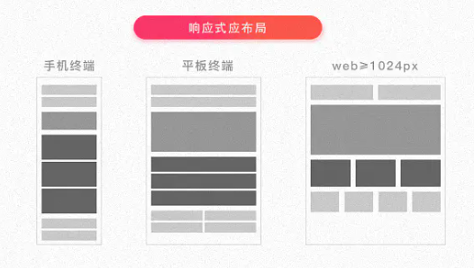

响应式设计

## 是什么
## 实现方式
## 总结

## 一、是什么

响应式网站设计（`Responsive Web design`）是一种网络页面设计布局，
页面的设计与开发应当根据
`用户行为`
以及
`设备环境`（系统平台、屏幕尺寸、屏幕定向等）
进行相应的响应和调整。

描述响应式界面最著名的一句话就是`"Content is like water"`。

大白话便是“如果将屏幕看作容器，那么内容就像水一样”。

响应式网站常见特点：

- 同时适配`PC + 平板 + 手机`等。

- 标签导航在接近手持终端设备时，改变为景点的抽屉式导航。

- 网站的布局会根据视口来调整模块的大小和位置。



## 二、实现方式

响应式设计的基本原理是通过媒体查询检测不同的设备屏幕尺寸做处理，
为了处理移动端，
页面头部必须有`meta`声明`viewport`。

```html
<meta name="viewport" content="width=device-width, initial-scale=1, maximum-scale=1, user-scalable=no">
```

属性对应如下：

- `width=device-width`：是自适应手机屏幕的尺寸宽度。

- `maximum-scale`：是缩放比例的最大值。

- `initial-scale`：是缩放的初始化。

- `user-scalable`：是用户的可以缩放的操作。

实现`响应式布局`的方式有如下：

- `媒体查询`。
- `百分比`。
- `vw/vh`。
- `rem`。

**媒体查询**

`CSS3`中的增加了更多的`媒体查询`，
就像`if`条件表达式一样，
我们可以`设置不同类型`的`媒体`条件，
并根据对应的条件，
给`相应`符合条件的`媒体`调用`相对应`的`样式表`。

使用`@Media`查询，可以`针对不同`的`媒体`类型`定义不同`的`样式`，如：

```css
@media screen and (max-width: 1920px) { ... }
```

当视口在`375px - 600px`之间，设置特定字体大小`18px`。

```css
@media screen (min-width: 375px) and (max-width: 600px) {
 body {
  font-size: 18px;
 }
}
```

通过媒体查询，
可以通过给`不同分辨率`的设备
编写不同的样式来实现`响应式`的布局，

比如我们为`不同分辨率`的屏幕，
`设`置`不同`的`背景图片`。

比如给`小屏幕`手机设置`@2x`图，
为`大屏幕`手机设置`@3x`图，
通过`媒体查询`就能很方便的实现。

**百分比**

通过`百分比`单位`“%”`去实现`响应式`的效果。

比如当浏览器的宽度或者高度 发生变化时，
通过百分比单位，
可以使得浏览器中的组件的宽和高随着浏览器的变化而变化，
从而实现响应式的效果。

`height`、`width`属性的`百分比`依托于`父标签`的`宽高`，
但是`其他`盒子`属性`则`不完全`依赖父元素：

- 子元素的`top/left`和`bottom/right`如果设置`百分比`，
则相对于直接非`static`定位（默认定位）的父元素的高度/宽度。

- 子元素的`padding`如果设置`百分比`，
不论是`垂直`方向或者`水平`方向，
都`相对`于`直接父亲`元素的`width`，
而与`父元素`的`height`无关。

- 子元素的`margin`如果设置成`百分比`，
不论是`垂直`方向还是`水平`方向，
都相对于直接`父亲`元素的`width`。

- `border-radius`不一样，
如果设置`border-radius`为百分比，
则是相对于自身的宽度。

可以看到每个属性都使用`百分比`，
会照成布局的复杂度，
所以`不建议`使用`百分比`来实现`响应式`。

**vw/vh**

`vw`表示相对于`视图窗口`的`宽度`，
`vh`表示相对于`视图窗口高度`。

任意层级元素，
在使用`vw`单位的情况下，
`1vw`都等于视图宽度的百分之一。

与百分比布局很相似，
在以前文章提过与`%`的区别，
这里就不再展开述说。

**rem**

在以前也讲到，
`rem`是相对于`根`元素`html`的`font-size`属性，
默认情况下浏览器字体大小为`16px`，
此时`1rem = 16px`。

可以利用前面提到的媒体查询，
针对`不同设备`分辨率改变`font-size`的值，
如下：
```css
@media screen and (max-width: 414px) {
  html {
    font-size: 18px;
  }
}

@media screen and (max-width: 375px) {
  html {
    font-size: 16px;
  }
}

@media screen and (max-width: 320px) {
  html {
    font-size: 12px;
  }
}
```

为了更准确`监听`设备`可视窗口`变化，
我们可以在`css`之前插入`script`标签，
内容如下：

```js
// 动态为根元素设置字体大小
function init () {
  // 获取屏幕宽度。
  var width = document.documentElement.clientWidth

  // 设置根元素字体大小，此时为宽的10等分。
  document.documentElement.style.fontSize = width / 10 + 'px'
}

// 首次加载应用，设置一次。
init()

// 监听手机旋转的事件的时机，重新设置。
window.addEventListener('orientationchange', init)

// 监听手机窗口变化，重新设置。
window..addEventListener('resize', init)
```
无论设备可视窗口如何变化，
始终设置`rem`为`width`为`1/10`，
实现了百分比布局。

除此之外，

我们还可以利用主流`UI`框架，
如：
`element ui`、
`antd`
提供的栅格布局实现响应式。

## 小结

响应式设计实现通常会从以下几方面思考：

- `弹性`盒子（包括`图片`、`表格`、`视频`）和`媒体查询`等技术。

- 使用`百分比`布局创建`流式布局`的`弹性UI`，
同时使用`媒体查询`限制元素的`尺寸`和`内容`变更范围。

- 使用`相对单位`使得内容`自适应`调节。

- 选择断点，针对`不同断点`实现`不同布局`和`内容`展示。

## 三、总结

响应式布局优点可以看到：

- 面对不同分辨率设备灵活性强。

- 能够快捷解决多设备显示适应问题。

缺点：

- 仅使用布局、信息、框架并不复杂的部门类型网站。

- 兼容各种设备工作量大，效率低下。

- 代码累赘，会出现隐藏无用的元素，加载时间加长。

- 其实这是一种折中性质的设计解决方案，
多方面因素影响而达不到最佳效果。

- 一定程度上改变了网站又有的布局结构，
会出现用户混淆的情况。
