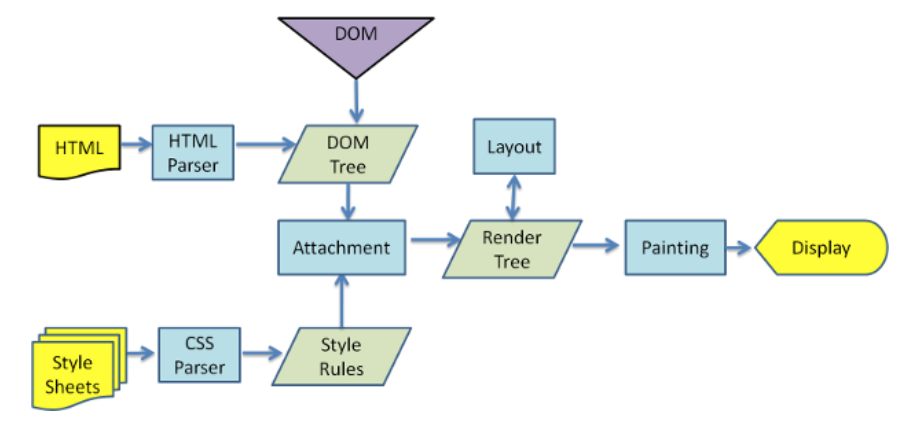

回流重绘

## 是什么
## 如何触发
## 如何减少

## 一、是什么

在`HTML`中，
每个元素都可以理解成一个盒子，
在浏览器`解析`过程中，
会涉及到`回流`与`重绘`：

- `回流`： 布局`引擎`会根据各种样式`计算`每个盒子在页面上的`大小`与`位置`。

- `重绘`：
当计算好盒模型的`位置`、`大小`以其他`属性`后，
浏览器`根据`每个盒子`特性`进行`绘制`。

具体的浏览器解析渲染机制如下所示：



- 解析`HTML`，生成`DOM`树，解析`CSS`，生成`CSS`OM树。

- 将`DOM`树和`CSSOM`树结合，生成渲染树（`Render Tree`）。

- `Layout（回流）`：根据生成的渲染树，进行回流（`Layout`），得到节点的几何信息（位置，大小）。

- `Painting（重绘）`：根据`渲染树`以及`回流`得到的`几何信息`，得到节点的`绝对像素`。

- `Display`：将像素发送给`GPU`，展示在页面上。

在页面初始`渲染`阶段，
回流不可避免的触发，
可以理解成页面`一开始`是`空白`的元素，
后面`添加`了`新`的`元素`使页面`布局`发生`改变`。

当我们对`DOM`的修改引发了`DOM`几何尺寸的变化（比如修改元素的`宽`、`高`或`隐藏元素`等）时，
浏览器需要`重新计算`元素的`几何属性`，
然后再将计算的结果`绘制`出来。

当我们对`DOM`的修改导致了样式的变化（`color`或`background-color`），
却并`未影响`其`几何属性`时，
浏览器不需重新计算元素的几何属性、`直接`为该元素`绘制新的样式`，
这里就仅`仅触发了重绘`。

## 二、如何触发

要想减少回流和重绘的次数，
首先要`了解`回流和重绘是`如何触发`的。

**回流触发时机**

回流这一阶段主要是计算`节点的位置`和`几何信息`，
那么当页面布局和几何信息`发生变化`的时候，
就需要`回流`，
如下面情况：

- 添`加`或`删`除可见的`DOM`元素。

- 元素的`位置`发生变化。

- 元素的`尺寸`发生变化（包括`外边距`、`内边框`、`边框大小`、`高度`和`宽度`等。）

- 内容`发生`变化，比如`文本变化`或`图片被`另一个不同尺寸的图片所`替代`。

- 页面一开始`渲染`的时候（这避免不了）。

- 浏览器的`窗口尺寸变化`（因为回流是根据视口的大小来计算元素的位置和大小的）。

还有一些容易被忽略的操作：获取一些特定属性的值。

- `offsetTop`
- `offsetLeft`
- `offsetWidth`
- `offsetHeight`

- `scrollTop`
- `scrollLeft`
- `scrollWidth`
- `scrollHeight`

- `clientTop`
- `clientLeft`
- `clientWidth`
- `clientHeight`

这些属性有一个共性，
就是需要通过即时计算得到。

因此浏览器为了获取这些值，
也会进行回流。

除此还包括`getComputedStyle`方法，
原理是一样的。

**重绘触发时机**

触发回流一定会触发重绘。

可以把页面理解为一个黑板，
黑板上又一朵画好的小花。

现在我们要把这朵从左边移到了右边，
那我们要先确定好右边的具体位置，
画好形状（回流），
再画上它原有的颜色（重绘）。

除此之外还有一些其他引起`重绘行为`：

- `颜色`的`修改`。
- `文本`方向的`修改`。
- `阴影`的`修改`。

**浏览器优化机制**

由于每次`重排`都会造成额外的计算`消耗`，
因此大多数浏览器都会通过`队列化`修改并批量执行来`优化重排`过程。

浏览器会将`修改`操作放入到`队列`里，
直到过了一段时间或者操作`达到`了一个`阈值`，
才清空队列。

当你`获取布局`信息的操作的时候，
会`强制队列刷新`，
包括前面讲到的`offsetTop`等方法都会`返回最新的数据`。

因此浏览器`不得不清空`队列，
`触发`回流重绘来`返回正确`的值。

## 三、如何减少

我们了解了如何触发回流和重绘的场景，
下面给出`避免回流`的经验：

- 如果想设定元素的样式，
通过改变元素的`class`类名（尽可能在`DOM`树的最里层）。

- 避免设置多项内联样式。

- 应用元素的动画，
使用`position`属性的`fixed`值或`absolute`值（如前文示例所提）。

- 避免使用`table`布局，
`table`中每个元素的大小以及内容的改动，
都会导致整个`table`的重新计算。

- 对于那些复杂的动画，
对其设置`position: fixed/absolute`，
尽可能地使元素脱离文档流，
从而减少对其他元素的影响。

- 使用`css3`硬件加速，
可以让
`transform`、
`opacity`、
`filters`
这些动画不会引起回来重绘。

- 避免使用`CSS`的`js`表达式。

在使用`js`动态插入多个节点时，
可以使用`DocumentFragment`创建后一次插入，
就能避免多次的渲染性能。

但有时候，
我们会无可避免地进行回流或者重绘，
我们可以更好使用它们。

例如，
`多次修改`一个把`元素布局`的时候，
我们很可能会如下操作。

```js
const el = document.getElementById('el')

for (let i = 0; i < 10; i++) {
  el.style.top = el.offsetTop + 10 + 'px';
  el.style.left = el.offsetLeft + 10 + 'px';
}
```
每次循环都需要获取多次`offset`属性，
比较槽糕，
可以使用`变量`的形式`缓存`起来，
`待计算完毕`再提交给浏览器发出`重计算请求`。

```js
// 缓存offsetLeft 与 offsetTop的值
const el = document.getElementById('el')
let offLeft = el.offsetLeft,
  offTop = el.offsetTop

// 在JS层面进行计算
for (let i = 0; i < 10; i++) {
  offLeft += 10
  offTop += 10
}

// 一次性将计算结果应用到DOM上
el.style.left = offLeft + "px"
el.style.top = offTop + "px"
```
我们还可避免改变样式，
使用`类名`去`合并样式`。

```js
const container = document.getElementById('container')

container.style.width = '100px'
container.style.height = '200px'
container.style.border = '10px solid red'
container.style.color = 'red'
```
使用`类名`去`合并样式`。

```html
<script>
  const container = document.getElementById('container')
  container.classList.add('basic_style')
</script>

<style>
  .basic_style {
    width: 100px;
    height: 200px;
    border: 10px solid red;
    color: red;
  }
</style>
```
前者每次单独操作，
都去触发一次渲染树更改（新浏览器不会），

都去触发一次渲染树更改，
从而导致相应的回流和重绘过程。

合并之后，
等于我们将所有的更改一次性发出。

我们还可以通过设置元素属性`display: none`，
将其从页面上去掉，
然后再进行后续操作，
这些后续操作也不会触发回流和重绘，
这个过程称为`离线操作`。

```js
const container = document.getElementById('container');

container.style.width = '100px';
container.style.height = '200px';
container.style.border = '10px solid red';
container.style.color = 'red';
```
离线操作后。
```js
let container = document.getElementById('container');

container.style.display = 'none';

container.style.width = '100px';
container.style.height = '200px';
container.style.border = '10px solid red';
container.style.color = 'red';

...(省略了许多类似的后续操作)

container.style.display = 'block';
```