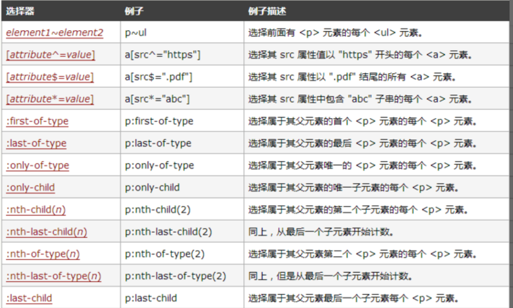

css新增特性

## 是什么
## 选择器
## 新样式
## transition
## transform
## animation
## 渐变

## 一、是什么

`css`，
即层叠样式表（`Cascading Style Sheets`）的简称，
是一种标记语言，
由浏览器解释执行用来使页面变得更美观。

`css3`是`css`的最新标准，
是向后兼容的，
`CSS1/2`的特性在`CSS3`里都是可以使用的，
而`CSS3`也增加了很多新特性，
为开发带来了更佳的开发体验。

## 二、选择器

`css3`中新增了一些选择器，
主要为如下图所示：



## 三、新样式

边框

`css3`新增了三个边框属性，
分别是：

- `border-radius`：创建圆角边框。
- `box-shadow`：为元素添加阴影。
- `border-image`：使用图片来绘制边框。

**box-shadow**

设置`元素阴影`，
设置属性如下：

- `水平`阴影。
- `垂直`阴影。
- `模糊`距离（虚实）。
- 阴影`尺寸`（影子大小）。
- 阴影`颜色`。
- `内/外`阴影。

其中水平阴影和垂直阴影是必须设置的。

**背景**

新增了几个关于背景的属性，
分别是
`background-clip`、
`background-origin`、
`background-size`
`background-break`。

**background-clip**

用于确定背景画区，
有以下几种可能的属性：

- `background-clip: border-box;` 背景从`border`开始显示。

- `background-clip: padding-box;` 背景从`padding`开始显示。

- `background-clip: content-box;` 背景从`content`区域开始显示。

- `background-clip: no-clip;` 默认属性，等同于`border-box`。

通常情况，
背景都是覆盖整个元素的，
利用这个属性可以`设定背景颜色`或`图片`的覆盖范围。

**background-origin**

当我们设置背景图片时，
图片是会以左上角对齐，
但是
是以`border`的左上角
还是以`padding`的左上角
或者`content`的左上角对齐？

`border-origin`正是用来设置这个的。

- `background-origin: border-box;`
 从`border`开始计算`background-position`。

- `background-origin: padding-box;`
从`padding`开始计算`background-position`。

- `background-origin: content-box`；
从`content`开始计算`background-position`。

默认情况是`padding-box`，
即以`padding`的左上角为原点。

**background-size**

`background-size`属性常用来调整背景`图片`的`大小`，
主要用于设定图片本身。

有以下可能的属性：

- `background-size: contain;` 缩小图片以适合元素。（维持像素长宽比）。
- `background-size: cover;` 扩展元素以填补元素。（维持像素长宽比）。

- `background-size: 100px 100px;` 缩小图片至指定的大小。
- `background-size: 50% 100%;` 缩小图片至指定的大小，百分比是相对包含元素的尺寸。

**background-break**

元素可以被`分`成`几个`独立的`盒`子（如使内联元素`span`跨越多行），
`background-break`属性用来控制背景怎样在这些不同的盒子中显示。

- `background-break: continuous;`
默认值。
忽略盒之间的距离
（也就是像元素没有分成多个盒子，依然是一个整体一样）。

- `background-break: bounding-box;` 把盒之间的距离计算在内；

- `background-break: each-box;` 为每个盒子单独重绘背景。

**文字**

**word-wrap**

语法：`word-wrap: normal | break-word`。

- `normal`：使用浏览器默认的换行。
- `break—all`：允许子啊单词内换行。

**text-overflow**

`text-overflow`设置或检索当前行超过指定容器的边界时如何显示，
属性有两个值选择：

- `clip:`修剪文本。
- `ellipsis：` 显示省略符号来代表被修剪的文本。

**text-shadow**

`text-shadow`可向文本应用阴影。
能够规定
`水平`阴影、
`垂直`阴影、
模糊`距离`，
以及阴影的`颜色`。

**text-decoration**

`CSS3`里面开始支持对文字的更深层次的渲染,
具体有三个属性可供设置：

- `text-fill-color`：设置文字内部填充颜色。

- `text-stroke-color`：设置文字边界填充颜色。

- `text-stroke-width`：设置文字边界宽度。

**颜色**

`css3`新增了新的颜色表示方式`rgba`与`hsla`。

- `rgba`分为两部分，
`rgb`为颜色值，
`a`为透明度。

- `hala`分为四部分，
`h`为色相，
`s`为饱和度，
`l`为亮度，
`a`为透明度。

## 四、transition过渡

`transition`属性可以被指定为一个
或多个`css`属性的过渡效果，
多个属性之间用逗号进行分隔，
必须规定两项内容：

- 过度效果。
- 持续时间。

语法如下：

```css
transition: css 属性，花费时间，效果曲线（默认ease），
```
上面为简写模型，也可以分开写各个属性。

```css
transition-property: width;
transition-duration: 1s;
transition-timing-function: linear;
transition-delay: 2s;
```
## 五、transform 转换

`transform`属性允许你`旋转`，`缩放`，`倾斜`或`平移`给定元素。

`transform-origin`：
转换元素的位置（`围绕哪个点`进行`转`换），
默认值为`(x, y, z): (50%, 50%, 0)`。

使用方式：

- `transform: translate(120px, 50%)`： 平移。
- `transform: scale(2, 0.5)`：缩放。
- `transform: rotate(0.5turn)`：旋转。
- `transform: skew(30deg, 20deg)`：倾斜。

## 六、animation 动画

动画这个平常用的也很多，
主要是做一个`预设`的动画。
和一些页面`交互`的`动画`效果，
结果和`过渡`应该一样，
让页面不会那么`生硬`。

`animation`也有很多的属性。

- `animation-name`：动画`名称`。
- `animation-duration`：动画持续`时间`。
- `animation-timing-function`：动画`时间函数`。
- `animation-delay`：动画`延迟`时间。
- `animation-iteration-count`：动画执行`次数`，可以设置为一个整数，也可以设置为`infinite`，意识是无限循环。
- `animation-direction`：动画执行`方向`。
- `animation-play-state`：动画播放`状态`。
- `animation-fill-mode`：动画`填充模式`。

## 七、渐变

颜色渐变是指在两个颜色之间平稳的过渡，
`css3`渐变包括：

- `linear-gradient`：线性渐变。

> background-image: linear-gradient(direction, color-stop1, color-stop2, ....)；

- `radial-gradient`：径向渐变。

> linear-gradient(0deg, red, green);

## 八、其他

关于`css3`其他的新特性还包含
`flex`弹性布局、
`Grid`栅格布局、
这两个布局在以前就已经讲过，
这里就不再展示。

除此之外，
还包括`多列`布局、
`媒体查询`、
`混合`模式等等......
