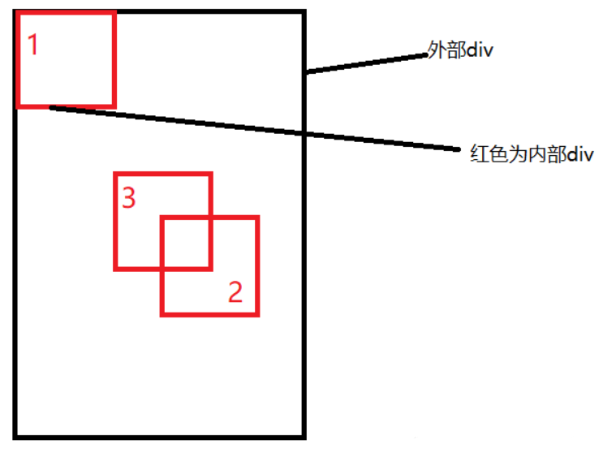

水平垂直居中。

不定高的解决方式。

## 背景
## 实现方式
## 总结

## 一、背景

在开发中经常遇到这个问题。
即让某个元素的内容
在`水平`和`垂直`方向上都`居中`。

内容不仅限于文字。
可能是图片或其他元素。

居中是一个非常基础
但有时非常重要的应用场景。
实现居中的`方法`存在`很多`。

可以将这些方法分成`两`个大`类`：

- 居中元素（子元素）的`宽高已知`。
- 居中元素`宽高未知`。

## 二、实现方式

实现元素水平垂直居中的方式：

- 利用定位 + `margin:auto`。

- 利用定位 + `margin:负值`。

- `table`布局。

- `flex`布局。

- `grid`布局。

**利用定位+margin:auto**

先上代码：

```html
<style>
  .father {
    width: 500px;
    height: 300px;
    border: 1px solid #0a3b98;
    position: relative;
  }
  .son {
    width: 100px;
    height: 40px;
    background: #f0a238;
    position: absolute;
    top: 0;
    left: 0;
    right: 0;
    bottom: 0;
    margin: auto;
  }
</style>

<div class="father">
  <div class="son"></div>
</div>
```

`父`级位置为`相对`定位。
`子`级`绝对`定位。
并且四个定位属性的值都设置了`0`。
那么这时候如果子级`没`有设置`宽高`。
则会被`拉`开到`父级一样宽高`。

这里子元素设置了宽高。
所以宽高会按照我们设置来显示。
但是实际上子级的虚拟占位已经撑满了整个父级。

这时候再给它一个`margin:auto`它就可以上下左右都居中了。
```html
<div class="father">
  <div class="son"></div>
</div>

<style>
  .father {
    position: relative;
    width: 200px;
    height: 200px;
    background: skyblue;
  }

  .son {
    position: absolute;
    top: 50%;
    left: 50%;
    margin-left: -50px;
    margin-top: -50px;
    width: 100px;
    height: 100px;
    background: red;
  }
</style>
```
整个实现思路如下图所示：

。

- 初始位置为方块`1`的位置。

- 当设置`left`、`top`为`50%`的时候。
内部子元素为方块`2`的位置。

- 设置`margin`为负数时。
使内部子元素到方块`3`的位置。
即中间位置。

这种方案不要求父元素的高度。
也就是即使元素的高度变化了。
仍然可以保持在父元素的垂直居中位置。
水平方向上是一样的操作。

但是该方案需要知道子元素自身的宽高。
但是我们可以通过下面`transform`属性进行移动。

**利用定位+transform**

实现代码如下：

```html
<div class="father">
  <div class="son"></div>
</div>

<style>
  .father {
    position: relative;
    width: 200px;
    height: 200px;
    background: skyblue;
  }
  .son {
    position: absolute;
    top: 50%;
    left: 50%;
    transform: translate(-50%, -50%);
    width: 100px;
    height: 100px;
    background: red;
  }
</style>
```
`translate(-50%, -50%)`将会将元素位移自己宽度和高度的`-50%`。

这种方法其实和最上面被否定掉的`margin`负值用法一样。
可以说是`margin`负值的替代方案。
并不需要知道自身元素的宽高。

**table布局**

设置父元素为`display:table-cell`。
子元素设置`display:inline-block`。

利用`vertical`和`text-align`
可以让所有的行内块级元素垂直居中。

```html
<div class="father">
  <div class="son"></div>
</div>

<style>
  .father {
    display: table-cell;
    width: 200px;
    height: 200px;
    background: skyblue;
    vertical-align: middle;
    text-align: center;
  }
  .son {
    display: inline-block;
    width: 100px;
    height: 100px;
    background: red;
  }
</style>
```

**flex弹性布局**

还是看看实现的整体代码：

```html
<div class="father">
  <div class="son"></div>
</div>

<style>
  .father {
    display: flex;
    justify-content: center;
    align-items: center;
    width: 200px;
    height: 200px;
    background: skyblue;
  }
  .son {
    width: 100px;
    height: 100px;
    background: red;
  }
</style>
```

`css3`中了`flex`布局。
可以非常简单实现垂直水平居中。

这里可以简单看看`flex`布局的关键属性作用：

- `display:flex`时，表示该容器内容的元素将`flex`进行布局。

- `align-items:center`，表示这些元素将相对于本容器水平居中。

- `justify-content: center` 也是同样的道理垂直居中。

**grid网格布局**

```html
<div class="father">
  <div class="son"></div>
</div>

<style>
  .father {
    display: grid;
    align-items: center;
    justify-content: center;
    width: 200px;
    height: 200px;
    background: skyblue;
  }

  .son {
    width: 10px;
    height: 10px;
    border: 1px solid red;
  }
</style>
```
这里看到。
`grid`网格布局和`flex`弹性布局都简单粗暴。

**小结**

上述方法中。
不知道元素宽高大小仍能实现`水平垂直居中`的方法有：

- 利用定位+`margin:auto`。
- 利用定位+`transform`。
- `flex`布局。
- `grid`布局。

## 三、总结

根据元素标签的性质，
可以分为：

- `内联`元素居中布局。
- `块级`元素居中布局。

**内联元素居中布局**

水平居中

- 行内元素可设置：`text-align: center`。

- `flex`布局设置父元素：`display: flex; justify-content: center`。

垂直居中

- 单行文本父元素确认高度： `height === line-height`。

- 多行文本父元素确认高度： `display: table-cell; vertical-align: middle`。

```html
  <div class="parent">
    <div class="child">
      display: table-row-group;
      display: table-header-group;
      display: table-footer-group;
      display: table-row;
      display: table-cell;
      display: table-column;
      display: table-column-group;
      display: table-caption;
      display: ruby-base;
      display: ruby-text;
      display: ruby-base-container;
      display: ruby-text-container;
    </div>
  </div>
  <style>
    .parent {
      display: table;
      width: 400px;
      text-align: center;
    }
    .child {
      display: table-cell;
      vertical-align: middle;
      white-space: pre;
    }
  </style>
```
**块级元素居中布局**

水平居中

- 定宽：`margin: 0 auto`。
- 绝对定位 + `left:50%` + `margin: 负自身一半`。

垂直居中

- `position: absolute`设置`left`、`top`、`margin-left`、`margin-top（定高）`。
- `display: table-cell`。
- `transform: translate(x, y)`。
- `flex`（不定高，不定宽）。
- `grid`（不定高，不定宽），兼容性相对比较差。