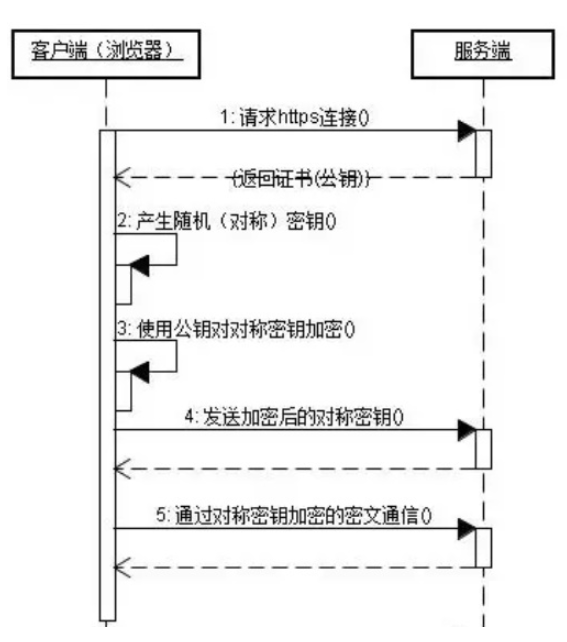

什么是`HTTP`?`HTTP`和`HTTPS`的区别？

HTTP和HTTPS：

## HTTP
## HTTPS
## 区别

## 一、HTTP

`HTTP（HyperText Transfer Protocol）`，
即超文本运输协议，
是实现网络通信的一种规范。

在计算机和网络世界有，
存在不同的协议，
如：
`广播`协议、
`寻址`协议、
`路由协议`等等。。。

然而`HTTP`是一个传输协议，
即将数据由`A`传到`B`
或`B`传输到`A`,

并且`A`与`B`之间能够存放很多第三方，

如：`A<=>X<=>Y<=>Z<=>B`。

传输的数据并不是计算机底层中的二进制包，
而是完整的、
有意义的数据，
如`HTML`文件，
图片文件，
查询结果等超文本，
能够被上层应用识别。

在实际应用中，
`HTTP`常被用于在`Web`浏览器和网站服务器之间`传递信息`，
以`明文方式`发送内容，
`不`提供任何方式的数据`加密`。

特点如下：

- 支持`客户/服务器`模式。

- 简单快速：
客户向服务器请求服务时，
只需`传送请求方法`和`路径`。
由于`HTTP`协议简单，
使得`HTTP`服务器的程序`规模小`，
因而通信`速度很快`。

- `无连接`：
无连接的含义是`限制每次连接`只`处理一个`请求。
服务器处理完客户的请求，
并受到客户的`应答后`，
即`断开连接`。
采用这种方式可以`节省传输时间`。

- 无状态：
`HTTP`协议`无`法根据`之前`的`状态`进行本次的`请求处理`。

## 二、HTTPS

在上述介绍`HTTP`中，
了解到`HTTP`传递信息是以明文的形式发送内容，
这并不安全。

而`HTTPS`出现正是为了解决`HTTP`不安全的特性。

为了保证这些隐私数据能加密传输，
让`HTTP`运行安全的`SSL/TLS`协议上，

即`HTTPS = HTTP + SSL/TLS`,
通过`SSL`证书来验证服务器的身份，
并为浏览器和服务器之间的通信进行加密。

`SSL`协议位于`TCP/IP`协议与各种应用层协议之间，
浏览器和服务器在使用`SSL`建立连接时需要选择一组恰当的加密算法来实现安全通信，
为数据通讯提供安全支持。

Baidu
https

加密
(密钥A)

密文
Xynuyunxoz

解密
(密钥B)

Baidu
https

---

流程图如下所示：

客户端（浏览器）

|
1、请求https连接 返回证书（公钥）
2、产生随机（对称）秘钥
3、使用公钥对对称密钥加密（）
4、发送加密后的对称密钥（）
5、通过对称密钥加密的密文通信（）

服务端

---

- 首先客户端通过`URL`访问服务器`建立SSL`连接。

- 服务端收到客户端请求后，
会将网站支持的整合素信息（证书中包含公钥）传送一份给客户端。

- 客户端的服务器开始协商`SSL`连接的安全等级，
也就是信息加密的等级。

- 客户端的浏览器根据双方同意的安全等级，
建立会话秘钥，
然后利用网站的公钥将会话秘钥加密，
并传送给网站。

- 服务器利用自己的私钥解密出会话密钥。

- 服务器利用会话秘钥加密与客户端之间的通信。

## 三、区别

- `HTTPS`是`HTTP`协议的安全版本，
`HTTP`协议的数据传输是明文的，
是不安全的，
`HTTPS`使用了`SSL/TLS`协议进行了加密处理，
相对更安全。

- `HTTP`和`HTTPS`使用连接方式不同，
默认端口也不一样，
`HTTP`是`80`，
`HTTPS`是`443`。

- `HTTPS`由于需要设计加密以及多次握手，
性能方面不如`HTTP`。

- `HTTPS`需要`SSL`，
`SSL`整数需要钱，
功能越强大的证书费用越高。