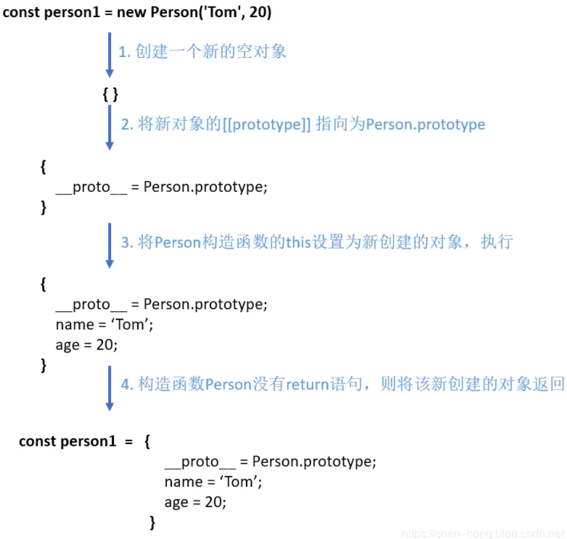

## what
## how

## what

在`js`中。
`new`操作符用于创建一个给定`构造函数`的`实例对象`。

```js
function Person(name, age) {
  this.name = name;
  this.age = age;
}

Person.prototype.sayName = function () {
  console.log(this.name)
}

const person1 = new Person('Tom', 20)
console.log(person1) // Person { name: 'Tom', age: 20 }
person1.sayName() // 'Tom'
```
从上面可以看到:
- `new`通过构造函数`Person`创建出来的实例。
可以访问到构造函数中的`属性`。

- `new`通过构造哦函数`Person`创建出来的实例。
可以访问到构造函数`原型链中的属性`。
（即`实例`与`构造函数`通过`原型链`连接了起来）。

现在在构建函数中显式加上返回值。
并且这个`返回值`是一个`原始类型`。
```js
function Test(name) {
  this.name = name
  return 1
}

const t = new Test('xxx')
console.log(t.name) // 'xxx'
```
可以发现。
构造函数中返回一个原始值。
然而。
这个返回值并没有作用。

下面在构造函数中返回一个对象。
```js
function Test(name) {
  this.name = name
  console.log(this) // Test { name: 'xxx' }
  return { age: 26 }
}

const t = new Test('xxx')
console.log(t) // { age: 26 }
console.log(t.name) // 'undefined'
```
从上面可以发现。
构造函数如果返回值是一个对象。
那么这个返回值会被正常使用。

## how

可以看到`new`关键字主要做了以下的工作：
- 创建一个新的对象`obj`。
- 将`对象与构建函数`通过`原型链`连接起来。
- 将构建函数中的`this`绑定到新建的对象`obj`上。
- 根据构建函数返回类型判断。
如果是原始值则被忽略。
如果是返回对象。
需要正常处理。
```js
function Person(name, age) {
  this.name = name;
  this.age = age;
}
Person.prototype.sayName = function () {
  console.log(this.name)
}
const person1 = new Person('Tom', 20)
console.log(person1) // Person { name: "Tom", age: 20 }
person1.sayName() // 'Tom'
```
流程图如下：
```js
const person1 = new Person('Tom', 20)
| 1、创建一个新的空对象
{}
| 2、将新对象的[[prototype]]指向为`Person.prtototype`
{
  __proto__ = Person.prototype
}
| 3、将`Person构造函数的this`设置为`新创建的对象`，执行。
{
  __proto__ = Person.prototype;
  name = 'Tom';
  age = 20;
}
| 4、构造函数Person没有return语句。则将该新创建的对象返回。
const person1 = {
  __proto__ = Person.prototype;
  name = 'Tom';
  age = 20;
}
```


## 手写new操作符

掌握`new`的执行过程。

手动实现`new`。
```js
function mynew (Func, ...args) {
  // 1、创建一个新对象
  const obj = {}
  // 2、新对象原型 指向 构造函数 原型对象
  obj.__proto__ = Func.prototype
  // 3、将构建函数的this指向新对象
  let result = Func.apply(obj, args)
  // 4、根据返回值判断
  return result instanceof Object ? result : obj
}
```
测试一下
```js
function mynew(func, ...args) {
  const obj = {}
  obj.__proto__ = func.prototype
  let result = func.apply(obj, args)
  return result instanceof Object ? result : obj
}

function Person(name, age) {
  this.name = name;
  this.age = age;
}

Person.prototype.say = function () {
  console.log(this.name)
}

let p = mynew(Person, 'huihui', 123)
console.log(p) // Person { name: 'huihui', age: 123 }
p.say() // huihui
```
可以发现。
代码短。
但可以模拟实现`new`。