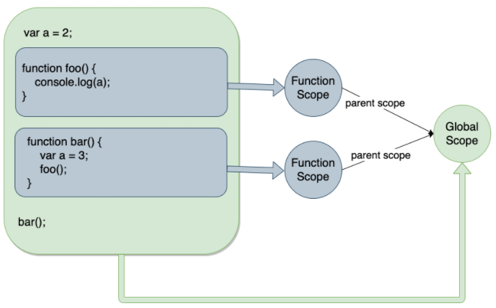
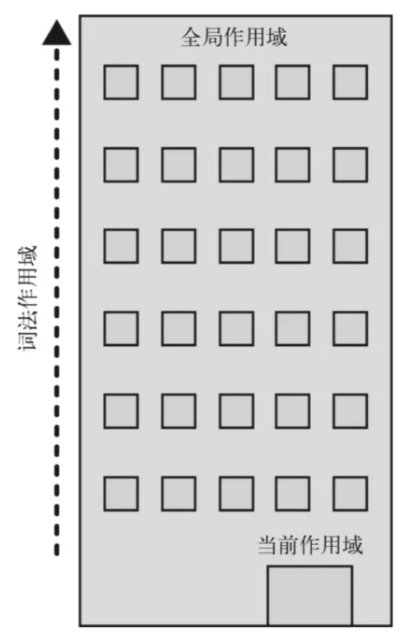

## what

作用域。

- 变量。
- 函数区域或集合。

变量作用域又叫做上下文。

```js
function myFunction() {
  let inVariable = "函数内部变量";
}
myFunction(); // 先执行函数。不用管里面是啥。
console.log(inVariable); // 报错。
```
函数内创了个变量。
在外面全局那块要访问这个局部变量的话。
就报错。

全局无法访问到局部的变量。
除了闭包这种情况。

作用域：
- 全局。
- 函数。
- 块级。

## 全局。

```js
// 全局
var greeting = 'Hello World!';

function greet() {
  console.log(greeting);
}

// 打印 'Hello World!'
greet();
```
## 函数。

```js
function greet() {
  var greeting = 'Hello World!';
  console.log(greeting);
}

// 打印 ’Hello World!‘
greet();

console.log(greeting); // 报错。
```

## 块级。

```js
{
  // 块级作用域中的变量
  let greeting = 'Hello World!';
  var lang = 'English';
  console.log(greeting);
}

console.log(lang) // 打印 'English'

console.log(greeting) // 报错s
```

## 词法作用域

```js
var a = 2;
function foo() {
  console.log(a)
}

function bar() {
  var a = 3;
  foo()
}

bar() // 打印2
```
相同层级的`foo`和`bar`没有办法访问到对方的变量。
所以最终打印的是全局的`a`。
如图：



## 作用域链

js用一个变量的时候。
js引擎会在当前作用域去找这个变量。

没找到。
去上层找。

知道找到这个变量。
或者这个变量是全局作用域里的。

如果全局作用域里也没有。
第一种，可能是隐式声明。
第二种，直接报错。

《你不知道的js》上。
一张图可以解释。

一栋楼。
第一层是当前作用域。
顶层是全局作用域。

变量的引用。
顺着楼层找。
找不到。
往上一层找。
找到就停。
找不到就。
直到顶层。

```js
var sex = '男';
function person() {
  var name = '张三';

  function student() {
    var age = 18;
    console.log(name); // 张三
    console.log(sex); // 男
  }

  student();
  console.log(age); // 报错
}
person()
```
`student`是最内层。
找不到`name`。
就往上层`person`函数内部找到了。
就输出`张三`。

`student`找不到`sex`。
向上一层`person`找不到。
就再上一层找。
在全局那里找到了`男`。

`age`在`person`找不到。
就往上找。
直到全局作用域。
找不到就报错。
