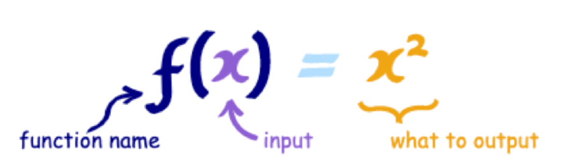
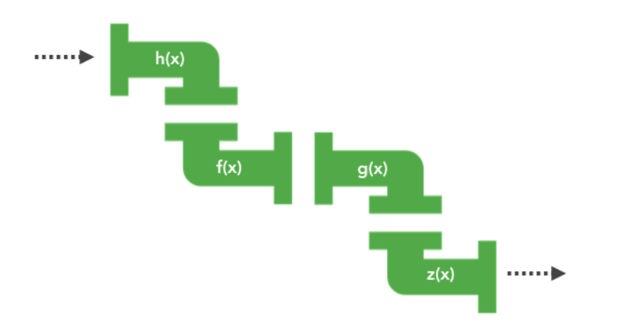

## 是什么。
## 概念。
## 优缺点。

## 是什么。

函数式编程是一种“编程范式”(`programming paradigm`)。
一种编写程序的方法论。

主要的编程范式有三种：
`命令式编程`。
`声明式编程`。
`函数式编程`。

相比命令式编程。
`函数式`编程更加`强调`程序执行的`结果`而`非`执行的`过程`。
倡导利用若干简单的执行单元让计算结果不断渐进。
逐层推导复杂的运算。
而非设计一个复杂的执行过程。

举个例子。
将`数组`每个元素进行`平方`操作。
`命令`式编程与`函数`式编程如下：
```js
// 命令式编程
var array = [0, 1, 2, 3];

for (let i = 0; i < array.length; i++) {
  array[i] = Math.pow(array[i], 2);
}

// 函数式方式
[0, 1, 2, 3].map(num => Math.pow(num, 2));
```

简单来讲。
就是要把`过程逻辑`写成`函数`。
定义好输入`参数`。
只关心它的`输出结果`。

即是一种描述集合和集合之间的转换关系。
输入通过`函数`都会`返回`有且`只有`一个`输出值`。



举个简单的例子：

```js
let double = value => value * 2;
```
特性：

- 函数内部传入指定的值，就会返回确定唯一的值。
- 不会造成超出作用域的变化，例如修改全局变量或引用传递的参数。

优势：

- 使用`纯函数`，我们可以产生可测试的代码。
```js
test('double(2) 等于 4', () => {
  expect(double(2)).toBe(4);
})
```
- 不依赖外部环境计算。
不会产生副作用。
提高函数的复用性。

- 可读性更强。
函数不管是否是纯函数。
都会有一个语义化的名称。
更便于阅读。

- 可以组装成复杂任务的可能性。
符合模块化概念及单一职责原则。

## 高阶函数。

在我们的编程世界中。
我们需要处理的其实也只是"数据"和“关系”。
而关系就是函数。

编程工作也就是找一种映射关系。
一旦关系找到了。
问题就解决了。
剩下的事情。
就是让数据流过这种关系。
然后转换成另一个数据。
如下图所示。



在这里。
就是`高阶函数`的作用。
高阶函数。
就是`以函数`作为`输入`或者`输出`的函数被称为`高阶函数`。

通过高阶函数抽象过程。
注重结果。
如下面例子。
```js
const forEach = function(arr, fn) {
  for (let i = 0; i < arr.length; i++) {
    fn(arr[i]);
  }
}

let arr = [1, 2, 3];

forEach(arr, (item) => { console.log(item) });
```
上面通过高阶函数`forEach`去抽象循环如何做的逻辑。
直接关注做了什么。

高阶函数存在缓存的特性。
主要是利用闭包作用。
```js
const once = () => {
  let done = false;
  return function() {
    if (!done) {
      fn.apply(this, fn);
    } else {
      console.log('该函数已经执行');
    }
    done = true;
  }
}
```

## 柯里化

柯里化是把一个`多参数`函数转化成一个嵌套的`一元函数`的过程。

一个二元函数如下：
```js
let fn = (x, y) => x + y;
```
转化成柯里化函数如下：
```js
const curry = function(fn) {
  return function(x) {
    return function(y) {
      return fn(x, y);
    }
  }
}

let myfn = curry(fn);
console.log(myfn(1)(2));
```
上面的`curry`函数只能处理二元情况。
下面再来实现一个实现多参数的情况。

```js
// 多参数柯里化：
const curry = function(fn) {
  return function curriedFn(...args) {
    if (args.length < fn.length) {
      return function() {
        return curriedFn(...args.concat([...arguments]));
      }
    }
    return fn(...args);
  }
}

const fn = (x, y, z, a) => x + y + z + a;
const myfn = curry(fn);
console.log(myfn(1)(2)(3)(1));
```
---

## Arguments 对象

`arguments`是一个对应于`传递给函数的参数`的`类数组对象`。
```js
function fnc1 (a, b, c) {
  console.log(arguments[0]);
  // Expected output: 1

  console.log(arguments[1]);
  // Expected output: 2

  console.log(arguments[2]);
  // Expected output: 3
}

fnc1(1, 2, 3);
```
## 描述

> 备注: 如果你编写兼容 ES6 的代码，那么优先推荐使用`剩余参数`。

> 备注: "类数组"意味着`arguments`有`长度`属性并且属性的索引是从零开始的，
> 但是它没有`Array`的内置方法，
> 例如`forEach()`和`map()`都是没有的。

> 详情可以看`$Description`。

`arguments`对象是所有（非箭头）函数中都可用的`局部变量`。
你可以使用`arguments`对象在函数中引用函数的参数。

此对象包含传递给函数的每个采纳数，
第一个参数在索引`0`处。

例如，
如果一个函数传递了三个采纳数，
你可以如下方式引用他们：
```js
arguments[0];
arguments[1];
arguments[2];
```

## 通过索引赋值

参数也可以被设置：

```js
arguments[1] = 'new value';
```

`arguments`对象不是一个`Array`。
它‘类似于`Array`。
但除了`length`属性和索引元素之外没有任何`Array`属性。

例如，
它没有`pop`方法。
但是它可以被转换为一个真正的`Array`：

```js
var args = Array.prototype.slice.call(arguments);
var args = [].slice.call(arguments);

// es2015
const args = Array.from(arguments);
const args = [...arguments];
```

警告：对参数使用`slice`会阻止某些`js`引擎中的优化（比如`v8`）。
---

关于柯里化函数的意义如下：

- 让`纯函数`更纯。
每次接受一个`参数`。
`松散解耦。

- `惰性`执行。

## 组合与管道。

组合函数。
目的是将`多个函数`组合成`一个函数`。

举个简单的例子：
```js
function afn(a) {
  return a*2;
}

function bfn(b) {
  return b*3;
}

const compose = (a, b) => c => a(b(c));

let myfn = compose(afn, bfn);

console.log(myfn(2));
```
------

这个函数`compose`可以看做是一个函数合成(`function composition`)的操作。
接受两个函数`a`和`b`。
然后返回一个新的函数。
将参数`c`传递给函数`b`。
再将函数`b`的结果传递给函数`a`。
最终返回的函数实际上是将函数`a`和函数`b`连续执行的结果。

如果你觉得这个函数关系难以理解。
可以把它`拆分`成更容易理解的步骤。
或者使用更具体的示例来说明。
西面是一个更详细和易于理解的解释：
```js
// 定义一个函数 compose, 接受两个函数 a 和 b 作为参数。
const compose = (a, b) => {
  // 返回一个新的函数，这个函数接受一个参数 c
  return function(c) {
    // 首先将参数 c 传递给函数 b，得到中间结果。
    const resultFromB = b(c);
    // 然后将中间结果传递给函数 a，得到最终结果
    const finalResult = a(resultFromB)
    // 返回最终结果
    return finalResult;
  };
};

// 使用示例：定义两个简单的函数
const addOne = x => x + 1;
const multiplyByTwo = x => x * 2;

// 将 addOne 和 multiplyByTwo 组合在一起。
const combinedFunction = compose(multiplyByTwo, addOne);

// 调用组合后的函数，相当于先执行`addOne`。再执行`multiplyByTwo`。
const result = combinedFunction(3); // 先加一再乘二：(3 + 1) * 2 = 8

console.log(result); // 输出 8
```
这段代码中。
`compose`函数实现了将`两个函数`串联起来执行的功能。
可以帮助你更清晰地理解这种函数组合的概念。
------

可以看到`compose`实现一个简单的功能：
形成了一个新的函数，
而这个函数就是一条从`bfn -> afn`的流水线。

下面再来看看如何`实现`一个`多函数`组合：
```js
const compose = (...fns) => val => fns.reverse().reduce((acc, fn) => fn(acc), val);
```
`compose`执行是从右到左的。
而管道函数。
执行顺序是从左到右执行的。
```js
const pipe = (...fns) => val => fns.reduce((acc, fn) => fn(acc), val);
```
`组合函数`与`管道函数`的意义在于：
可以把很多`小函数`组合起来`完成`更`复杂`的逻辑。

## 优缺点

优点

- 更好的管理状态：
因为它的宗旨是`无状态`。
或者说`更少`的状态。
能最大化地`减少`这些
`未知`、
`优化代码`、
减少出错情况。

- 更简单的复用。
`固定输入`->`固定输出`。
没有`其他外部变量`影响。
并且`无副作用`。
这样代码复用时。
完全不需要考虑它的内部实现和外部影响。

- 更优雅的组合。
往大的说。
网页是由各个组件组成的。
往小的说。
一个函数可能是由多个小函数组成的。
更强的复用性。
带来更强大的组合性。

- 隐形好处。
减少代码量。
提高维护性。

缺点：
- 性能：
函数式编程相对于指令式编程。
性能绝对是一个短板。
因为它往往会对一个方法进行过度包装。
从而产生上下文切换的性能开销。

- 资源占用：
在`js`中为了实现`对象状态`的`不可变`。
往往会创建新的对象。
因此。
它对垃圾回收所产生的压力远远超过其他编程方式。

- `递归陷进`：
在函数式编程中，
为了实现迭代。
通常会采用`递归`操作。