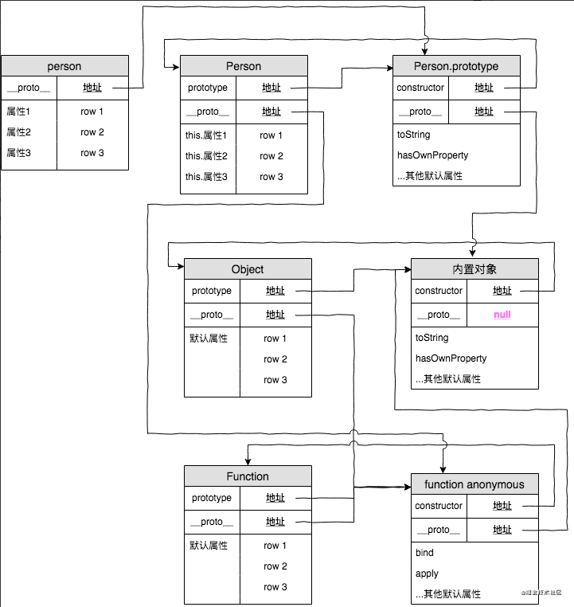

## 原型

`js`叫做`一种基于原型的语言`。
`每个对象`拥有一个`原型对象`。

访问一个对象的属性时。
不仅仅在`对象`中查找。
还会在`对象的原型`。
`对象的原型的原型`中查找。

依次层层往上找。

直到找到一个名字匹配的属性为止。
或者原型链的末尾。

属性和方法定义在`Object`的构造函数上的`prototype`属性上。
而不是`非实例对象`本身。

举例子。

函数有属性。
每个函数都有特殊属性。
原型`prototype`。

```js
function doSomething() {}

console.log(doSomething.prototype);
```
控制输出
```js
{
  constructor: f doSomething(),
  __proto__: {
    constructor: f Object(),
    hasOwnProperty: f hasOwnProperty(),
    isPrototypeOf: f isPrototypeOf(),

    propertyIsEnumerable: f propertyIsEnumerable(),
    toLocaleString: f toLocaleString(),
    toString: f toString(),
    valueOf: f valueOf()
  }
}
```
上面👆就是`原型对象`。

原型对象有个属性`constructor`。
这个属性指向该函数。


## 原型链

原型对象有原型。
从中继承`方法`和`属性`。
层层过。
类推。

原型链这东西就解释了。
为何一个对象会拥有定义在其他对象中的属性和方法。

对象实例。
和。
构造器。
建立链接。

`__proto__`属性。
构造函数的`prototype`属性派生的。

通过上溯原型链。
在构造器中找到这些属性和方法。

例子:
```js
function Person(name) {
  this.name = name;
  this.age = 18;

  this.sayName = function() {
    console.log(this.name);
  }
}

// 第二步 创建实例
var person = new Person('person')
```
有图，看图。



分析：
- 构造函数`Person`存在原型对象`Person.prototype`。
- 构造函数生成实例对象`person`。
`person`的`__proto__`指向构造函数`Person`原型对象。

- `Person.prototype.__proto__`指向内置对象。
因为`Person.prototype`是个对象。
默认是由`Object`函数作为类创建的。
而`Object.prototype`为内置对象。

- `Person.__proto__`指向内置匿名函数`anonymous`。
`Person`是个函数对象。
默认由`Function`作为类创建。

- `Function.prototype`和`Function.__proto__`。
同时指向匿名函数`anonymous`。
原型链的终点就是`null`。

## 总结

概念。

`__proto__`作为不同对象之间的桥梁。
用来指向创建它的构造函数的原型对象的。


每个对象的`__proto__`都指向它的构造函数的原型对象`prototype`的。
```js
person1.__proto__ === Person.prototype;
```

构造函数是一个函数对象，是通过`Function`构造器产生的。
```js
Person.__proto__ = Function.prototype;
```
原型对象本身是一个普通对象。
而普通对象的构造函数都是`Object`。
```js
Person.prototype.__proto__ === Object.prototype
```
所有构造器都是函数对象。
函数对象都是`Function`构造产生的。
```js
Object.__proto__ === Function.prototype
```
`Object`的原型对象也有`__proto__`属性指向`null`。
`null`是原型链的顶端。
```js
Object.prototype.__proto__ === null
```

## 总结。

- 一切对象都是继承自`Object`对象。
`Object`对象直接继承根源对象`null`。

- 一切的函数对象（包括`Object`对象）。
都是继承自`Function`对象。

- `Object`对象直接继承`Function`对象。

- `Function`对象的`__proto__`会指向自己的原型对象。
最终还是继承自`Object`对象。

