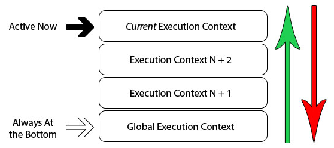

## what

执行上下文是一种。
对`js`代码执行环境的抽象概念。

只要有`js`代码运行。
那么一定是运行在`执行上下文`中。

`执行上下文`的`类型`分`3种`：

- 全局。
- 函数。
- eval。

- 全局。
浏览器的全局对象就是`window`。
`this`指向这个全局对象。

- 函数。
无数个。
函数被调的时候才会创。
每次调函数都创一个新的`执行上下文`。

- eval。
运行在`eval`函数中的代码。
少用。
不建议。

全局。
函数。
例子。

```js
// global context

var sayHello = 'Hello';

function person() { // execution context

  var first = 'David',
      last = 'Shariff';

  function firstName() { // execution context
    return first;
  }

  function lastName() { // execution context
    return last;
  }

  alert(sayHello + firstName() + ' ' + lastName());
}
```


紫色框。
是全局上下文。

蓝色和橘色。
是不同函数的上下文。

只有全局上下文（的变量）。
可以被其他任何上下文访问。

可以有任意多个函数上下文。
每次调用函数创建一个新的上下文。
会创建一个私有作用域。
函数内部声明的任何变量都不能在当前函数作用域外部直接访问。

## 生命周期

执行上下文的生命周期：
`创建` - `执行` - `回收`。

### 创建

当函数被调用。
但没执行任何其内部代码之前。

创建阶段：
- 确定`this`的值。也叫`this binding`。
- 词法环境 组件被创。
- 变量环境 组件被创。

伪代码：
```js
ExecutionContext = {
  ThisBinding = <this value>, // 确实this
  LexicalEnvironment = { ... }, // 词法环境
  VariableEnvironment = { ... }, // 变量环境
}
```

`this binding`。

确定`this`的值。
`this`的值是在执行的时候才能确认。
定义的时候不能确认。

词法环境。

- 全局。
`没有外部`环境的词法环境。
外部环境引用是`null`。
有个全局对象。
`this`的zhi

- 函数。
用户在函数中`定义的变量`被`存储`在`环境记录`中。
包含了`arguments`对象。
外部环境的引用可以是`全局环境`。
也可以是包含`内部函数`的`外部函数环境`。

伪代码：
```js
GlobalExecutionContext = { // 全局执行上下文
  LexicalEnvironment: { // 词法环境
    EnvironmentRecord: { // 环境记录
      Type: 'Object', // 全局环境
      // 标识符绑定在这里
      outer: <null> // 对外部环境的引用
    }
  }
}

FunctionExecutionContext = { // 函数执行上下文
  LexicalEnvironment: { // 词法环境
    EnvironmentRecord: { // 环境记录
      Type: 'Declarative', // 函数环境
      // 标识符绑定在这里 、、 对外部环境的引用
      outer: <Global or outer function environment reference>
    }
  }
}
```

变量环境。

是个词法环境。
所以。
具有定义的词法环境的所有属性。

词法环境和变量环境。
区别在于.
前者用于, `存储函数声明`和`变量`(`let`和`const`)绑定。
后者仅用，于`存储变量`（`var`）绑定。

举例子：
```js
let a = 20;
const b = 30;

var c;

function multiply(e, f) {
  var g = 30;
  return e * f * g;
}

c = multiply(20, 30);
```

执行上下文：

```js
GlobalExecutionContext = {

  ThisBinding: <Global Object>,

  LexicalEnvironment: { // 词法环境
    EnvironmentRecord: {
      Type: 'Object',
      // 标识符绑定在这里
      a: < uninitialized >,
      b: < uninitialized >,
      multiply: < func >
    }
    outer: <null>
  },

  VariableEnvironment: { // 变量环境
    EnvironmentRecord: {
      Type: "Object",
      // 标识符绑定在这里
      c: undefined,
    }
    outer: <null>
  }
}

FunctionExecutionContext = {
  ThisBinding: <Global Object>,

  LexicalEnvironment: {
    EnvironmentRecord: {
      Type: "Declarative",
      // 标识符绑定在这里
      Arguments: {
        0: 20,
        1: 30,
        length: 2
      }
    },
    outer: <GlobalLexicalEnvironment>
  },

  VariableEnvironment: {
    EnvironmentRecord: {
      Type: "Declarative",
      // 标识符绑定在这里
      g: undefined
    },
    outer: <GlobalLexicalEnvironment>
  }
}
```

`let`和`const`定义的变量`a`和`b`。在创建阶段没有被赋值。
但。
`var`声明的变量在创建阶段被赋值为`undefined`。

创建阶段。
会在代码中扫描`变量`和`函数声明`。
然后将`函数声明`存储在环境中。

变量会被`初始化`为`undefined`（var声明的情况下）。
和保持`uninitialized`（1、未初始化状态；2、使用`let`和`const`声明的情况下）。

这就是`变量提升`的`实际原因`。

### 执行阶段

在这阶段。
执行变量赋值。
代码执行。

如果`js`引擎在源代码中。
声明的实际位置。
找不到`变量`的值。

那么将为其分配`undefined`值。

### 回收阶段

执行`上下文`出栈。等待`虚拟机`回收执行上下文。

## 执行栈

执行栈，也叫`调用栈`。
具有`LIFO`（后进先出）结构。
用在存储在代码执行期间创建的所有执行上下文。



当`js`引擎开始执行你的第一行脚本代码的时候。
它就会创建`一个全局执行上下文`。
然后将它压到`执行栈`中。

每当引擎碰到一个函数的时候。
它就会创建一个`函数执行上下文`。
然后将这个执行上下文压到`执行栈`中。

引擎会执行位于栈栈顶的执行上下文（一般是函数执行上下文）。
当函数执行结束后。
对应的执行上下文就会被弹开。
然后控制流程到达执行栈的下一个执行上下文。

举例子：
```js
let a = "Hello World!";

function first() {
  console.log('Inside first function');
  second();
  console.log('Again inside first function');
}

function second() {
  console.log('Inside second function');
}

first();

console.log('Inside Global Execution Context');
```


简单分析一下流程：
- 创建全局上下文搞进执行栈。
- `first`函数被调用。创建函数执行上下文搞进栈内。

- 执行`first`函数过程遇到`second`函数。
再创建一个函数执行上下文并入栈。

- `second`函数执行完。
对应的函数执行上下文被推出执行栈。
执行下个执行上下文`first`函数。

- `first`函数执行完。
对应的函数执行上下文也被推出栈中。
然后执行全局上下文。

- 所有代码执行完。
全局上下文也会被推出栈中。
程序结束。