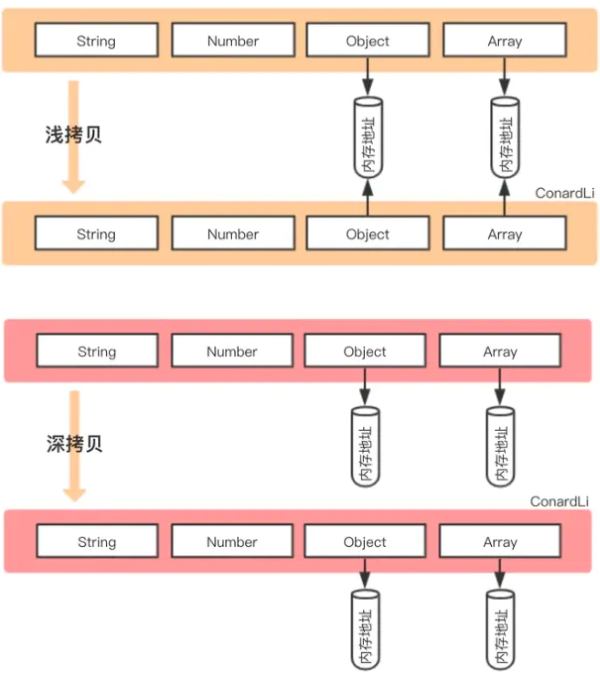

## 数据类型

- 基本。
- 引用。

基本 保存 在 栈内存。

引用 保存 在 堆内存。

引用指向堆内存实际对象的引用。
存栈中。

## 浅

基本类型 - 就拷贝 值。
引用类型 - 就拷贝 引用。

```js
function shallowClone(obj) {
  const newObj = {};

  for (let prop in obj) {
    if (obj.hasOwnProperty(prop)) {
      newObj[prop] = obj[prop];
    }
  }

  return newObj;
}
```

- `Object.assign`。
- `Array.prototype.slice()`。
- `Array.prototype.concat()`。
- 三个点`...`扩展符。

## Object.assign

```js
var obj = {
  age: 18,
  nature: ['smart', 'good'],
  names: {
    name1: 'fx',
    name2: 'xka'
  },
  love: function () {
    console.log('fx is a great girl!')
  }
}

var newObj = Object.assign({}, obj)
```

## slice

```js
const fxArr = ['One', 'Two', 'Three']
const fxArrs = fxArr.slice(0)

fxArrs[1] = 'love'

console.log(fxArr) // ['One', 'Two', 'Three']
console.log(fxArrs) // ['One', 'love', 'Three']
```

## concat

```js
const fxArr = ['One', 'Two', 'Three']
const fxArrs = fxArr.concat()

fxArrs[1] = 'love'

console.log(fxArr) // ['One', 'Two', 'Three']
console.log(fxArrs) // ['One', 'love', 'Three']
```

## 三个点`...`

```js
const fxArr = ['One', 'Two', 'Three']
const fxArrs = [...fxArr]

fxArrs[1] = 'love'

console.log(fxArr) // ['One', 'Two', 'Three']
console.log(fxArrs) // ['One', 'love', 'Three']
```

## 深

两人完全相同。
但地址指向不同。

两者互不干扰。

- _.cloneDeep()
- jQuery.extend()
- JSON.stringify()
- 循环递归

_.cloneDeep()

```js
const _ = require('lodash');
const obj1 = {
  a: 1,
  b: {
    f: {
      g: 1
    }
  },
  c: [1, 2, 3]
};

const obj2 = _.cloneDeep(obj1);
console.log(obj1.b.f === obj2.b.f); // false
```

JSON.stringify()

```js
const obj2 = JSON.parse(JSON.stringify(obj1);
```
有缺点。
会忽略`undefined`。
`symbol`。
`函数`。

```js
const obj = {
  name: 'A',
  name1: undefined,
  name3: function() {},
  name4: Symbol('A')
}
const obj2 = JSON.parse(JSON.stringify(obj));
console.log(obj2); // {name: "A"}
```
循环递归
```js
function deepClone(obj, hash = new WeakMap()) {
  if (obj === null) return obj; // 如果是null或者undefined，就不进行拷贝操作
  if (obj instanceof Date) return new Date(obj);
  if (obj instanceof RegExp) return new RegExp(obj);

  // 可能是对象或者普通值。
  // 如果是函数就不用深拷贝

  if (type obj !== 'object') return obj;
  // 是对象的话就进行深拷贝
  if (hash.get(obj)) return hash.get(obj);
  let cloneObj = new obj.constructor();

  // 找到所属类型上的constructor。
  // 原型上的constructor指向当前类本身。
  hash.set(obj, cloneObj);
  for (let key in obj) {
    if (obj.hasOwnProperty(key)) {
      // 实现一个递归拷贝
      cloneObj[key] = deepClone(obj[key], hash);
    }
  }
  return cloneObj;
}
```

## 区别

看图说话：



浅的 就拷贝 对象的指针。
不复制人家对象本身。
共用一个内存。
修改新的会影响旧的。
```js
// 浅
const obj1 = {
  name: 'init',
  arr: [1, [2, 3], 4]
};

const obj3 = shallowClone(obj1); // 浅拷贝

obj3.name = 'update';

obj3.arr[1] = [5, 6, 7] // 共用一个内存

console.log('obj1', obj1) // obj1 { name: 'init', arr: [ 1, [5, 6, 7], 4 ] }
console.log('obj3', obj3) // obj3 { name: 'update', arr: [ 1, [5, 6, 7], 4 ] }
```

深拷贝就是复制一模一样的玩意。
但是 内存地址不同。
也就是说 不住同一屋。

你改我改。
都互不影响。
都互不干扰。

```js
// 深拷贝
const obj1 = {
  name: 'init',
  arr: [1, [2, 3], 4]
};

const obj4 = deepClone(obj1); // 深拷贝

obj4.name = 'update';
obj4.arr[1] = [5, 6, 7]; // 不共用一个内存

console.log('obj1', obj1) // obj1 { name: 'init', arr: [ 1, [2, 3], 4 ] }
console.log('obj4', obj4) // obj4 { name: 'update', arr: [ 1, [5, 6, 7], 4 ] }
```

- 浅。
指向同个地址。

- 深。
新开栈。
不共用地址。
一般都是递归搞的。