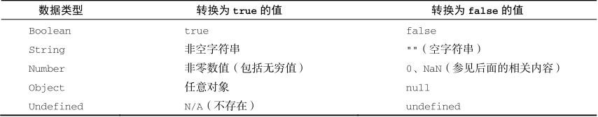

## what

简单
- undefined
- null
- boolean
- string
- number
- symbol

引用类型 object

```js
let x = y ? 1 : a
```
- 强制。（显示）
- 自动。（隐式）

## 显示

- Number()
- parseInt()
- String()
- Boolean()

## Number

- Undefined - NaN
- Null - 0
- true - 1
- false - 0
- String - 根据语法和规则去转化
- Symbol - 报错
- Object - 先调toPrimitive再调用toNumber

```js
Number(324) // 324

Number('324') // 324

Number('324abc') // NaN

Number('') // 0

Number(true) // 1
Number(false) // 0

Number(undefined) // NaN

Number(null) // 0

Number({ a: 1 }) // NaN
Number([1, 2, 3]) // NaN
Number([]) // 0
Number(Symbol('sy')) // TypeError
Number([5]) // 5
```

parseInt
遇到转不了的就停。
```js
parseInt('324abc3') // 324
```

string


```js
String(1) // '1'

String('a') // 'a'

String(true) // 'true'

String(undefined) // 'undefined'

String(null) // 'null'

String({ a: 1 }) // '[object Object]'

String([1, 2, 3]) // '1,2,3'
```

Boolean



```js
Boolean(1) // true

Boolean('') // false

Boolean(null) // false

Boolean(undefined) // false

Boolean({ a: 1 }) // true

Boolean([1, 2, 3]) // true

Boolean(0) // false

Boolean('0') // true

Boolean('false') // true

Boolean(null) // false

Boolean(NaN) // false

Boolean(new Boolean(false)) // true
```

## 隐式转换

比较

- ==
- !=
- >
- <
- if
- while

算术

- +
- -
- *
- /
- %

## 自动转布尔

系统内部自动转

- undefined
- null
- false
- +0
- -0
- NaN
- ""

都转成`false`

## 自动转字符串

```js
'5' + 1 // '51'
'5' + true // '5true'
'5' + false // '5false'
'5' + null // '5null'
'5' + undefined // '5undefined'
'5' + {} // '5[object Object]'
'5' + [] // '5'
'5' + Symbol() // TypeError
'5' + function () {} // '5function () {}'
'5' + [] + 1 // '51'
```

## 自动转成数值

```js
'5' - '2' // 3
'5' * '2' // 10
true - 1 // 0
false - 1 // -1
'5' * [] // 0
[] * 2 // NaN
[] + 1 // '1'
[] * 1 // 0
'abc' * 1 // NaN
'abc' - 1 // NaN
'abc' * '2' // NaN
'abc' - '2' // NaN

false / '2' // 0
```
null 转 为数值。值为0。
undefined 转 为数值。值为NaN。

