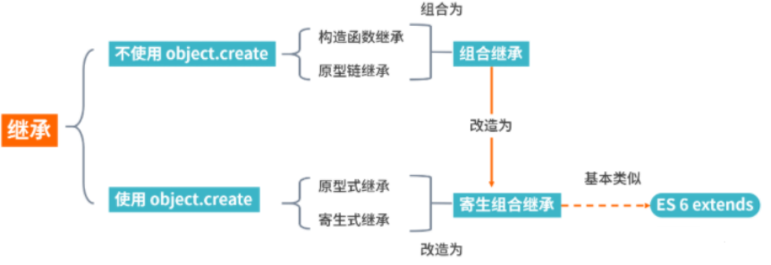

## what

继承是。
面向对象软件技术当中的一个概念。

- 如果一个类别`B`继承另一个类别`A`。
就把这个`B`称为`A`的子类。

`A`就叫`B`的父类别。
`A`是`B`的超类。

- 继承的优点。

继承可以使得子类具有父类别的各种属性和方法。
而不需要再次编写相同的代码。

在子类别继承父类别的同时。
可以重新定义某些属性。
并重写某些方法。
就是覆盖父类别的原有属性和方法。
使其获得与父类别不同的功能。

虽然`js`并不是真正的面向对象语言。
但它天生的灵活性。
使应用场景更加丰富。

关于继承。
举个例子。

`定义一个类(Class)叫汽车。汽车的属性包括颜色、轮胎、品牌、速度、排气量等`。
```js
class Car {
  constructor(color, speed) {
    this.color = color
    this.speed = speed
    // ...
  }
}
```
由`汽车`这个类可以派生出`轿车`和`货车`两个类。
在汽车的基础属性上。

为轿车添加一个后备厢、给火车添加一个大货箱。
```js
// 货车
class Truck extends Car {
  constructor(color, speed) {
    super(color, speed)
    this.Container = true // 货箱
  }
}
```
轿车和货车不一样。
但是。
都是汽车类型。

汽车、轿车、继承了汽车的属性。
所以不需要再次在`轿车`中定义汽车已有的属性。

在`轿车`继承`汽车`的同时。
也可以重新定义汽车的某些属性。
并重写或者覆盖某些属性和方法。

使得获得与`汽车`这个父类不同的属性和方法。

```js
class Truck extends Car {
  constructor(color, speed) {
    super(color, speed)
    this.color = 'black' // 覆盖
    this.Container = true // 货箱
  }
}
```
`轿车`和`卡车`继承`汽车`这个类。

## 实现

继承方式：
- 原型链。
- 构造函数。（借助`call`）
- 组合。
- 原型式。
- 寄生式。
- 寄生组合式。

## 原型链。
涉及：
构造函数。
原型。
实例。

三者的关系。

每个`构造函数`都有个`原型对象`。
`原型对象`包含一个`指向构造函数的指针`。
`实例`包含`原型对象的指针`。

```js
function Parent() {
  this.name = 'parent1';
  this.play = [1, 2, 3]
}

function Child() {
  this.type = 'child2';
}

Child.prototype = new Parent();
console.log(new Child())
```
`实际存在潜在问题`:
```js
var s1 = new Child();
var s2 = new Child();
s1.play.push(4);
console.log(s1.play, s2.play); // [1, 2, 3, 4]
```
改变`s1`的`play`属性。
`s2`也的`play`属性也改了。

`两个实例`用的是`同一个`原型对象。
内存共享。

## 构造

用`call`去搞`Parent`函数。

```js
function Parent() {
  this.name = 'parent1';
}

Parent.prototype.getName = function () {
  return this.name;
}

function Child() {
  Parent.call(this);
  this.type = 'child'
}

let child = new Child();
console.log(child); // 没问题
console.log(child.getName()) // 会报错
```
父类`原型对象`中一旦存在父类之前定义的方法。
`子类`将无法继承这些方法。

跟第一种`原型链继承`比。
父类的引用属性不会被共享。
`优化`了第一种继承方式的弊端。
但`只能`继承父类的`实例`属性和方法。
`不能`继承`原型`属性或方法

## 组合

```js
function Parent3 () {
  this.name = `parent3`;
  this.play = [1, 2, 3];
}

Parent3.prototype.getName = function () {
  return this.name;
}

function Child3() {
  // 第二次调用 Parent3()
  Parent3.call(this);
  this.type = 'child3';
}

// 第一次调用 Parent3()
Child3.prototype = new Parent3();

// 手动搓上构造器、指向自己的构造函数
Child3.prototype.constructor = Child3;

var s3 = new Child3();
var s4 = new Child3();

s3.play.push(4);

console.log(s3.play, s4.play); // 不互相影响
console.log(s3.getName()); // 正常输出`parent3`
console.log(s4.getName()); // 正常输出`parent3`
```
`方式一`和`方式二`的问题都解决了。

但是从代码上也可以看到。
`Parent3`执行了两次，造成了多构造一次的性能开销。

## 原型式

用`Object.create`去搞普通对象的继承。
```js
let parent4 = {
  name: 'parent4',
  friends: ['p1', 'p2', 'p3'],
  getName: function() {
    return this.name;
  }
};

let person4 = Object.create(parent4);
person4.name = 'tom';
person4.friends.push('jerry');

let person5 = Object.create(parent4);
person5.friends.push('lucy');

console.log(person4.name); // tom
console.log(person4.name === person4.getName()); // true

console.log(person5.name); // parent4

console.log(person4.friends); // ['p1', 'p2', 'p3', 'jerry', 'lucy']
console.log(person5.friends); // ['p1', 'p2', 'p3', 'jerry', 'lucy']
```
缺点明显。
`Object.create`是浅拷贝。

多个实例的引用类型属性。
指向相同的内存。

所以会互相干扰。
互相影响。

## 寄生

就是浅拷贝再添加一些方法。

```js
let parent5 = {
  name: 'parent5',
  friends: ['p1', 'p2', 'p3'],
  getName: function() {
    return this.name;
  }
};

function clone(original) {
  let clone = Object.create(original);
  clone.getFriends = function() {
    return this.friends;
  };
  return clone;
}

let person5 = clone(parent5);

console.log(person5.getName()); // parent5
console.log(person5.getFriends()); // ['p1', 'p2', 'p3']
```
优缺点跟`原型式继承`一样。

## 寄生组合

用`Object.create`。
和根据前面几点的缺点改造了一下。

```js
function clone (parent, child) {
  // 这里改用`Object.create`，减少组合继承中多一次构造的过程。
  child.prototype = Object.create(parent.prototype);
  child.prototype.constructor = child;
}

function Parent6() {
  this.name = 'parent6';
  this.play = [1, 2, 3];
}

Parent6.prototype.getName = function () {
  return this.name;
}

function Child6() {
  Parent6.call(this);
  this.friends = 'child5';
}

clone(Parent6, Child6)

Child6.prototype.getFriends = function () {
  return this.friends;
}

let person6 = new Child6();
console.log(person6); // { friends: 'child5', name: 'parent6', play: [1, 2, 3], __proto__: Parent6}
console.log(person6.getName()); // parent6
console.log(person6.getFriends()); // child5
```
`person6`打印出来。
属性都能继承。
方法也没问题。

用`es6`的`extends`去做继承。

```js
class Person {
  constructor(name) {
    this.name = name
  }

  getName = function () {
    console.log('Person:', this.name)
  }
}

class Gamer extends Person {
  constructor(name, age) {
    super(name)
    this.age = age
  }
}

const asuna = new Gamer('Asuna', 20)
asuna.getName() // 成功访问到父类的方法
```
利用`babel`转代码看。
其实`extends`用的就是`寄生组合`继承方式这种。

## 总结

`Object.create`划分继承。

寄生组合继承。
是最好的。

es6的`extends`用的就是这种。

图来总结一下。

