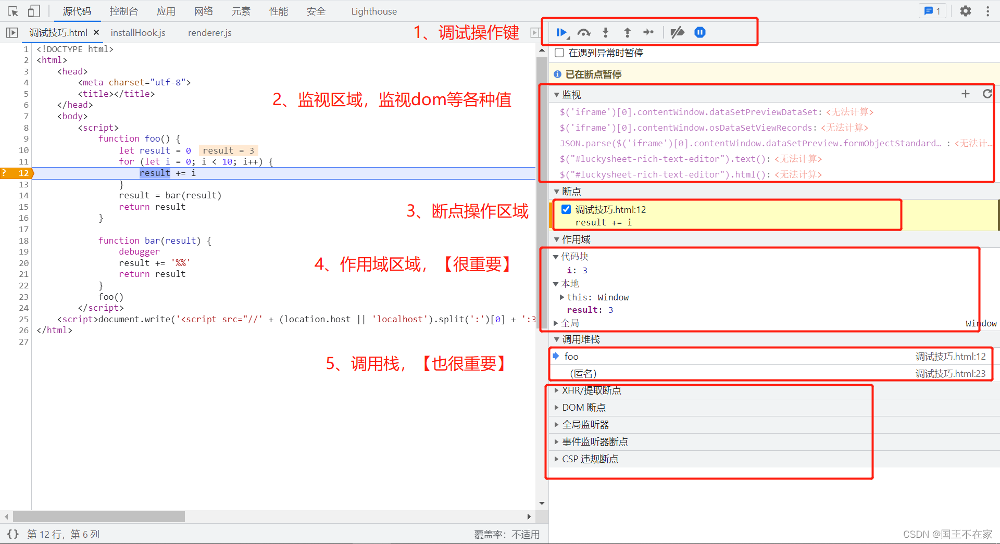
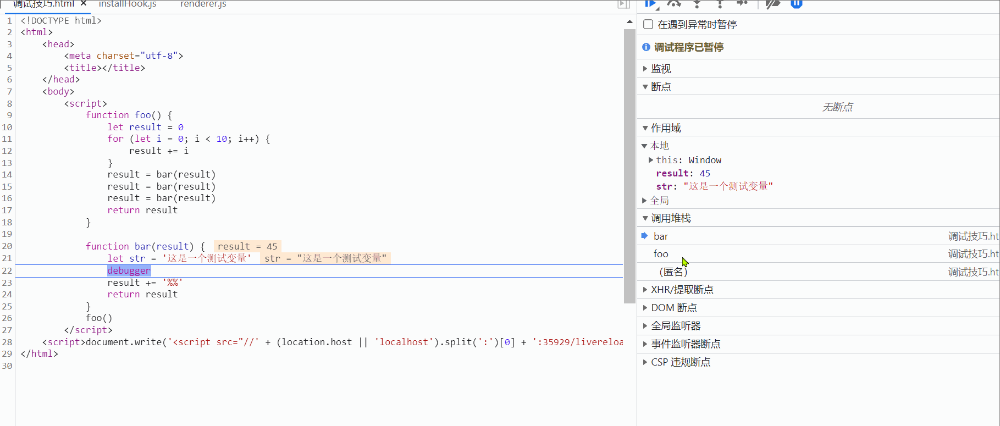

## 调试hover样式

1、第一种方法就是利用`debugger`（推荐）

在`控制台输入`下面一段代码(时间自己决定)并执行。
返回页面。

鼠标放在需要调试的`dom`上。
把`hover`样式显示出来。

等待`debugger`。
然后就能安心调试`hover`样式了。

```js
setTimeout(() => {
  debugger
}, 1800)
```

改进版本：

1、先在控制台输入以下代码。
注意不要回车。
控制台的光标会一直在。
```js
debugger
```

2、然后将鼠标放在需要`hover`的`dom`上。
使其出现`hover`样式。
这个时候回车。
就能调试了。

## 利用控制台“元素”选项调试

先定位到调试的元素。
然后咔咔一顿操作。
见下图。
不推荐。


## 控制台的$操作符

`$0`【获取调试选中dom】

先在元素面板中选中`dom`。
右边就会显示`$0`。
然后在控制台执行`$0`。
结果就是刚才选中的`dom`。

操作1：


`$1`【返回上一次$0的执行结果】

执行两次$0选中不同元素。
再打印$1。
结果是第一次的$0的结果。


`$_` 【返回上一次控制台执行的结果】

先执行`2+3`返回`5`。
然后执行`$_`。
结果是`5`。
（也就是上一次执行的结果）。


`$i` 【为控制台下载包】

完整的使用`$i`操作需要先在`chrome`安装`console importer`插件。


以常用的`lodash`为例：

```js
$i('lodash')

// [$i]: searching for lodash, please be patient...
/**
 * [$i]: lodash not found,  import `lodash.jd` instead.
 * [$i]: lodash.js is loading, please be patient...
 * [$i]: lodash.js(https://cdnjs.cloudflare.com/ajax/libs/lodash.js/4.17.21/lodash.miin.js) is loaded.
 *
 * lodash
 * _.chunk([2, 3, 5, 56, 34], 2)
 * [Array(2), Array(2), Array(1)]
 * 0 (2) [2, 3]
 * 1 (2) [5, 56]
 * 2 [34]
 * length 3
 */
```


`$i`使用`cdn`。
不用担心内存。

## 更多的$操作符

https://github.com/pd4d10/console-importer

看文档。

## 断点（包含条件断点）调试 以及 相应面板介绍

先准备两个函数。
在`bar`函数中使用`debugger`。
代码：
```js
function foo () {
  let result = 0;

  for (let i = 0; i < 10; i++) {
    result += i
  }

  result = bar(result)
  return result
}

function bar(result) {
  debugger
  result += '%%'
  return result
}

foo(
```
执行后。
来到源代码面板。
在合适的位置。
比如下面的12行。
点击鼠标右键。
有个`添加条件断点`。
点击这个选项。
输入条件。
比如"i==4"。
`ctrl+r`重新执行。
会发现断点在设置的条件断点处停下。
并且此时的`i`等于`4`。
这个时候想做什么就能做什么了。


介绍右边的操作区域。



第一部分是`调试操作键`。具体说明如下：

- `继续执行脚本`。
遇到断点或错误会停下来。

常用于跳到下一个断点。

- `跳到下一个函数调用`。
连续两个函数调用。
正常情况下不会进入函数体。
直接拿结果。
（但是函数体中有断点或错误进入函数体跳到对应位置）。

广义的下一步。
请无脑用。
（多数情况下用这个就行，不用单步调试）。

- `进入下一个函数调用`。
顾名思义。

进入函数体，
想干嘛就干嘛。

- `跳出当前函数`。
顾名思义。

跳出函数体后，想干嘛就干嘛。

- `单步调试`。
不管什么情况，遇到函数调用就会进入函数体。

狭义的下一步。
很少用。

- `停用断点`。
顾名思义。

停用断点，
可以用。

- `在遇到异常时停止`。
开启后，有异常就会在异常处停下。

很好用。
建议开启。

---

第二部分是`监视区域`。
可以监视`dom`的一些属性和一些表达式的值。（很好用）。

第三部分是`断点操作区域`。
可以关闭和打开断点。

第四部分是`作用域`。
显示当前块级作用域的变量、函数作用域的变量、全局作用域的变量。（很好用）。

第五部分是函数调用堆栈。
注意选中函数后右键会有个“重启帧”。
`点击重启帧后能重新执行该函数`。

操作如下：



## 查找页面中所有监听的事件回调。

选中`dom`后。
元素面板的`事件监听器`会把该`dom`的事件显示出来。
`点开后能定位到代码位置`。

只想显示当前`dom`的事件。
可以把`祖先`选框取消勾选。


## 查找网络请求的代码位置。

网络面板的`启动器`能找到网络请求的位置。
能方便定位到代码。

网络面板的信息很有用。


## 给dom打上断点。

当一个`dom`发生变化（样式、子节点）。
我们又不知道是那一段代码引起的变化时。
我们就可以在`dom`上打断点。
定位到引起变化的代码。

选中`dom`。
然后点击鼠标右键。
选中`发生中断条件`的`属性修改`（根据情况选择什么情况上打上断点）。
然后执行引起变化的操作。
最后就会定位到引起变化的代码了。


