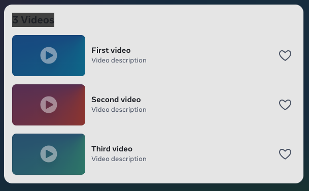
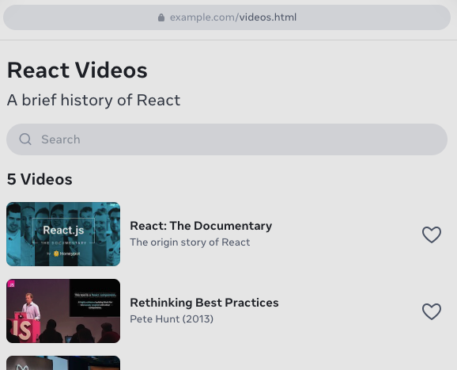
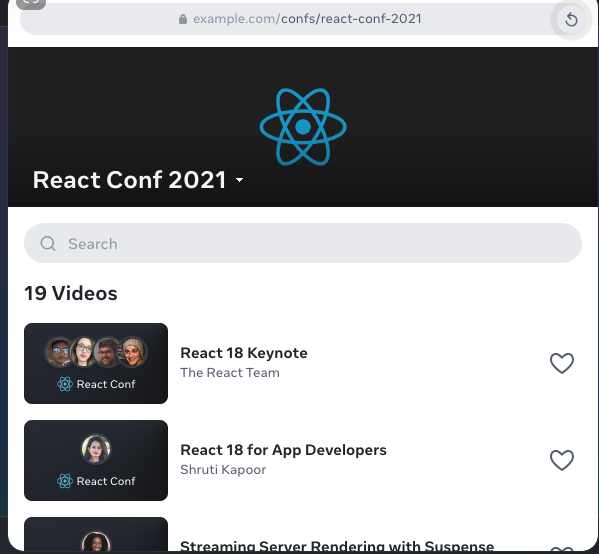

react v`18`.3.1

教程、参考、社区、博客。

用`组件`创`建`用户界`面`。

`React`让你可以通过组件来构建用户界面。
你可以创建像`Thumbnail`、`LikeButton`和`Video`这样的组件。
然后将它们`组`合成整个应用程序。

```js
// Video.js

function Video({ video }) {
  return (
    <div>
      <Thumbnail video={video} />

      <a href={video.url}>
        <h3>{video.title}</h3>
        <p>{video.description}</p>
      </a>

      <LikeButton video={video} />

    </div>
  )
}
```


无论你是独自工作还是与成千上万的其他开发人员合作，
使用react的感觉都是相同的。
它旨在让你轻松地组合由独立开发者、团队或组织编写的组件。

用代码和标签`编`写组件。

react组件是js函数。
想要有条件的现实一些内容吗？
使用`if`语句。

想要展示一个列表？
尝试使用数组的`map()`方法。学习react就是学习编程。

// VideoList.js
```js
function VideoList({ videos, emptyHeading }) {
  const count = videos.length;
  let heading = emptyHeading;

  if (count > 0) {
    const noun = count > 1 ? 'Videos' : 'Video';
    heading = count + ' ' + noun;
  }

  return (
    <section>
      <h2>{heading}</h2>
      {videos.map(video =>
        <Video key={video.id} video={video} />
      )}
    </section>
  )
}
```


这种标签语法被称为`jsx`。
它是由react推广的js语法扩展。
将jsx标签与相关的渲染逻辑放在一起，
使得创建、维护和删除react组件变得容易。


**在任何地方添加交互**
react组件接收数据并返回应该出现的屏幕上的内容。
你可以通过响应交互（例如用户输入）向它们传递新数据。
然后，react将更新屏幕以匹配新数据。

```js
// SearchableVideoList.js

import { useState } from 'react';

function SearchableVideoList({ videos }) {
  const [searchText, setSearchText] = useState('');
  const foundVideos = filerVideos(videos, searchText);

  return (
    <>

      <SearchInput
        value={searchText}
        onChange={newText => setSearchText(newText)} />

      <VideoList
        videos={foundVideos}
        emptyHeading={`No matches for "${searchText}"`} />

    </>
  );
}

```


你也可以不用react去构建整个页面，而只是将react添加到现有的html页面中，
在任何地方呈现交互式的react组件。

`</> 将react添加到你已有的页面中 >`


**使用框架进行全栈开发**

react是一个库。
它允许你将组件放在一起，
但不关注路由和数据获取。
要使用react构建整个应用程序，
我们建议使用像`next.js`或`remix`这样的全栈`react`框架。

```js
// confs/[slug].js
import { Suspense } from 'react';

async function ConferencePage({ slug }) {

  return (
    <ConferenceLayout conf={conf}>

      <Suspense fallback={ <TalkLoading /> }>
        <Talks confId={conf.id} />
      </Suspense>

    </ConferenceLayout>
  );
}

async function Talks({ confId }) {
  const talks = await db.Talks.findAll({ confId });
  const videos = talks.map(talk => talk.video);

  return <SearchableVideoList videos={videos} />
}
```


react也是一种`架构`。
实现它的框架可以再`服务`端甚至是构建阶段使用异步组件来获取数据，
也可以从文件或数据库读取数据，并将其传递给交互式组件。

`使用框架开始一个新项目`

**博采众长**

人们因为不同的原因偏好web应用或原生应用。
react让你使用相同的技能构建web应用程序和原生应用程序。
它依赖于每个平台独特的优势，使你的界面就像`原生`一样。

**不忘初心**
人们期望网页加载速度更快。
在服务器上，react可以让你在获取数据的同时可以流式传输html，
在任何js代码加载之前逐步填充剩余内容。
在客户端，即使是在渲染过程中，
react也会使用标准的web api使ui`快`速响应。

**开发真正的原生应用**
人们希望原生应用程序都有和自己使用的平台相一致的体验。
`react native`和`expo`让你可以使用react构建`android`、`ios`等应用程序。
它们的样式和体验都和原生应用程序一样，因为它们的用户界面是真正的`原生用户界面`。
这不是一个web试图————你的react组件由平台提供的真实android或ios试图来渲染。

使用react，你可以成为web和原生应用的开发人员。
你的团队可以在不牺牲用户体验的情况下发布到各个平台。
你的组织可以忽略平台差异，并拥有端到端的全部功能。

`为原生平台构建`

**充分测试，安心升级**
react非常谨慎地处理每个改动。
每个react提交都在拥有超过十亿用户的关键业务页面上进行测试。
meta的10万个react组件帮助验证每种迁移策略。

react团队始终在研究如何改进react。
一些研究需要数年才能得到回报。
react对将研究想法转化为生产具有高标准要求，只有经过证明的方法才能成为react的一部分。

`阅读更多react新闻`

**最新react新闻**

react compiler发布beta版本以及路线图。
October 21, 2024

回顾react conf 2024
May 22, 2024

react 19 rc
april 25,2024

react 19 rc 升级指南
April 25,2024

---

加入数百万人的社区

你并不孤单。
每个月有来自世界各地的两百万开发者访问react文档。
react可以让人们达成共识。

这就是为什么react不仅仅是一个库、一种架构，甚至不只是一个生态系统。
react是一个社区。
在这里你可以寻求帮助，
发现机会并结交新朋友。
你将会遇到开发者和设计师、初学者和专家、研究人员和艺术家、教师和学生等各行各业的人士。
我们的背景可能非常不同，
但react让我们所有人都能够共同创建用户界面。

欢迎来到react社区。
开始react之旅。

---

meta open source
copyright © meta, platforms, Inc.
uwu?

学习react
快速入门
安装
描述UI
添加交互
状态管理
脱围机制

api参考
react api
react dom api

社区
行为准则
团队
文档贡献者
鸣谢

了解更多
博客
react native
隐私政策
条框。

facebook
x
bsky
github