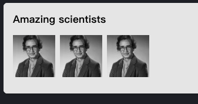
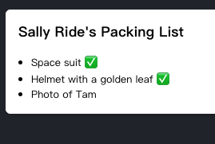
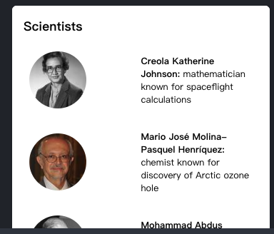
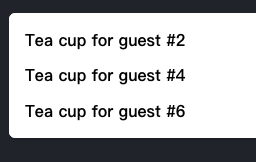
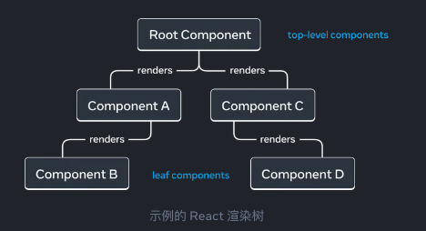

## 描述 UI

React 是一个用于构建用户界面（UI）的 JavaScript 库，用户界面由按钮、文本和图像等小单元内容构建而成。React帮助你把它们组合成可重用、可嵌套的组件。从 web端网站到移动端应用，屏幕上的所有内容都可以被分解成组件。在本章节中，你讲学习如何创建、定制以及有条件地显示 React 组件。

> 本章节

- [如何创建你的第一个组件](https://zh-hans.react.dev/learn/your-first-component)

- [在什么时候以及如何创建多文件组件](https://zh-hans.react.dev/learn/
importing-and-exporting-components)

- [如何使用JSX为JavaScript 添加标签](https://zh-hans.react.dev/learn/writing-markup-with-jsx)

- [如何在JSX中使用花括号来从组件中使用 JavaScript 功能](https://zh-hans.react.dev/learn/javascript-in-jsx-with-curly-braces)

- [如何用 props 配置组件](https://zh-hans.react.dev/learn/passing-props-to-a-component)

- [如何有条件地渲染组件](https://zh-hans.react.dev/learn/conditional-rendering)

- [如何在同一时间渲染多个组件](https://zh-hans.react.dev/learn/rendering-lists)

- [如果通过保持组件的纯粹性来避免令人困惑的错误](https://zh-hans.react.dev/learn/keeping-components-pure)

- [为什么将UI理解为树是有用的](https://zh-hans.react.dev/learn/understanding-your-ui-as-a-tree)

## 你的第一个组件

React 应用是由被称为 `组件` 的独立UI片段构建而成。React 组件本质上是可以任意添加标签的 JavaScript 函数。组件可以小到一个按钮，也可以大到是整个页面。这是一个 `Gallery` 组件，用于渲染三个 `Profile` 组件：

```js
// App.js
function Profile() {
  return (
    
  )
}

export default function Gallery() {
  return (
    <section>
      <h1>Amazing scientists</h1>
      <Profile />
      <Profile />
      <Profile />
    </section>
  )
}
```


## 想要仔细学习这个主题的内容吗？

请参阅 [你的第一个组件](https://zh-hans.react.dev/learn/your-first-component) 以学习如何声明并使用 React 组件

[阅读更多>](https://zh-hans.react.dev/learn/your-first-component)

## 组件的导入与导出

你可以在一个文件中声明许多组件，但文件的体积过大会变得难以浏览。为了解决这个问题，你可以在一个文件中只导出一个组件，然后再从另一个文件中导入该组件：

```js
// Profile.js
export default function Profile() {
  return (
    
  );
}
```

```js
// Gallery.js
import Profile from './Profile.js'

export default function Gallery() {
  return (
    <section>
      <h1>Amazing scientists</h1>
      <Profile />
      <Profile />
      <Profile />
    </section>
  )
}
```
想要仔细学习这个主题的内容吗？

请参阅 [组件的导入与导出](https://zh-hans.react.dev/learn/importing-and-exporting-components) 以学习如何切分组件。

[阅读更多>](https://zh-hans.react.dev/learn/importing-and-exporting-components)

## 使用 JSX 书写标签语言

每个 React 组件都是一个 JavaScript 函数，它可能包含一些标签，React 会将其渲染到浏览器中。React 组件使用一种叫做 JSX 的语法扩展来表示该标签。JSX 看起来很像 HTML， 但它更为严格，可以显式动态信息。

如果我们把现有的 HTML 标签粘贴到 React 组件中，它并不一定能成功运行：

```js
// App.js

export default function TodoList() {
  return (
    // This doesn't quite work!
    <h1>Hedy Lamarr's Todos</h1>
    
    <ul>
      <li>Invent new traffic lights
      <li>Rehearse a movie scene
      <li>Improve spectrum technology
    </ul>
  );
}
```
```js
// Error

/src/App.js: Adjacent JSX elements must be wrapped in an enclosing tag. Did you want a JSX fragment <>...</>? (5:4)

// This doesn't quite work!
<h1>Hedy Lamarr's Todos</h1>

      <h1>Hedy Lamarr's Todos</h1>
      
      <ul>
        <li>Invent new traffic lights</li>
        <li>Rehearse a movie scene</li>
        <li>Improve spectrum technology</li>
      </ul>
    </>
  );
}
```


想要仔细学习这个主题的内容吗？

请参阅 [使用 JSX 书写标签语言](https://zh-hans.react.dev/learn/writing-markup-with-jsx) 以学习如何编写有效的 JSX。

[阅读更多>](https://zh-hans.react.dev/learn/writing-markup-with-jsx)

## 在 JSX 中通过大括号使用 JavaScript

JSX 可以让你在 JavaScript 文件中编写类似 HTML 的标签语法，使渲染逻辑和内容展示维护在同一个地方。有时你会想在标签中添加一点 JavaScript 逻辑或引用一个动态属性。在这种情况下，你可以在 JSX 中使用花括号来为 JavaScript“开辟通道”：

```js
// App.js

const person = {
  name: 'Gregor io Y. Zara',
  theme: {
    backgroundColor: 'black',
    color: 'pink'
  }
};

export default function TodoList() {
  return (
    <div style={person.theme}>
      <h1>{person.name}'s Todos</h1>
      
      <ul>
        <li>Improve the videophone</li>
        <li>Prepare aeronautics lectures</li>
        <li>Work on the alcohol-fuelled engine</li>
      </ul>
    </div>
  );
}
```


想要仔细学习这个主题的内容吗？

请参阅 [在 JSX 中通过大括号使用 JavaScript](https://zh-hans.react.dev/learn/javascript-in-jsx-with-curly-braces)以学习如何从JSX中访问 JavaScript 数据。

[阅读更多>](https://zh-hans.react.dev/learn/javascript-in-jsx-with-curly-braces)

## 将 Props 传递给组件

`React`组件使用 props 来进行组件之间的通讯。每个父组件都可以通过为子组件提供 props 的方式来传递信息。 `props`可能会让你想起 HTML 属性，但你可以通过它们传递任何 JavaScript 的值，包括对象、数组、函数、甚至是JSX！

```js
// utils.js

export function getImageUrl(person, size = 's') {
  return (
    'https://i.imgur.com/' +
    person.imageId +
    size +
    '.jpg'
  );
}
```

```js
// App.js
import { getImageUrl } from './utils.js'

export default function Profile() {
  return (
    <Card>
      <Avatar
        size={100}
        person={{
          name: 'Hedy Lamarr',
          imageId: 'QIrZWGIs'
        }}
      />
    </Card>
  )
}

function Avatar({ person, size }) {
  return (
    
  );
}
```


想要仔细学习这个主题的内容吗？

请参阅[将 Props 传递给组件](https://zh-hans.react.dev/learn/passing-props-to-a-component)以了解如何传递并读取 props。
[阅读更多>](https://zh-hans.react.dev/learn/passing-props-to-a-component)

## 条件渲染

你的组件经常需要根据不同的条件来显示不同的东西。在 React 中，你可以使用 JavaScript 语法，如`if`语句、`&&`和`?:`操作符有条件地渲染 JSX。

在这个示例中，JavaScript 的 `&&` 操作符将会有条件渲染一个复选标签：

```js
function Item({ name, isPacked }) {
  return (
    <li className="item">
      {name} { isPacked && '✅'}
    </li>
  );
}

export default function PackingList() {
  return (
    <section>
      <h1>Sally Ride's Packing List</h1>
      <ul>
        <Item
          isPacked={true}
          name="Space suit"
        />
        <Item
          isPacked={true}
          name="Helmet with a golden leaf"
        />
        <Item
          isPacked={false}
          name="Photo of Tam"
        />
      </ul>
    </section>
  )
}
```


想要仔细学习这个主题的内容吗？

请参阅 [条件渲染](https://zh-hans.react.dev/learn/conditional-rendering) 以学习使用不同的方法对内容进行条件渲染。

[阅读更多>](https://zh-hans.react.dev/learn/conditional-rendering)

## 渲染列表

通常，你需要根据数据集合来渲染多个较为类似的组件。你可以在 React 中使用 JavaScript 的 `filter()`和`map()`来实现数据的过滤和转换，将数据数组转换为组件数组。

对于数组的每个元素项，你需要指定一个`key`。通常你需要使用数据库中的ID作为`key`。即使列表发生了变化，React 也可以通过key来跟踪每个元素在列表中的位置。

```js
// utils.js
export function getImageUrl(person) {
  return (
    'https://i.imgur.com/' +
    person.imageId +
    's.jpg'
  );
}
```

```js
// data.js
export const people = [{
  id: 0,
  name: 'Creola Katherine Johnson',
  profession: 'mathematician',
  accomplishment: 'spaceflight calculations',
  imageId: 'MK3eW3A'
}, {
  id: 1,
  name: 'Mario Jose Molina-Pasquel Henriquez',
  profession: 'chemist',
  accomplishment: 'discovery of Arctic ozone hole',
  imageId: 'mynHUSa'
}, {
  id: 2,
  name: 'Mohammad Abdus Salam',
  profession: 'physicist',
  accomplishment: 'electromagnetism theory',
  imageId: 'bE7W1ji'
}, {
  id: 3,
  name: 'Percy Lavon Julian',
  profession: 'chemist',
  accomplishment: 'pioneering cortisone drugs, steroids and birth control pills',
  imageId: 'IOjWm71'
}, {
  id: 4,
  name: 'Subrahmanyan Chandrasekhar',
  profession: 'astrophysicist',
  accomplishment: 'white dwarf star mass calculations',
  imageId: 'lrWQx8l'
}];
```

```js
// App.js
export default function List() {
  const listItems = people.map(person =>
    <li key={person.id}>
      
      <p>
        <b>{person.name}</b>
        {' ' + person.profession + ' '}
        known for {person.accomplishment}
      </p>
    </li>
  );

  return (
    <article>
      <h1>Scientists</h1>
      <ul>{ listItems }</ul>
    </article>
  )
}
```


想要仔细学习这个主题的内容吗？

请参阅 [渲染列表](https://zh-hans.react.dev/learn/rendering-lists) 以学习如何渲染一个组件列表，以及如何选择一个`key`、

[阅读更多>](https://zh-hans.react.dev/learn/rendering-lists)

## 保持组件纯粹

有些 JavaScript 函数是 纯粹 的。纯函数的基本定义：

- `只负责自己的任务`。它不会更改在该函数调用前就已存在的对象或变量。

- `输入相同，输出也相同`。在输入相同的情况下，对纯函数来说应总是返回相同的结果。

严格遵循纯函数的定义编写组件，可以让代码库体量增长时，避免一些令人困惑的错误和不可预测的行为。下面是一个非纯函数组件的示例：

```js
let guest = 0;

function Cup() {
  // Bad: changing a preexisting variable!
  guest = guest + 1;
  return <h2>Tea cup for guest #{guest}</h2>
}

export default function TeaSet() {
  return (
    <>
      <Cup />
      <cup />
      <cup />
    </>
  )
}
```


你可以通过传递一个`props`来使这个组件变得纯粹，而非修改已经存在的变量：

```js
// App.js
function Cup({ guest }) {
  return <h2>Tea cup for guest #{guest}</h2>;
}

export default function TeaSet() {
  return (
    <>
      <Cup guest={1} />
      <Cup guest={2} />
      <Cup guest={3} />
    </>
  )
}

```


想要仔细学习这个主题的内容吗？

请参阅 [保持组件纯粹](https://zh-hans.react.dev/learn/keeping-components-pure) 以学习如何将组件写成纯粹且可预测的函数。

[阅读更多>](https://zh-hans.react.dev/learn/keeping-components-pure)

## 将 UI 视为树

React 使用树形关系建模以展示组件和模块之间的关系。

React 渲染树是组件之间父子关系的表示。



构建工具经常使用依赖树来捆绑客户端下载和渲染所需的所有 JavaScript 代码。对于 React 应用程序，打包大小会导致用户体验退化。了解模块依赖树有助于调试此类问题。

想要仔细学习这个主题的内容吗？

阅读 [将UI视为树](https://zh-hans.react.dev/learn/understanding-your-ui-as-a-tree) 以了解如何为 React 应用程序创建渲染和模块依赖树，以及它们如何成为有效改善用户体验和性能的心理模型。

[阅读更多>](https://zh-hans.react.dev/learn/understanding-your-ui-as-a-tree)

## 接下来应该......

请访问[你的第一个组件](https://zh-hans.react.dev/learn/your-first-component)这个章节并开始阅读！

如若你已熟悉这些主题，可直接阅读[添加交互](https://zh-hans.react.dev/learn/adding-interactivity)一节。