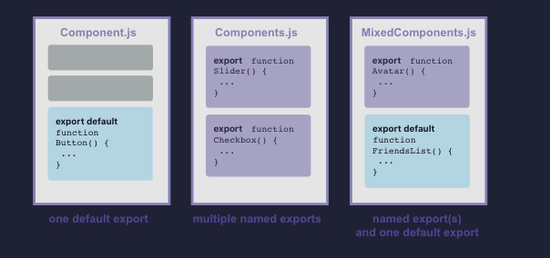

## 组件的导入与导出

组件的神奇之处在于它们的可重用性：你可以创建一个由其他组件构成的组件。但当你嵌套了越来越多的组件时，则需要将它们拆分成不同的文件。这样可以使得查找文件更加容易，并且能在更多地方复用这些组件。

你将会学习到

- 何为根组件

- 如何导入和导出一个组件

- 何时使用默认和具名导入导出

- 如何在一个文件中导入导出多个组件

- 如何将组件拆分成多个文件

## 根组件文件

在[`你的第一个组件`](https://zh-hans.react.dev/learn/your-first-component)中，你创建了一个`Profile`组件，并且渲染在`Gallery`组件里。

```js
// App.js
function Profile() {
  return (
    "
    />
  )
}

export default function Gallery() {
  return (
    <section>
      <h1>了不起的科学家们</h1>
      <Profile />
      <Profile />
      <Profile />
    </section>
  )
}
```


在此示例中，所有组件目前都定义在 `根组件 App.js` 文件中。具体还需根据项目配置决定，有些组件可能会声明在其他文件中。如果你使用的框架基于文件进行路由，如`Next.js`，那你每个页面的根组件都会不一样。

## 导出和导入一个组件

如果将来需要在首页添加关于科学书籍的列表，亦或者需要将所有的资料信息移动到其他文件。这时将`Gallery`组件和`Profile`组件移除根组件文件会更加合理。这会使组件更加模块化，并且可在其他文件中复用。你可以根据以下三个步骤对组件进行拆分：

1、`创建` 一个新的JS文件来存放该组件。

2、`导出`该文件中的函数组件（可以使用[`默认导出`](https://developer.mozilla.org/en-US/docs/Web/JavaScript/Reference/Statements/export#using_the_default_export)或[`具名导出`](https://developer.mozilla.org/en-US/docs/Web/JavaScript/Reference/Statements/import#import_a_single_export_from_a_module)）

3、在需要使用该组件的文件中 `导入` （可以根据相应的导出方式使用[默认导入](https://developer.mozilla.org/en-US/docs/Web/JavaScript/Reference/Statements/import#importing_defaults)或者[具名导入](https://developer.mozilla.org/en-US/docs/Web/JavaScript/Reference/Statements/import#import_a_single_export_from_a_module)）。

这里将`Profile`组件和`Gallery`组件，从`App.js`文件中移动到`Gallery.js`文件中。修改后，即可在`App.js`中导入`Gallery.js`中的`Gallery`组件：

```js
// Gallery.js
function Profile() {
  return (
    "
    />
  )
}

export default function Gallery() {
  return (
    <section>
      <h1>了不起的科学家们</h1>
      <Profile />
      <Profile />
      <Profile />
    </section>
  )
}
```

```js
// App.js
import Gallery from './Gallery.js';

export default function App() {
  return (
    <Gallery />
  )
}
```


该实例中需要注意的是，如果将组件拆分成两个文件：

1、`Gallery.js`:

- 定义了 `Profile` 组件，该组件仅在该文件内使用，没有被导出。

- 使用 `默认导出` 的方式，将`Gallery`组件导出。

2、`App.js`:

- 使用`默认导入`的方式，从`Gallery.js`中导入`Gallery`组件。

- 使用`默认导出`的方式，将根组件`App`导出。

> 注意

引入过程中，你可能会遇到一些文件并未添加`.js`文件后缀，如下所示：

```js
import Gallery from './Gallery';
```

无论是`'./Gallery.js'`还是`'./Gallery'`，在`React`里都能正常使用，只是前者更符合[`原生ES模块`](https://developer.mozilla.org/en-US/docs/Web/JavaScript/Guide/Modules)。

》 深入探讨

`默认导出`vs`具名导出`

显示更多

这是 JavaScript 里两个主要用来导出值的方式：默认熬出和具名导出。到目前为止，我们的示例中只用到了默认导出。但你可以再一个文件中，选择使用其中一种，或者两种都使用。`一个文件里有且仅有一个 默认导出，但是可以有任意多个 具名导出`。



组件的导出方式决定了其导入方式。当你用默认导入的方式，导入具名导出的组件时，就会报错。如下表格可以帮你更好地理解它们：

| 语法 | 导出语句 | 导入语句 |
| --- | --- | --- |
| 默认 | `export default function Button() {}` | `import Button from './Button.js;` |
| 具名 | `export function Button() {}` | `import { Button } from './Button.js;` |

当使用默认导入时，你可以在`import`语句后面进行任意命名。比如`import Banana from './Button.js'`, 如此你能获得与默认导出一致的内容。相反, 对于具名导入，导入和导出的名字必须一致。这也是称其为`具名`导入的原因！

`通常，文件中仅包含一个组件时，人们会选择默认导出，而当文件中包含多个组件或某个值需要导出时，则会选择具名导出。`无论选择哪种方式，请记得给你的组件和相应的文件命名一个有意义的名字。我们不建议创建未命名的组件，比如`export default () => {}`，因为这样会使得调试变得异常困难。

## 从同一文件中导出和导入多个组件

如果你只想展示一个`Profile`组，而不展示整个图集。你也可以导出`Profile`组件。但`Gallery.js`中已包含`默认导出`，此时，你不能定义`两个`默认导出。但你可以将其在新文件中进行默认导出，或者将`Profile`进行具名导出。同一文件中，有且仅有一个默认导出，但可以有多个具名导出！

> 注意

为了减少在默认导出和具名导出之间的混淆，一些团队会选择只使用一种风格（默认或者具名），或者禁止在单个文件内混合使用。这因人而异，选择最适合你的即可！

首先，用具名导出的方式，将Profile组件从Gallery.js导出（不使用default关键字）：

```js
export function Profile() {
  // ...
}
```
接着，用具名导入的方式，将 Profile 组件从 Gallery.js 导出（不使用 default 关键字）：

```js
export function Profile() {
  // ...
}
```
接着，用具名导入的方式，从`Gallery.js`文件中导入`Profile`组件（用大括号）：
```js
import { Profile } from './Gallery.js';
```
最后，在`App`组件里渲染`<Profile />`:
```js
export default function App() {
  return <Profile />;
}
```
现在，`Gallery.js`包含两个导出：一个是默认导出的 Gallery，另一个是具名导出的 Profile。App.js 中均导入了这两个组件。尝试将 <Profile /> 改成 <Gallery />，回到示例中：

```js
// App.js
import Gallery from './Gallery.js';
import { Profile } from './Gallery.js';

export default function App() {
  return (
    <Profile />
  );
}
```

```js
// Gallery.js

export function Profile() {
  return (
    
  );
}

export default function Gallery() {
  return (
    <section>
      <h1>了不起的科学家们</h1>
      <Profile />
      <Profile />
      <Profile />
    </section>
  )
}
```

示例中混合使用了默认导出和具名导出：

- `Gallery.js`:
  - 使用`具名导出`的方式，将`Profile`组件导出，并取名为`Profile`。
  - 使用`默认导出`的方式，将`Gallery`组件导出。

- `App.js`：
  - 使用`具名导入`的方式，从`Gallery.js`中导入`Profile`组件，并取名为`Profile`。
  - 使用`默认导入`的方式，从`Gallery.js`中导入`Gallery`组件。
  - 使用`默认导出`的方式，将根组件App导出。

## 摘要

在本章节中，你学到了：

- 何为根组件
- 如何导入和导出一个组件
- 何时和如何使用默认和具名导入导出
- 如何在一个文件里导出多个组件

## 尝试一些挑战

`第1个挑战 共1个挑战：进一步拆分组件`

现在，`Gallery.js`同时导出了`Profile`和`Gallery`，这会让人感到有点混淆。

尝试将 Profile 组件移动到 Profile.js 文件中，然后更新 App 组件，依次渲染 <Profile /> 和 <Gallery />。

你也许会使用默认导出或者具名导出的方式，来导出`Profile`组件，但请保证在`App.js`和`Gallery.js`里使用相应的导入语句！具体可以参考下面的表格：

| 语法 | 导出语句 | 导入语句 |
| --- | --- | --- |
| 默认 | `export default function Button() {}` | `import Button from './Button.js';` |
| 具名 | `export function Button() {}` | `import { Button } from './Button.js;` |

```js
// App.js
import Gallery from './Gallery.js';

export default function App() {
  return (
    <div>
      <Gallery />
    </div>
  )
}
```

```js
// Gallery.js
import Profile from './Profile.js';

export default function Gallery() {
  return (
    <section>
      <h1>了不起的科学家们</h1>
      <Profile />
      <Profile />
      <Profile />
    </section>
  )
}
```

```js
// Profile.js
export default function Profile() {
  return (
    
  );
}
```

效果:


当你使用其中一种导出方式完成以上任务后，请尝试使用另一种导出方式实现。