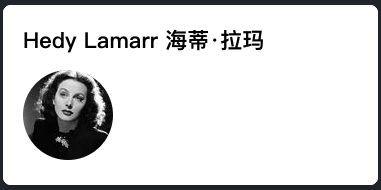
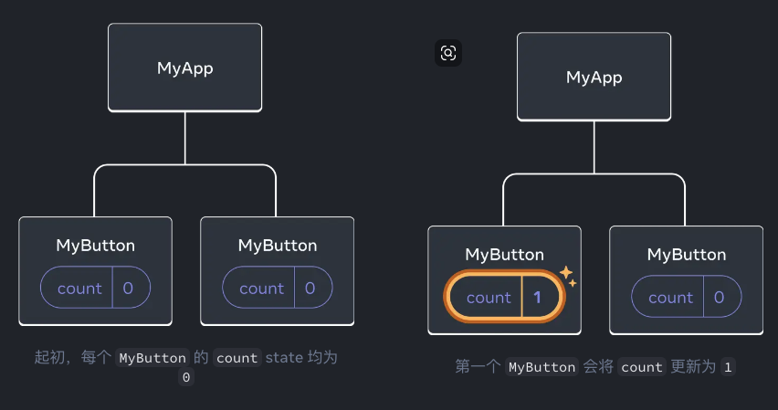

学习react

快速入门

欢迎来到react文档！
本章节将介绍你每天都会使用的`80%`的react概念。

你将会学习到

- 如何`创`建和`嵌`套组件

- 如何`添`加标签和`样式`

- 如何`显`示`数据`

- 如何`渲`染`条件`和`列表`

- 如何对事件做出`响应`并`更`新界面

- 如何在组件间`共享`数据

`创`建和`嵌`套组件

react应用程序是由`组件`组成的。
一个组件是`UI（用户界面）`的一部分，
它拥有自己的逻辑和外观。
组件可以小到一个按钮，
也可以大到整个页面。

react组件是`返`回`标签`的`js`函数：
```js
function MyButton() {
  return (
    <button>I'm a button</button>
  );
}
```
至此，你已经声明了`MyButton`，
现在把它嵌套到另一个组件中：
```js
export default function MyApp() {
  return (
    <div>
      <h1>Welcome to my app</h1>
      <MyButton />
    </div>
  )
}
```
你可能已经注意到`<MyButton />`是以大写字母开头的。
你可以据此识别react组件。
`react`组件必须以`大写`字母`开头`，
而`html`标签则必须是`小写`字母。

来看下效果：

```js
// App.js
function MyButton() {
  return (
    <button>
      I'm a button
    </button>
  );
}

export default function MyApp() {
  return (
    <div>
      <h1>Welcome to my app</h1>
      <MyButton />
    </div>
  )
}
```


`export default`关键字指定了文件中的主要组件。
如果你对js某些语法不熟悉，
可以参考[`mdn`](https://developer.mozilla.org/zh-CN/docs/Web/JavaScript/Reference/Statements/export)和[`javascript.info`](https://javascript.info/import-export)。

**使用jsx编写标签**

上面所使用的标签语法被称为`jsx`。
它是可选的，
但大多数react项目会使`用jsx`，
主要是它很方便。
所有我们推荐的本地开发工具都开箱即用地支持jsx。

jsx比html更加严格。
你必须闭合标签，如`<br />`。
你的组件也不能返回多个jsx标签。
你必须将它们包裹到一个共享的父级中，
比如`<div>...</div>`或使用空的`<>...</>`包裹:
```js
function AboutPage() {
  return (
    <>
      <h1>About</h1>
      <p>Hello there.<br />How do you do?</p>
    </>
  );
}
```
如果你有大量的html需要移植到jsx中，
你可以使用[在线转换器](https://transform.tools/html-to-jsx)。

**添加样式**

在react中，
你可以使用`className`来指定一个css的class。
它与html的class属性的工作方式相同：
```js

```
然后，你可以再一个单独的css文件中为它编写css规则：
```js
/* In your CSS */
.avatar {
  border-radius: 50%;
}
```

react并没有规定你如何添加css文件。
最简单的方式使用html的`<link>`标签。
如果你使用了构建工具或框架，请阅读其文档来了解如何将css文件添加到你的项目中。

**显示数据**

jsx会让你把标签放到js中。
而大括号会让你”回到“js中，
这样你就可以从你的代码中嵌入一些变量并展示给用户。
例如，
这将显示`user.name`：
```js
return (
  <h1>
    {user.name}
  </h1>
);
```
你还可以将jsx属性”转义到js“，
但你必须使用大括号而非引号。
例如，
`className="avatar"`是将`”avatar“`字符串传递给`className`，
作为css的class。
但`src={user.imageUrl}`会读取js的`user.imageUrl`变量，
然后将该值作为`src`属性传递：
```js
return (
  
);
```
你也可以把更为复杂的表达式放入jsx的大括号内，例如`字符串拼接`：
```js
// App.js

const user = {
  name: 'Hedy Lamarr',
  imageUrl: 'https://i.imgur.com/yXOvdOSs.jpg',
  imageSize: 90,
};

export default function Profile() {
  return (
    <>

      <h1>{user.name}</h1>
      
    </>
  );
}
```


在上面示例中，`style={{}}`并不是一个特殊的语法，
而是`style={}`jsx大括号内的一个普通`{}对象`。
当你的样式依赖于js变量时，
你可以使用`style`属性。

**条件渲染**

react没有特殊的语法来编写条件语句，
因此你使用的就是普通的js代码。
例如使用`if`语句根据条件引入jsx：
```js
let content;

if (isLoggedIn) {
  content = <AdminPanel />;
} else {
  content = <LoginForm />;
}

return (
  <div>
    {content}
  </div>
);
```
如果你喜欢更为紧凑的代码，
可以使用`条件？运算符`。
与`if`不同的是，
它工作与`jsx内`部：
```js
<div>
  {isLoggedIn ? (
    <AdminPanel />
  ) : (
    <LoginForm />
  )}
</div>
```
当你不需要`else`分支时，你也可以使用更简短的`逻辑&&语法`:
```js
<div>
  { isLoggedIn && <AdminPanel /> }
</div>
```
所有这些方法也适用于有条件地指定属性。
如果你对js语法不熟悉，
你可以先使用`if...else`。

**渲染列表**

你将依赖js的特性，例如`for`循环和`array的map()函数`来渲染组件列表。

假设你有一个产品数组：
```js
const products = [
  { title: 'Cabbage', id: 1 },
  { title: 'Garlic', id: 2 },
  { title: 'Apple', id: 3 },
];
```
在你的组件中，使用`map()`函数将这个数组转换为`<li>`标签构成的列表：
```js
const listItems = products.map(product =>
  <li key={product.id}>
    {product.title}
  </li>
);

return (
  <ul>{listItems}</ul>
);
```
注意，
`<li>`有一个`key`属性。
对于列表中的每一个元素，
你都应该传递一个字符串或者数字给`key`，
用于在其兄弟节点中唯一标识该元素。
通常key来自你的数据，
比如数据库中的id。

如果你在后续插入、删除或重新排序这些项目，
react将依靠你提供的key来思考发生了什么。

```js
// App.js
const products = [
  { title: 'Cabbage', isFruit: false, id: 1 },
  { title: 'Garlic', isFruit: false, id: 2 },
  { title: 'Apple', isFruit: true, id: 3 },
];

export default function ShoppingList() {
  const listItems = products.map(product =>
    <li
      key={product.id}
      style={{
        color: product.isFruit ? 'magenta' : 'darkgreen'
      }}
    >
      {product.title}
    </li>
  );

  return (
    <ul>{listItems}</ul>
  );
}
```


**响应事件**

你可以通过在组件中声明事件处理函数来响应事件：
```js
function MyButton() {
  function handleClick() {
    alert('You clicked me!');
  }

  return (
    <button onClick={handleClick}>
      Click me
    </button>
  )
}
```

注意，
`onClick={handleClick}`的结尾没有小括号！
不要调用事件处理函数：
你只需`把函数传递给事件`即可。
当用户点击按钮时，
react会调用你传递的事件处理函数。

**更新界面**

通常你会希望你的组件”记住“一些信息并展示出来，
比如一个按钮被点击的次数。
要做到这一点，你需要在你的组件中添加`state`。

首先，
从react引入`useState`：
```JS
IMPORT { useState } from 'react';
```

现在你可以在你的组件中声明一个state变量：
```js
function MyButton() {
  const [count, setCount] = useState(0);
  // ...
}
```
你将从`useState`中获得两样东西：
当前的`state(count)`，
以及用于更新它的函数（`setCount`）。

你可以给它们起任何名字，
但按照惯例会像`[something, setSomething]`这样为它们命名。

第一次显示按钮时，
`count`的值为`0`，
因为你把`0`传给了`useState()`。
当你想改变`state`时，
调用`setCount()`并将新的值传递给它。
点击该按钮计数器将递增：
```js
function MyButton() {
  const [count, setCount] = useState(0);

  function handleClick() {
    setCount(count + 1);
  }

  return (
    <button onClick={handleClick}>
      Clicked {count} times
    </button>
  );
}
```

react将再次调用你的组件函数。
第一次count变成1。
接着点击会变成2。
继续点击会逐步递增。

如果你多次渲染同一个组件，
每个组件都会拥有自己的`state`。

你可以尝试点击不同的按钮：
```js
import { useState } from 'react';

export default function MyApp() {
  return (
    <div>
      <h1>Counters that update separately</h1>
      <MyButton />
      <MyButton />
    </div>
  );
}

function MyButton() {
  const [count, setCount] = useState(0);

  function handleClick() {
    setCount(count + 1);
  }

  return (
    <button onClick={handleClick}>
      Clicked { count } times
    </button>
  )
}
```


**使用hook**

以`use`开头的函数被称为`hook`。
`useState`是react提供的一个内置hook。
你可以在[`react api 参考`](https://zh-hans.react.dev/reference/react)中找到其他内置的hook。
你有可以通过组合现有的hook来编写属于你自己的hook.

hook比普通函数更为严格。
你只能在你的组件（或其他hook）的`顶`层`调`用hook。
如果你想在`一个条件或循环`中使用`useState`，
请`提`取一个`新`的`组件`并在组件内部使用它。

**组件间共享数据**

在前面的示例中，
每个`MyButton`都有自己独立的`count`，
当每个按钮被点击时，
只有被点击按钮的`count`才会发生改变：



起初，MyApp的count state为0并传递给了两个子组件。

点击后，MyApp将count state更新为1，并将其传递给两个子组件。

此刻，
当你点击任何一个按钮时，
MyApp中的count都将改变，
同时会改变MyButton中的两个count。

具体代码如下：

首先，将`MyButton`的state上移到MyApp中：

```js
export default function MyApp() {
  const [count, setCount] = useState(0);

  function handleClick() {
    setCount(count + 1);
  }

  return (
    <div>
      <h1>Counters that update separately</h1>
      <MyButton />
      <MyButton />
    </div>
  )
}

function MyButton() {
  // ... we're moving code from here ...
}
```

接着，
将`MyApp`中的点击事件处理函数以及state一同向下传递到每个MyButton中。
你可以使用jsx大括号向MyButton传递信息。
就像之前向等内置标签所做的那样：

```js
export default function MyApp() {
  const [count, setCount] = useState(0);

  function handleClick() {
    setCount(count + 1);
  }

  return (
    <div>
      <h1>Counters that update together</h1>
      <MyButton count={count} onClick={handleClick} />
      <MyButton count={count} onClick={handleClick} />
    </div>
  );
}
```


下一节

至此，你已经了解了如何编写react代码的基本知识。

接下来你可以查看实战教程并把它们付诸实践，
用react建立第一个迷你应用程序。

---

## 概览

## 创建和嵌套组件

## 使用jsx编写标签

## 添加样式

## 显示数据

## 条件渲染

## 渲染列表

## 响应事件

## 更新界面

## 使用Hook

## 组件间共享数据
