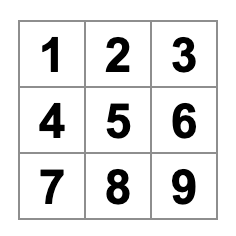
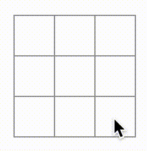
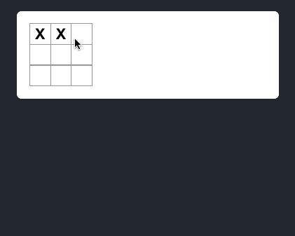

目录

## 概览
### 实现的是什么程序？

## 配置

## 概览
  ## 看一下刚刚的代码
  ## 构建棋盘
  ## 通过props传递数据
  ## 创建一个具有交互性的组件
  ## react开发者工具

## 完成这个游戏
  ## 状态提升
  ## 为什么不变性很重要
  ## 交替落子
  ## 宣布获胜者

## 添加时间旅行
  ## 存储落子历史
  ## 再一次“状态提升”
  ## 显示过去的落子
  ## 选择key
  ## 实现时间旅行
  ## 最后清理
  ## 收尾

---

学习React 快速入门

# 教程：井字棋游戏

本教程将引导你逐步实现一个简单的井字棋游戏，
并且不需要你对React有任何了解。
在此过程中你会学习到一些编写react程序的基本知识，
完全理解它们可以让你对react有比较深入的理解。

> 注意：
> 本教程专为喜欢 理论与实战相结合 以及希望快速看到成果的人而设计。
> 如果你喜欢逐步学习每个概念，
> 请从描述UI开始。

教程分成以下几个部分：

- `配置`是一些准备工作。

- `概览`介绍了react的基础知识：组件、props和state。

- `完成游戏`介绍了react开发中 最常用的技术。

- `添加“时间旅行”`可以让你更深入地了解react的独特优势。

### 实现的是什么程序？

本教程将使用React实现一个交互式的井字棋游戏。

你可以在下面预览最终成果：

```js
// App.js

function Square({ value, onSquareClick }) {
  return (
    <button className="square" onClick={onSquareClick}>
      {value}
    </button>
  );
}

function Board({ xIsNext, squares, onPlay }) {
  function handleClick(i) {
    const nextSquares = squares.slice();
    if (xIsNext) {
      nextSquares[i] = 'X';
    } else {
      nextSquares[i] = 'O';
    }
    onPlay(nextSquares);
  }

  return (
    <>
      <div className="board-row">
        <Square value={squares[0]} onSquareClick={() => handleClick(0)} />
        <Square value={squares[1]} onSquareClick={() => handleClick(1)} />
        <Square value={squares[2]} onSquareClick={() => handleClick(2)} />
      </div>
      <div className="board-row">
        <Square value={squares[3]} onSquareClick={() => handleClick(3)} />
        <Square value={squares[4]} onSquareClick={() => handleClick(4)} />
        <Square value={squares[5]} onSquareClick={() => handleClick(5)} />
      </div>
      <div className="board-row">
        <Square value={squares[6]} onSquareClick={() => handleClick(6)} />
        <Square value={squares[7]} onSquareClick={() => handleClick(7)} />
        <Square value={squares[8]} onSquareClick={() => handleClick(8)} />
      </div>
    </>
  )
}

function calculateWinner(squares) {
  const lines = [
    [0, 1, 2],
    [3, 4, 5],
    [6, 7, 8],
    [0, 3, 6],
    [1, 4, 7],
    [2, 5, 8],
    [0, 4, 8],
    [2, 4, 6],
  ];
  for (let i = 0; i < lines.length; i++) {
    const [a, b, c] = lines[i];
    if (squares[a] && squares[a] === squares[b] && squares[a] === squares[c]) {
      return squares[a];
    }
  }
  return null;
}

export default function Game() {
  const [history, setHistory] = useState([Array(9).fill(null)]);
  const [currentMove, setCurrentMove] = useState(0);
  // x 打头阵
  const xIsNext = currentMove % 2 === 0;
  const currentSquares = history[currentMove];

  function handlePlay(nextSquares) {
    const nextHistory = [...history.slice(0, currentMove + 1), nextSquares];
    setHistory(nextHistory);
    setCurrentMove(nextHistory.length - 1);
  }

  return (
    <div className="game">
      <div className="game-board">
        <Board xIsNext={xIsNext} squares={currentSquares} onPlay={handlePlay} />
      </div>
      <div className="game-info">

      </div>
    </div>
  )
}
```

// styles.css
```css
* {
  box-sizing: border-box
}

body {
  font-family: sans-serif;
  margin: 20px;
  padding: 0;
}

h1 {
  margin-top: 0;
  font-size: 22ox;
}

h2 {
  margin-top: 0;
  font-size: 20px;
}

h3 {
  margin-top: 0;
  font-size: 18px;
}

h4 {
  margin-top: 0;
  font-size: 16px;
}

h5 {
  margin-top: 0;
  font-size: 14px;
}

h6 {
  margin-top: 0;
  font-size: 12px;
}

code {
  font-size: 1.2em;
}

ul {
  padding-inline-start: 20px;
}

* {
  box-sizing: border-box;
}

body {
  font-family: sans-serif;
  margin: 20px;
  padding: 0;
}

.square {
  background: #fff;
  border: 1px solid #999;
  float: left;
  font-size: 24px;
  font-weight: bold;
  line-height: 34px;
  height: 34px;
  margin-right: -1px;
  margin-top: -1px;
  padding: 0;
  text-align: center;
  width: 34px;
}

.board-row:after {
  clear: both;
  content: '';
  display: table;
}

.status {
  margin-bottom: 10px;
}

.game {
  display: flex;
  flex-direction: row;
}

.game-info {
  margin-left: 20px;
}
```

`npx create-react-app my-app`
创建的路程英文：
```js
creating a new react app in 路径

react
react-dom
react-scripts
cra-template


core-js postinstall

core-js-pure postinstall

node -e "try{require('./postintall')}catch(e){}"

+ cra-template@1.2.0
+ react-scripts@5.0.1
+ react-dom@18.3.1
+ react@18.3.1
added 1516 packages from 657 contributors in 334.721s

259 packages are looking for funding
run `npm fund` for details

Initialized a git repository.

Installing template dependencies using npm...

Created git commit.

Success! Created react-dom-pratice at 路径
Inside aht directory, you can run several commands:

npm start
  Starts the development server.

npm run build
  Bundles the app into static files for production.

npm test
  Starts the test runner.

npm run eject
  Removes this tool and copies build dependencies, configuration files and scripts into the app directory.If you do this, you can't go back!

We suggesst that you begin by typing:

  cd react-dom-pratice
  npm start

Happy hacking!
```


如果你还不是很明白上面的代码，
不用担心！

本教程的目的就是帮你理解react及其语法。

我们建议你在继续本教程之前，
先看看上面的井字棋游戏。
我们会注意到的一项功能是，
棋盘右侧有一个编号列表，
它记录了游戏中落子的历史，
并随着游戏的进行而更新。

体验完游戏以后，
继续阅读本教程吧！
我们将从一个更简单的模板开始。
下一步将介绍相关配置，
以便于你着手实现这个游戏。

---

## 井字棋第一步

```js

import './App.css';
import { useState } from 'react';

function Square({ value, onSquareClick }) {
  return (
    <button className="square" onClick={onSquareClick}>
      {value}
    </button>
  )
}

function Board({ xIsNext, squares, onPlay }) {

  function handleClick(i) {
    console.log(calculateWinner(squares));
    if (calculateWinner(squares) || squares[i]) return;

    const nextSquares = squares.slice();
    console.log(nextSquares);
    if (xIsNext) {
      nextSquares[i] = "X";
    } else {
      nextSquares[i] = "O";
    }
    onPlay(nextSquares);
  }

  return (
    <>
      <div className="board-row">
        <Square value={squares[0]} onSquareClick={() => handleClick(0)} />
        <Square value={squares[1]} onSquareClick={() => handleClick(1)} />
        <Square value={squares[2]} onSquareClick={() => handleClick(2)} />
      </div>
      <div className="board-row">
        <Square value={squares[3]} onSquareClick={() => handleClick(3)} />
        <Square value={squares[4]} onSquareClick={() => handleClick(4)} />
        <Square value={squares[5]} onSquareClick={() => handleClick(5)} />
      </div>
      <div className="board-row">
        <Square value={squares[6]} onSquareClick={() => handleClick(6)} />
        <Square value={squares[7]} onSquareClick={() => handleClick(7)} />
        <Square value={squares[8]} onSquareClick={() => handleClick(8)} />
      </div>
    </>
  );
}

function calculateWinner(squares) {
  const lines = [
    [0, 1, 2],
    [3, 4, 5],
    [6, 7, 8],
    [0, 3, 6],
    [1, 4, 7],
    [2, 5, 8],
    [0, 4, 8],
    [2, 4, 6],
  ];
  for (let i = 0; i < lines.length; i++) {
    const [a, b, c] = lines[i];
    if (squares[a] && squares[a] === squares[b] && squares[a] === squares[c]) {
      return squares[a];
    }
  }
  return null;
}

function App() {
  const [history, setHistory] = useState([Array(9).fill(null)]);
  const [currentMove, setCurrentMove] = useState(0);
  const xIsNext = currentMove % 2 === 0;
  const currentSquares = history[currentMove];

  function handlePlay(nextSquares) {
    const nextHistory = [...history.slice(0, currentMove + 1), nextSquares];
    setHistory(nextHistory);
    setCurrentMove(nextHistory.length - 1);
  }

  return (
    <div className="game">
      <div className="game-board">
        <Board xIsNext={xIsNext} squares={currentSquares} onPlay={handlePlay} />
      </div>
      <div className="game-info">

      </div>
    </div>
  );
}

export default App;
```

## 配置

在下面的实时代码编辑器中，
单击右上角的`Fork`来在新选项卡中打开`CodeSandbox`编辑器。
`CodeSandbox`让你能够在浏览器中编写代码并预览效果。
一切顺利的话，
你应该会看见一个空方块和本教程的初始代码。

```js
export default function Square() {
  return <button className="square">X</button>
}
```


**注意：**

如果你想要使用本地开发环境来学习这个教程，
需要按照下面的流程进行：

- 1、安装[`Node.js`](https://nodejs.org/zh-cn/)

- 2、在之前打开的`CodeSandbox`选项卡中，按左上角的按钮打开菜单，然后选择`Download Sandbox`，将代码压缩包下载到本地。

- 3、将压缩包解压，打开终端并使用`cd`命令切换到你解压后的目录。

- 4、使用`npm install`安装依赖。

- 5、运行`npm start`启动本地服务器，按照提示在浏览器中查看运行效果。

如果你遇到了困难，不要花费时间去找解决方案。请改为在线进行操作，稍后再尝试本地配置。

## 概览

完成配置以后，我们先来大致了解一下React吧！

## 看一下刚刚的代码

在`CodeSandbox`中，你将看到三个主要的部分：


1、`Files`部分列出了一些文件：`App.js`、`index.js`、`styles.css`和`public`文件夹。

2、`code editor`部分可以看到你所选中文件的源码。

3、`browser`部分可以预览代码的实时效果。

`App.js`文件里面的饿内容应该是这样的：

```js
export default function Square() {
  return <button className="square">X</button>
}
```
`browser`部分应该会像下面这样在方块里面显示一个`X`：


现在，让我们仔细研究一下这些文件吧。

`App.js`

`App.js`的代码创建了一个组件。在React中，组件是一段可重用代码，它通常作为UI界面的一部分。组件用于渲染、管理和更新应用中的UI元素。让我们逐行查看这段代码，看看发生了什么：
```js
export default function Square() {
  return <button className="square">X</button>;
}
```
第二行返回一个按钮。
`JavaScript`的`return`关键字意味着后面的内容都作为值返回给函数的调用者。`<button>`是一个`jsx`元素。`jsx`元素是`JavaScript`代码和`HTML`标签的组合，用于描述要显示的内容。`className="square"`是一个`button`属性，它决定`css`如何设置按钮的样式。`X`是按钮内显示的文本，`</button>`闭合`JSX`元素以表示不应将任何后续内容放置在按钮内。

**styles.css**

单击`CodeSandbox`中的`styles.css`文件。该文件定义了`React`应用的样式。前两个`CSS选择器`（*和body）定义了应用大部分的样式，而`.square`选择器定义了`className`属性设置为`square`的组件的样式。这与`App.js`文件中的`Square`组件中的按钮是相匹配的。

**index.js**

单击`CodeSandbox`中的`index.js`的文件。在本教程中我们不会编辑此文件，但它是`App.js`文件中创建的组件与`Web`浏览器之间的桥梁。

```js
import { StrictMode } from 'react';
import { createRoot } from 'react-dom/client';
import './styles.css';

import App from './App';
```
第`1-5`行将所有必要的部分组合在一起：

- `React`

- `React`与`Web`浏览器对话的库（`React DOM`）

- 组件的样式

- `App.js`里面创建的组件

其他文件将它们组合在一起，并将最终成果注入`public`文件夹里面的`index.html`中。

**构建棋盘**

让我们回到`App.js`。接下来我们将专注于这个文件。

目前棋盘只有一个方块，但你需要九个！如果你只是想着复制粘贴来制作`两`个像这样的方块：
```js
export default function Square() {
  return <button className="square">X</button><button className="square">X</button>;
}
```

你将会得到如下错误：

`Console`
```js
/src/App.js: Adjacent JSX elements must be wrapped in an enclosing tag.Did you want a JSX Fragment `<>...</>`?
```
`React`组件必须返回单个`JSX`元素，不能像两个按钮那样返回多个相邻的`JSX`元素。要解决此问题，可以使用`Fragment(<>与</>)`包裹多个相邻的`JSX`元素，如下所示：
```js
export default function Square() {
  return (
    <>
      <button className="square">X</button>
      <button className="square">X</button>
    </>
  )
}
```
现在你应该可以看见：


非常棒！现在你只需要通过复制粘贴来添加九个方块，然后......


但事与愿违的是这些方块并没有排列成网格，而是都在一条线上。
要解决此问题，需要使用`div`将方块分到每一行中并添加一些CSS样式。
当你这样做的时候，需要给每个方块一个数字，以确保你知道每个方块的位置。

`App.js`文件中，`Square`组件看起来像这样；
```js
export default function Square() {
  return (
    <>
      <div className="board-row">
        <button className="square">1</button>
        <button className="square">2</button>
        <button className="square">3</button>
      </div>
      <div className="board-row">
        <button className="square">4</button>
        <button className="square">5</button>
        <button className="square">6</button>
      </div>
      <div className="board-row">
        <button className="square">7</button>
        <button className="square">8</button>
        <button className="square">9</button>
      </div>

    </>
  )
}
```
借助`styles.css`中定义的`board-row`样式，我们将组件分到每一行的`div`中。最终完成了井字棋棋盘：



但是现在有个问题，名为`Square`的组件实际上不再是方块了。让我们通过将名称更改为`Board`来解决这个问题：
```js
export default function Board() {
  // ...
}
```
此时你的代码应如下所示;
```js
// App.js
export default function Board() {
  return (
    <>
      <div className="board-row">
        <button className="square">1</button>
        <button className="square">2</button>
        <button className="square">3</button>
      </div>
      <div className="board-row">
        <button className="square">4</button>
        <button className="square">5</button>
        <button className="square">6</button>
      </div>
      <div className="board-row">
        <button className="square">7</button>
        <button className="square">8</button>
        <button className="square">9</button>
      </div>
    </>
  )
}
```

```css
.square {
  background: #fff;
  border: 1px solid #999;
  float: left;
  font-size: 24px;
  font-weight: bold;
  line-height: 34px;
  height: 34px;
  margin-right: -1px;
  margin-top: -1px;
  padding: 0;
  text-align: center;
  width: 34px;
}

.board-row:after {
  clear: both;
  content: '';
  display: table;
}
```

> 注意：

嘶......要改的内容也太多了！从该页面复制和粘贴代码是很好的方法。不过如果你愿意挑战一下自己，可以只复制手动输入过的代码。

## 通过props传递数据

接下来，当用户单击方块时，我们要将方块的值从空更改为"X"。根据目前构建的棋盘，你需要复制粘贴九次更新方块的代码（每个方块都需要一次）！但是，React的组件架构可以创建可重用的组件，以避免混乱、重复的代码。

首先，要将定义第一个方块（`<button className="square">1</button>`）的这行代码从`Board`组件复制到新的`Square`组件中：

```js
function Square() {
  return <button className="square">1</button>
}

export default function Board() {
  // ...
}
```
然后，更新`Board`组件并使用JSX语法渲染`Square`组件：
```js
// ...
export default function Board() {
  return (
    <>
      <div className="board-row">
        <Square />
        <Square />
        <Square />
      </div>
      <div className="board-row">
        <Square />
        <Square />
        <Square />
      </div>
      <div className="board-row">
        <Square />
        <Square />
        <Square />
      </div>
    </>
  )
}
```

需要注意的是，这并不像`div`，这些你自己的组件如`Board`和`Square`，必须以大写字母开头。

让我们来看一看效果：


哦不！你失去了你以前有正确编号的方块。现在每个方块都写着“1”。要解决此问题，需要使用`props`将每个方块应有的值从父组件（`Board`）传递到其子组件（`Square`）。

更改`Square`组件，读取从`Board`传递的`value`props：
```js
function Square({ value }) {
  return <button className="square">1</button>;
}
```
`function Square({ value })`表示可以向`Square`组件传递一个名为`value`的`props`。

现在你如果想要显示对应的`value`而不是`1`，可以试一下像下面这样：

```js
function Square({ value }) {
  return <button className="square">value</button>;
}
```
糟糕！这还不是你想要的：


我们需要从组建中渲染名为`value`的`JavaScript`变量，而不是“value”这个词。要从JSX转义到JavaScript，你需要使用大括号。在JSX中的value周围添加大括号，如下所示：
```js
function Square({ value }) {
  return <button className="square">{ value }</button>
}
```
现在，你应该会看到一个空的棋盘了：


这是因为`Board`组件还没有将`value`props传递给它渲染的每个`Square`组件。要修复这个问题，需要向`Board`组件里面的每个`Square`组件添加`value`props：
```js
export default function Board() {
  return (
    <>
      <div className="board-row">
        <Square value="1" />
        <Square value="2" />
        <Square value="3" />
      </div>
      <div className="board-row">
        <Square value="4" />
        <Square value="5" />
        <Square value="6" />
      </div>
      <div className="board-row">
        <Square value="7" />
        <Square value="8" />
        <Square value="9" />
      </div>
    </>
  )
}
```
现在你应该能再次看到数字网格：


更新后的代码应该是这样：
```js
function Square({ value }) {
  return <button className="square">{value}</button>;
}

export default function Board() {
  return (
    <>
      <div className="board-row">
        <Square value="1" /> 
        <Square value="2" /> 
        <Square value="3" /> 
      </div>
      <div className="board-row">
        <Square value="4" /> 
        <Square value="5" /> 
        <Square value="6" /> 
      </div>
      <div className="board-row">
        <Square value="7" /> 
        <Square value="8" /> 
        <Square value="9" /> 
      </div>
    </>
  )
}
```


## 创建一个具有交换性的组件

当你单击它的时候，`Square`组件需要显示“X”。在`Square`内部声明一个名为`handleClick`的函数。然后，将`onClick`添加到由`Square`返回的`JSX`元素的`button`的`props`中：
```js
function Square({ value }) {

  function handleClick() {
    console.log('clicked!')
  }

  return (
    <button
      className="square"
      onClick={handleClick}
    >
      {value}
    </button>
  )
}
```
如果现在单击一个方块，你应该会看到一条日志，上面写着`"clicked!"`。在`CodeSandbox`中`Browser`部分底部的`Console`选项卡中。多次点击方块将再次记录“clicked!”。具有相同消息的重复控制台日志不会在控制台中重复创建。而你会在第一次“clicked!”旁边看到一个递增的计数器。

> 注意

如果使用本地开发环境学习本教程，则需要打开浏览器的控制台。例如，如果使用Chrome浏览器，则可以使用键盘快捷键`Shift+Ctrl+J`（在`Windows/Linux`上）或`Option+Cmd+J`（在`Mac`上）打开控制台。

下一步，我们希望`Square`组件能够“记住”它被单击过，并用“X”填充它。为了“记住”一些东西，组件使用`state`。

React提供了一个名为`useState`的特殊函数，可以从组件中调用它来让它“记住”一些东西。让我们将`Square`的当前值存储在`state`中，并在单击`Square`时更改它。

在文件的顶部导入`useState`。从`Square`组件中移除`value`props。在调用`useState`的`Square`的开头添加一个新行。让它返回一个名为`value`的`state`变量：

```js
import { useState } from 'react';

function Square() {
  const [value, setValue] = useState(null);

  function handleClick() {
    // ...
```

`value`存储值，而`setValue`是可用于更改值的函数。传递给`useState`的`null`用作这个`state`变量的初始值，因此此处`value`的值开始时等于`null`。

由于`Square`组件不再接受`props`，我们从`Board`组件、创建的所有九个`Square`组件中删除`value`props:
```js
// ...
export default function Board() {
  return (
    <>
      <div className="board-row">
        <Square />
        <Square />
        <Square />
      </div>
      <div className="board-row">
        <Square />
        <Square />
        <Square />
      </div>
      <div className="board-row">
        <Square />
        <Square />
        <Square />
      </div>
    </>
  );
}
```
现在将更改`Square`以在单击时显示`“X”`。不再使用`console.log("clicked!");`而使用`setValue('X');`的事件处理程序。现在你的`Square`组件看起来像这样：
```js
function Square() {
  const [value, setValue] = useState(null);

  function handleClick() {
    setValue('X');
  }

  return (
    <button
      className="square"
      onClick={handleClick}
    >
      {value}
    </button>
  )
}
```
通过从`onClick`处理程序调用此`set`函数，你告诉`React`在单击其`<button>`时要重新渲染该`Square`。更新后，方块的值将为“X”，因此会在棋盘上看到“X”。点击任意方块，“X”应该出现：


每个`Square`都有自己的`state`：存储在每个`Square`中的`value`完全独立于其他的`Square`。当你在组件中调用`set`函数时，React也会自动更新内部的子组件。

完成上述更改后，代码将如下所示：
```js
import { useState } from 'react';

function Square() {
  const [value, setValue] = useState(null);

  function handleClick() {
    setValue('X');
  }

  return (
    <button
      className="square"
      onClick={handleClick}
    >
      {value}
    </button>
  )
}

export default function Board() {
  return (
    <>
      <div className="board-row">
        <Square />
        <Square />
        <Square />
      </div>
      <div className="board-row">
        <Square />
        <Square />
        <Square />
      </div>
      <div className="board-row">
        <Square />
        <Square />
        <Square />
      </div>
    </>
  );
}
```


## React 开发者工具

react开发者工具可以检查react组件的props和state。可以在CodeSandbox的`Browser`部分底部找到`React DevTools`选项卡：


```js
props: ""

hooks:
  State: "X"

rendered by
  Board
```
要检查屏幕上的特定组件，请使用React开发者工具左上角的按钮：


> 注意

对于本地开发，react开发工具可作为Chrome、Firefox和Edge的浏览器扩展来使用。安装它，Component选项卡将出现在你的浏览器开发者工具中，将被用于使用React的站点。

## 完成这个游戏

至此，你已经拥有井字棋游戏的所有基本构建块。要玩完整的游戏，你现在需要在棋盘上交替放置“X”和“O”，并且你需要一种确定获胜者的方法。

## 状态提升

目前，每个`Square`组件都维护着游戏`state`的一部分。要检查井字棋游戏中的赢家，`Board`需要以某种方式知道9个Square组件中每个组件的state。

你会如何处理？起初，你可能会猜测`Board`需要向每个`Square`询问`Square`的state。尽管这种方法在React中在技术上是可行的，但我们不鼓励这样做，因为代码变得难以理解、容易出现错误并且难以重构。相反，最好的方法是将游戏的`state`存储在`Board`父组件中，而不是每个`Square`中。`Board`组价可以通过传递一个`props`来告诉每个`Square`显示什么，就像你将数字传递给每个`Square`时所做的那样。

`要从多个子组件收集数据，或让两个子组件相互通信，请改为在其组件中声明共享state。父组件可以通过props将该state传回给子组件。这使子组件彼此同步并与父组件保持同步。`

重构React组件时，将状态提升到父组件中很常见。

让我们借此机会尝试一下。编辑`Board`组件，使其声明一个名为`squares`的`state`变量，该变量默认为对应于9哥方块的9个空值数组：
```js
// ...
export default function Board() {
  const [squares, setSquares] = useState(Array(9).fill(null));
  return (
    // ...
  );
}
```
`Array(9).fill(null)`创建了一个包含九个元素的数组，并将它们中的每一个都设置为`null`。包裹它的`useState()`声明了一个初始设置为该数组的`squares`state变量。数组中的每个元素对应于一个`square`的值。当你稍后填写棋盘时，`squares`数组将如下所示：
```js
['0', null, 'X', 'X', 'X', 'O', 'O', null, null]
```
现在你的`Board`组件需要将`value`props向下传递给它渲染的每个`Square`:
```js
export default function Board() {
  return (
    <>
      <div className="board-row">
        <Square value={squares[0]} />
        <Square value={squares[1]} />
        <Square value={squares[2]} />
      </div>
      <div className="board-row">
        <Square value={squares[3]} />
        <Square value={squares[4]} />
        <Square value={squares[5]} />
      </div>
      <div className="board-row">
        <Square value={squares[6]} />
        <Square value={squares[7]} />
        <Square value={squares[8]} />
      </div>
    </>
  );
}
```
接下来，你将编辑`Square`组件，以从`Board`组件接收`value`props。这将需要删除`Square`组件自己的`value`state和按钮的`onClick`props：
```js
function Square({value}) {
  return <button className="square">{value}</button>
}
```
此时你应该看到一个空的井字棋棋盘：

你的代码应该是这样的：
```js
import { useState } from 'react';

function Square({ value }) {
  return <button className="square">{value}</button>
}

export default function Board() {
  const [squares, setSquares] = useState(Array(9).fill(null)); // [null, null, null, null, null, null, null, null, null]
  return (
    <>
      <div className="board-row">
        <Square value={squares[0]} />
        <Square value={squares[1]} />
        <Square value={squares[2]} />
      </div>
      <div className="board-row">
        <Square value={squares[3]} />
        <Square value={squares[4]} />
        <Square value={squares[5]} />
      </div>
      <div className="board-row">
        <Square value={squares[6]} />
        <Square value={squares[7]} />
        <Square value={squares[8]} />
      </div>
    </>
  )
}
```


现在，每个 Square 都会收到 value props，对于空方块，该props将会是`X`、`O`或`null`.

接下来，你需要更改单击`Square`时发生的情况。`Board`组件现在维护已经填充过的方块。你需要为`Square`创建一种更新 Board state 的方法。由于 state 对于定义它的组件是私有的，因此你不能直接从 Square 更新 Board 的 state。

你将从 Board 组件向下传递一个函数到 Square 组件，然后让 Square 在单击方块时调用该函数。我们将从单击 Square 组件时将调用的函数开始。调用该函数 onSquareClick:
```js
function Square({ value }) {
  return (
    <button className="square" onClick={onSquareClick}>
      {value}
    </button>
  )
}
```
接下来，将`onSquareClick`函数添加到Square组件的props中：
```js
function Square({ value, onSquareClick }) {
  return (
    <button className="square" onClick={onSquareClick}>
      {value}
    </button>
  )
}
```
现在，你将把 onSquareClick props连接到 Board 组件中的一个函数，命名为 handleClick 。要将 onSquareClick 连接到 handleClick，需要将一个函数传递给第一个Square组件的 onSquareClick props:
```js
export default function Board() {
  const [squares, setSquares] = useState(Array(9).fill(null));

  return (
    <>
      <div className="board-row">
        <Square value={squares[0]} onSquareClick={handleClick} />
        // ...
  )
}
```

最后，你将在 Board 组件内定义 handleClick 函数来更新并保存棋盘 state 的 squares 数组：
```js
export default function Board() {
  const [squares, setSquares] = useState(Array(9).fill(null));

  function handleClick() {
    const nextSquares = squares.slice();
    nextSquares[0] = "X";
    setSquares(nextSquares);
  }

  return (
    // ...
  )
}
```
handleClick 函数使用 JavaScript 数组的 slice() 方法创建 squares 数组（nextSquares）的副本。然后，handleClick 更新 nextSquares 数组，将X添加到第一个（[0] 索引）方块。

调用 setSquares 函数让 React 知道组件的 state 已经改变。这将触发使用 `squares` state的组件(`Board`)及其子组件（构成棋盘的`Square`组件）的重新渲染。

> 注意

JavaScript 支持 闭包，这意味着内部函数（例如 `handleClick`）可以访问外部函数（例如`Board`）中定义的变量和函数。handleClick 函数可以读取 squares state 并调用 setSquares 方法，因为它们都是在 Board 函数内部定义的。

现在你可以将X添加到棋盘上......但只能添加到左上角的方块。你的`handleClick`函数被硬编码为更新左上角方块（`0`）的索引。让我们更新`handleClick`以便能够更新任何方块。将参数`i`添加到`handleClick`函数，该函数采用要更新的`square`索引：
```js
export default function Board() {
  const [squares, setSquares] = useState(Array(9).fill(null));

  function handleClick(i) {
    const nextSquares = squares.slice();
    nextSquares[i] = "X";
    setSquares(nextSquares);
  }

  return (
    // ...
  )
}
```
接下来，你需要将`i`传递给`handleClick`。你可以尝试像这样在`JSX`中直接将`square`的`onSquareClick`props设置为`handleClick(0)`，但这样行不通的：
```js
<Square value={squares[0]} onSquareClick={handleClick(0)} />
```
为什么会是这样呢？`handleClick(0)`调用将成为渲染`Board`组件的一部分。因为`handleClick(0)`通过调用`setSquares`改变了棋盘组件的`state`，所以你的整个棋盘组件将再次再次重新渲染。但这再次运行了`handleClick(0)`，导致无限循环：
```js
Too many re-renders. React limits the number of renders to prevent an infinite loop.
```
为什么这个问题没有早点发生？

当你传递`onSquareClick={handleClick}`时，你将`handleClick`函数作为`props`向下传递。你不是在调用它！但是现在你立即调用了该函数--注意`handleClick(0)`中的括号--这就是它运行得太早的原因。你不想在用户点击之前调用`handleClick`！

你可以通过创建调用`handleClick(0)`的函数（如`handleFirstSquareClick`）、调用`handleClick(1)`的函数（如`handleSecondSquareClick`）等来修复。你可以将这些函数作为`onSquareClick={handleFirstSquareClick}`之类的`props`传递（而不是调用）。这将解决无限循环的问题。

但是，定义九个不同的函数并为每个函数命名过于冗余。让我们这样做：
```js
export default function Board() {
  // ...
  return (
    <>
      <div className="board-row">
        <Square value={squares[0]} onSquareClick={() => handleClick(0)} />
      </div>
  );
}
```

注意新的`() =>`语法。这里，`() => handleClick(0)`是一个箭头函数，它是定义函数的一种较短的方式。单击方块时，`=>`“箭头”之后的代码将运行，调用`handleClick(0)`。

现在你需要更新其他八个方块以从你传递的箭头函数中调用`handleClick`。确保`handleClick`的每次调用的参数对应于正确的`square`索引：
```js
export default function Board() {
  // ...

  return (
    <>
      <div className="board-row">
        <Square value={squares[0]} onSquareClick={() => handleClick(0)} />
        <Square value={squares[1]} onSquareClick={() => handleClick(1)} />
        <Square value={squares[2]} onSquareClick={() => handleClick(2)} />
      </div>
      <div className="board-row">
        <Square value={squares[3]} onSquareClick={() => handleClick(3)} />
        <Square value={squares[4]} onSquareClick={() => handleClick(4)} />
        <Square value={squares[5]} onSquareClick={() => handleClick(5)} />
      </div>
      <div className="board-row">
        <Square value={squares[6]} onSquareClick={() => handleClick(6)} />
        <Square value={squares[7]} onSquareClick={() => handleClick(7)} />
        <Square value={squares[8]} onSquareClick={() => handleClick(8)} />
      </div>
    </>
  );
};
```

现在你可以再次通过单击将`X`添加到棋盘的方块上：


但是这次所有的`state`管理都由`Board`组件处理！

你的代码应该是这样的：

```js
import { useState } from 'react';

function Square({ value, onSquareClick }) {
  return (
    <button className="square" onClick={onSquareClick}>
      {value}
    </button>
  )
}

export default function Board() {
  const [squares, setSquares] = useState(Array(9).fill(null));

  function handleClick(i) {
    const nextSquares = squares.slice();
    nextSquares[i] = 'X';
    setSquares(nextSquares);
  }

  return (
    <>
      <div className="board-row">
        <Square value={squares[0]} onSquareClick={() => handleClick(0)} />
        <Square value={squares[1]} onSquareClick={() => handleClick(1)} />
        <Square value={squares[2]} onSquareClick={() => handleClick(2)} />
      </div>
      <div className="board-row">
        <Square value={squares[3]} onSquareClick={() => handleClick(3)} />
        <Square value={squares[4]} onSquareClick={() => handleClick(4)} />
        <Square value={squares[5]} onSquareClick={() => handleClick(5)} />
      </div>
      <div className="board-row">
        <Square value={squares[6]} onSquareClick={() => handleClick(0)} />
        <Square value={squares[7]} onSquareClick={() => handleClick(1)} />
        <Square value={squares[8]} onSquareClick={() => handleClick(2)} />
      </div>
    </>
  )
})
```


现在，我们在`Board`组件中处理`state`，`Board`父组件将`props`传递给`Square`子组件，以便它们可以正确显示。单击`Square`时，`Square`子组件现在要求`Board`父组件更新棋盘的`state`。当`Board`的`state`改变时，`Board`组件和每个子`Square`都会自动重新渲染。保存`Board`组件中所有方块的`state`将使得它可以确定未来的赢家。

让我们回顾一下当用户单击你的棋盘左上角的方块以向其添加`X`时会发生什么：

1. 单击左上角的方块运行`button`从`Square`接收到的`onClick`props的函数。`Square`组件从`Board`通过`onSquareClick`props接收到该函数。`Board`组件直接在`JSX`中定义了该函数。它使用参数`0`调用`handleClick`。

2. `HandleClick`使用参数`(0)`将`squares`数组的第一个元素从`null`更新为`X`。

3. `Board`组件的`squares`state已更新，因此`Board`及其所有子组件都将重新渲染。这会导致索引为`0`的`Square`组件的`value`props从`null`更改为`X`。

最后，用户看到左上角的方块在单击从空变为`X`。

> 注意

`DOM`<button>元素的`onClick`props对`React`有特殊意义，因为它是一个内置组件。对于像`Square`这样的自定义组件，命名由你决定。你可以给`Square`这样的自定义组件，命名由你决定。你可以给`Square`的`onSquareClick`props或`Board`的`handleClick`函数起任何名字，代码还是可以运行的。在React中，通常使用`onSomething`命名代表事件的`props`，使用`handleSomething`命名处理这些事件的函数。

## 为什么不变性很重要

请注意在`handleClick`中，你调用了`.slice()`来创建`squares`数组的副本而不是修改现有数组。为了解决原因，我们需要讨论不变性以及为什么学习不变性很重要。

通常有两种更改数据的方法。第一种方法是通过直接更改数据的值来改变数据。第二种方法是使用具有所需变化的新副本替换数据。如果你改变`squares`数组，它会是这样的：
```js
const squares = [null, null, null, null, null, null, null, null, null];

squares[0] = 'X';

// Now `squares` is ["X", null, null, null, null, null, null, null, null];
```
如果你在不改变`squares`数组的情况下更改数据，它会是这样的：
```js
const squares = [null, null, null, null, null, null, null, null, null];
const nextSquares = ["X", null, null, null, null, null, null, null, null];

// Now `squares` is unchanged, but `nextSquares` first element is 'X' rather than `null`
```

结果是一样的，但通过不直接改变（改变底层数据），你可以获得几个好处。

不变性使复杂的功能更容易实现。在本教程的后，你将实现一个“时间旅行”功能，让你回顾游戏的历史并“跳回”到过去的动作。此功能并非特定于游戏--撤销和重做某些操作的能力是应用程序的常见要求。避免数据直接突变可以让你保持以前版本的数据完好无损，并在以后重用它们。

不变性还有另一个好处。默认情况下，当父组件的state发生变化时，所有子组件都会自动重新渲染。这甚至包括未受变化影响的子组件。尽管重新渲染本身不会引起用户注意（你不应该主动尝试避免它！），但出于性能原因，你可能希望跳出重新渲染显然不受其影响的树的一部分。不变性使得组件比较其数据是否已更改的成本非常低。你可以在`memo`API参考中了解更多关于React如何选择何时重新渲染组件的信息。

**交替落子**

现在是时候修复这个井字棋游戏的一个主要缺陷了：棋盘上无法标记“O”。

默认情况下，你会将第一步设置为“X“。让我们通过向`Board`组件添加另一个`state`来跟踪这一点：
```js
function Board() {
  const [xIsNext, setXIsNext] = useState(true);
  const [squares, setSquares] = useState(Array(9).fill(null));

  function handleClick(i) {
    const nextSquares = squares.slice();

    if (xIsNext) {
      nextSquares[i] = "X";
    } else {
      nextSquares[i] = "O";
    }

    setSquares(nextSquares);
    setIsNext(!xIsNext);
  }

  return (
    // ...
  );
}
```
现在，当你点击不同的方块时，它们会在`X`和`O`之间交替，这是它们应该做的！

但是等等，有一个问题，尝试多次点击同一个方块：


`X`被`O`覆盖！虽然这会给游戏带来非常有趣的变化，但我们现在将坚持原来的规则。

当你用`X`或`O`标记方块时，你没有检查该方块是否已经具有`X`或`O`值。你可以通过提早返回来解决此问题。我们将检查方块是否已经有`X`或`O`。如果方块已经填满，你将尽早在`handleClick`函数中`return`--在它尝试更新棋盘state之前。

```js
function handleClick(i) {
  if (squares[i]) {
    return;
  }

  const nextSquares = squares.slice();
  // ...
}
```
现在你只能将`X`或`O`添加到空方块中！此时你的代码应该如下所示：
```js
import { useState } from 'react';

function Square({value, onSquareClick}) {
  return (
    <button className="square" onClick={onSquareClick}>
      {value}
    </button>
  )
}

export default function Board() {
  const [xIsNext, setXIsNext] = useState(true);
  const [squares, setSquares] = useState(Array(9).fill(null));

  function handleClick(i) {
    if (squares[i]) {
      return;
    }
    const nextSquares = squares.slice();
    if (xIsNext) {
      nextSquares[i] = 'X';
    } else {
      nextSquares[i] = 'O';
    }
    setSquares(nextSquares);
    setXIsNext(!xIsNext);
  }

  return (
    <>
      <div className="board-row">
        <Square value={squares[0]} onSquareClick={() => handleClick(0)} />
        <Square value={squares[1]} onSquareClick={() => handleClick(1)} />
        <Square value={squares[2]} onSquareClick={() => handleClick(2)} />
      </div>
      <div className="board-row">
        <Square value={squares[3]} onSquareClick={() => handleClick(3)} />
        <Square value={squares[4]} onSquareClick={() => handleClick(4)} />
        <Square value={squares[5]} onSquareClick={() => handleClick(5)} />
      </div>
      <div className="board-row">
        <Square value={squares[6]} onSquareClick={() => handleClick(0)} />
        <Square value={squares[7]} onSquareClick={() => handleClick(1)} />
        <Square value={squares[8]} onSquareClick={() => handleClick(2)} />
      </div>
    </>
  )
}
```


## 宣布获胜者

现在你可以轮流对战，接下来我们应该显示游戏何时获胜。为此，你将添加一个名为`calculateWinner`的辅助函数，它接受9个方块的数组，检查获胜者并根据需要返回`X`、`O`或`null`。不要太担心`calculateWinner`函数；它不是React才会有的：
```js
export default function Board() {
  // ...
}

function calculateWinner(squares) {
  const lines = [
    [0, 1, 2],
    [3, 4, 5],
    [6, 7, 8],
    [0, 3, 6],
    [1, 4, 7],
    [2, 5, 8],
    [0, 4, 8],
    [2, 4, 6],
  ];

  for (let i = 0; i < lines.length; i++) {
    const [a, b, c] = lines[i];
    if (squares[a] && squares[a] === squares[b] && squares[a] === squares[c]) {
      return squares[a];
    }
  }

  return null;
}
```

> 注意

在Board之前还是之后定义`calculateWinner`并不重要。让我们把它放在最后，这样你就不必在每次编辑组件时都滚动过去。

你将在`Board`组件的`handleClick`函数中调用`calculateWinner(squares)`来检查玩家是否获胜。你可以在检查用户是否单击了已经具有`X`或`O`的方块的同时执行此检查。在这两种情况下，我们都希望尽早返回：
```js
function handleClick(i) {
  if (squares[i] || calculateWinner(squares)) {
    return;
  }
  const nextSquares = squares.slice();
  // ...
}
```
为了让玩家知道游戏何时结束，你可以显式”获胜者：X“或”获胜者：O“等文字。为此，你需要将`status`部分添加到`Board`组件。如果游戏结束，将显示获胜者，如果游戏正在进行，你将显示下一轮将会是哪个玩家：
```js
export default function Board() {
  // ...

  const winner = calculateWinner(squares);
  let status;
  if (winner) {
    status = "winner: " + winner;
  } else {
    status = "Next player: " + (xIsNext ? "X" : "O")
  }


  return (
    <>
      <div className="status">{status}</div>
      <div className="board-row">
        // ...
  )
}
```
恭喜！你现在有一个可以运行的井字棋游戏。你也学习了React的基础知识。所以你是真正的赢家。代码应该如下所示：
```js
// App.js

function Square({value, onSquareClick}) {
  return (
    <button className="square" onClick={onSquareClick}>
      {value}
    </button>
  )
}

export default function Board() {
  const [xIsNext, setXIsNext] = useState(true);
  const [squares, setSquares] = useState(Array(9).fill(null));

  function handleClick(i) {
    if (calculateWinner(squares) || squares[i]) {
      return;
    }

    const nextSquares = squares.slice();

    if (xIsNext) {
      nextSquares[i] = 'X';
    } else {
      nextSquares[i] = 'O';
    }

    setSquares(nextSquares);
    setXIsNext(!xIsNext);

  }

  const winner = calculateWinner(squares);
  let status;
  if (winner) {
    status = 'Winner: ' + winner;
  } else {
    status = 'Next player: ' + (xIsNext ? 'X' : 'O');
  }

  return (
    <>
      <div className="status">{status}</div>
      <div className="board-row">
        <Square value={squares[0]} onSquareClick={() => handleClick(0)} />
        <Square value={squares[1]} onSquareClick={() => handleClick(1)} />
        <Square value={squares[2]} onSquareClick={() => handleClick(2)} />
      </div>
      <div className="board-row">
        <Square value={squares[3]} onSquareClick={() => handleClick(0)} />
        <Square value={squares[4]} onSquareClick={() => handleClick(0)} />
        <Square value={squares[5]} onSquareClick={() => handleClick(0)} />
      </div>
      <div className="board-row">
        <Square value={squares[6]} onSquareClick={() => handleClick(0)} />
        <Square value={squares[7]} onSquareClick={() => handleClick(0)} />
        <Square value={squares[8]} onSquareClick={() => handleClick(0)} />
      </div>
    </>
  );
}

function calculateWinner(squares) {
  const lines = [
    [0, 1, 2],
    [3, 4, 5],
    [6, 7, 8],
    [0, 3, 6],
    [1, 4, 7],
    [2, 5, 8],
    [0, 4, 8],
    [2, 4, 6],
  ];

  for (let i = 0; i < lines.length; i++) {
    const [a, b, c] = lines[i];
    if (squares[a] && squares[a] === squares[b] && squares[a] === squares[c]) {
      return squares[a];
    }
  }

  return null;
}
```


## 添加时间旅行

作为最后的练习，让我们能够”回到“游戏中之前的动作。

## 存储落子历史

如果你改变了`squares`数组，实现时间旅行将非常困难。

但是，你在每次落子后都使用`slice()`创建`squares`数组的新副本，并将其视为不可变的。这将允许你存储`squares`数组的每个过去的版本，并在已经发生的轮次之间”来回“。

把过去的`squares`数组存储在另一个名为`history`的数组中，把它存储为一个新的`state`变量。`history`数组表示所有棋盘的`state`，从第一步到最后一步，其形状如下：
```js
[
  // Before first move
  [null, null, null, null, null, null, null, null,null],
  // After first move
  [null, null, null, null, 'X', null, null, null, null],
  // After second move
  [null, null, null, null, 'X', null, null, null, 'O'],
  // ...
]
```
再一次”状态提升“

你现在将编写一个名为`Game`的新顶级组件来显示过去的着法列表。这就是放置包含整个游戏历史的`history` state的地方。

将`history` state 放入 `Game`组件将使你可以从其`Board`子组件中删除`squares`state。就像你将`state`从`Square`组件”提升“到`Board`组件一样，你现在将把它从`Board`提升到顶层`Game`组件。这使`Game`组件可以完全控制`Board`的数据，并使它让`Board`渲染来自`history`的之前的回合。

首先，添加一个带有`export default`的`Game`组件。让它渲染`Board`组件和一些标签：
```js
function Board() {
  // ...
}

export default function Game() {
  return (
    <div className="game">
      <div className="game-board">
        <Board />
      </div>
      <div className="game-info">
        <ol>{/*TODO*/}</ol>
      </div>
    </div>
  )
}
```
请注意，你要删除`function Board() {`声明之前的`export default`关键字，并将它们添加到`function Game() {`声明之前。这会告诉你的`index.js`文件使用`Game`组件而不是你的`Board`组件作为顶层组件。`Game`组件返回的额外`div`正在为你稍后添加到棋盘的游戏信息腾出空间。

向`Game`组件添加一些`state`以跟踪下一个玩家和落子历史：
```js
export default function Game() {
  const [xIsNext, setXIsNext] = useState(true);
  const [history, setHistory] = useState([Array(9).fill(null)]);
  // ...
}
```
请注意，`[Array(9).fill(null)]`是一个包含单个元素的数组，它本身是一个包含9个`null`的数组。

要渲染当前落子的方块，你需要从`history`中读取最后一个`squares`数组。你不需要`useState`--你已经有足够的信息可以在渲染过程中计算它：
```js
export default function Game() {
  const [xIsNext, setXIsNext] = useState(true);
  const [history, setHistory] = useState([Array(9).fill(null)]);
  const currentSquares = history[history.length - 1];
  // ...
}
```
接下来，在`Game`组件中创建一个`handlePlay`函数，`Board`组件将调用该函数来更新游戏。将`xIsNext`、`currentSquares`和`handlePlay`作为`props`传递给`Board`组件：
```js
export default function Game() {
  const [xIsNext, setXIsNext] = useState(true);
  const [history, setHistory] = useState([Array(9).fill(null)]);
  const currentSquares = history[history.length - 1];

  function handlePlay(nextSquares) {
    // TODO
  }

  return (
    <div className="game">
      <div className="game-board">
        <Board xIsNext={xIsNext} squares={currentSquares} onPlay={handlePlay} />
        // ...
      </div>
    </div>
  )
}
```
让`Board`组件完全由它接收到的`props`控制。更改`Board`组件以采用三个`props`：`XIsNext`、`squares`和一个新的`onPlay`函数的一次调用，这样`Game`组件就可以在用户单击方块时更新`Board`:
```js
function Board({ xIsNext, squares, onPlay }) {
  function handleClick(i) {
    if (calculateWinner(squares) || squares[i]) {
      return;
    }
    const nextSquares = squares.slice();
    if (xIsNext) {
      nextSquares[i] = "X";
    } else {
      nextSquares[i] = "O";
    }
    onPlay(nextSquares);
  }
  // ...
}
```
`Board`组件完全由`Game`组件传递给它的`props`控制。你需要在`Game`组件中实现`handlePlay`函数才能使游戏重新运行。

`handlePlay`被调用应该做什么？请记住，`Board`以前使用更新后的数组调用`setSquares`；现在它将更新后的`squares`数组传递给`onPlay`。

`handlePlay`函数需要更新`Game`的`state`以触发重新渲染，但是你没有可以再调用的`setSquares`函数--你现在正在使用`history`state变量来存储这些信息。你需要追加更新后的`squares`数组来更新`history`作为新的历史入口。你还需要切换`xIsNext`，就像`Board`过去所做的那样：
```js
export default function Game() {
  // ...
  function handlePlay(nextSquares) {
    setHistory([...history, nextSquares]);
    setXIsNext(!xIsNext);
  }
  // ...
}
```
在这里，`[...history, nextSquares]`创建了一个新数组，其中包含`history`中的所有元素，后跟`nextSquares`。（你可以将`...history`展开语法理解为“枚举`history`中的所有元素”。）

例如，如果`history`是`[[null, null, null], ["X", null, null]]`，`nextSquares`是`["X", null, "O"]`，那么新的`[...history, nextSquares]`数组就是`[[null, null, null], ["X", null, null], ["X", null, "O"]]`。

此时，你已将`state`移至`Game`组件中，并且`UI`应该完全正常工作，就像重构之前一样。这还是此时代码的样子：
```js
// App.js
import {useState } from 'react';

function Square({ value, onSquareClick }) {
  return (
    <button className="square" onClick={onSquareClick}>
      {value}
    </button>
  )
}

function Board({ xIsNext, squares, onPlay }) {

  function handleClick(i) {
    if (calculateWinner(squares) || squares[i]) {
      return;
    }
    const nextSquares = squares.slice();
    if (xIsNext) {
      nextSquares[i] = "X";
    } else {
      nextSquares[i] = "O";
    }
    onPlay(nextSquares);
  }

  const winner = calculateWinner(squares);
  let status;
  if (winner) {
    status = 'Winner: ' + winner;
  } else {
    status = 'Next player: ' + (xIsNext ? "X" : "O");
  }

  return (
    <>
      <div className="status">{status}</div>
      <div className="board-row">
        <Square value={squares[0]} onSquareClick={() => handleClick(0)} />
        <Square value={squares[1]} onSquareClick={() => handleClick(1)} />
        <Square value={squares[2]} onSquareClick={() => handleClick(2)} />
      </div>
      <div className="board-row">
        <Square value={squares[3]} onSquareClick={() => handleClick(3)} />
        <Square value={squares[4]} onSquareClick={() => handleClick(4)} />
        <Square value={squares[5]} onSquareClick={() => handleClick(5)} />
      </div>
      <div className="board-row">
        <Square value={squares[6]} onSquareClick={() => handleClick(6)} />
        <Square value={squares[7]} onSquareClick={() => handleClick(7)} />
        <Square value={squares[8]} onSquareClick={() => handleClick(8)} />
      </div>
    </>
  )
}

export function function Game() {
  const [xIsNext, setXIsNext] = useState(true);
  const [history, setHistory] = useState([Array(9).fill(null)]);
  const currentSquares = history[history.length - 1];

  function handlePlay(nextSquares) {
    setHistory([...history, nextSquares]);
    setXIsNext(!xIsNext);
  }

  return (
    <div className="game">
      <div className="game-board">
        <Board xIsNext={xIsNext} squares={currentSquares} onPlay={handlePlay} />
      </div>
      <div className="game-info">
        <ol>{/*TODO*/}</ol>
      </div>
    </div>
  );
}

function calculateWinner(squares) {
  const lines = [
    [0, 1, 2],
    [3, 4, 5],
    [6, 7, 8],
    [0, 3, 6],
    [1, 4, 7],
    [2, 5, 8],
    [0, 4, 8],
    [2, 4, 6],
  ];
  for (let i = 0; i < lines.length; i++) {
    const [a, b, c] = lines[i];
    if (squares[a] && squares[a] === squares[b] && squares[a] === squares[c]) {
      return squares[a];
    }
    return null;
  }

}
```

## 显示过去的落子

由于你正在记录井字棋游戏的历史，因此你现在可以向玩家显示过去的动作列表。

像`<button>`这样的React元素是常规的JavaScript对象；你可以在你的应用程序中传递它们。要在React中渲染多个项目，你可以使用React元素数组。

你已经有一组state为`history`的数组，所以现在你需要将其转换为一组React元素。在JavaScript中，要将一个数组转换为另一个数组，可以使用[`数组的map方法`](https://developer.mozilla.org/zh-CN/docs/Web/JavaScript/Reference/Global_Objects/Array/map)。

```js
[1, 2, 3].map((x) => x * 2) // [2, 4, 6]`
```
你将使用`map`将你的`history`动作转换为代表屏幕上按钮的React元素，并显示一个按钮列表以“跳转”到过去的动作。让我们在`Game`组件中用`map`代替`history`：
```js
export default function Game() {
  const [xIsNext, setXIsNext] = useState(true);
  const [history, setHistory] = useState([Array(9).fill(null)]);
  const currentSquares = history[history.length - 1];

  function handlePlay(nextSquares) {
    setHistory([...history, nextSquares]);
    setXIsNext(!xIsNext);
  }

  function jumpTo(nextMove) {
    // TODO
  }

  const moves = history.map((squares, move) => {
    let description;
    if (move > 0) {
      description = `Go to move #${move}`;
    } else {
      description = 'Go to game start';
    }

    return (
      <li>
          <button onClick={() => jumpTo(move)}>{description}</button>
      </li>
    )
  })

  return (
    <div className="game">
      <div className="game-board">
        <Board xIsNext={xIsNext} squares={currentSquares} onPlay={handlePlay} />
      </div>
      <div className="game-info">
        <ol>{moves}</ol>
      </div>
    </div>
  )
}
```
你可以在下面看到你的代码应该是什么样子。请注意，你应该会在开发者工具控制台中看到一条错误消息：
```js
Warning: Each child in an array or iterator should have a unique "key" prop. Check the render method of `Game`.
```
你将在下一节中修复此错误。
```js
// App.js
import { useState } from 'react';

function Square({}) {
  return (
    <button className="square" onClick={onSquareClick}>
      {value}
    </button>
  );
}

function Board({ xIsNext, squares, onPlay }) {
  function handleClick(i) {
    if (calculateWinner(squares) || squares[i]) {
      return;
    }
    const nextSquares = squares.slice();
    if (xIsNext) {
      nextSquares[i] = 'X';
    } else {
      nextSquares[i] = 'O';
    }
    onPlay(nextSquares);
  }

  const winner = calculateWinner(squares);
  let status;
  if (winner) {
    status = 'Winner: ' + winner;
  } else {
    status = 'Next player: ' + (xIsNext ? 'X' : 'O');
  }

  return (
    <>
      <div className="status">{status}</div>
      <div className="board-row">
        <Square value={squares[0]} onSquareClick={() => handleClick(0)} />
        <Square value={squares[1]} onSquareClick={() => handleClick(1)} />
        <Square value={squares[2]} onSquareClick={() => handleClick(2)} />
      </div>
      <div className="board-row">
        <Square value={squares[3]} onSquareClick={() => handleClick(3)} />
        <Square value={squares[4]} onSquareClick={() => handleClick(4)} />
        <Square value={squares[5]} onSquareClick={() => handleClick(5)} />
      </div>
      <div className="board-row">
        <Square value={squares[6]} onSquareClick={() => handleClick(0)} />
        <Square value={squares[7]} onSquareClick={() => handleClick(1)} />
        <Square value={squares[8]} onSquareClick={() => handleClick(2)} />
      </div>
    </>
  )
}


export default function Game() {
  const [xIsNext, setXIsNext] = useState(true);
  const [history, setHistory] = useState([Array(9).fill(null)]);
  const currentSquares = history[history.length - 1];

  function handlePlay(nextSquares) {
    setHistory([...history, nextSquares]);
    setXIsNext(!xIsNext);
  }

  function jumpTo(nextMove) {
    // TODO
  }

  const moves = history.map((squares, move) => {
    let description;
    if (move > 0) {
      description = `Go to move #${move}`;
    } else {
      description = 'Go to game start';
    }

    return (
      <li key={move}>
        <button onClick={() => jumpTo(move)}>{description}</button>
      </li>
    );
  });

  return (
    <div className="game">
      <div className="game-board">
        <Board xIsNext={xIsNext} squares={currentSquares} onPlay={handlePlay} />
      </div>
      <div className="game-info">
        <ol>{moves}</ol>
      </div>
    </div>
  )
}

function calculateWinner(squares) {
  const lines = [
    [0, 1, 2],
    [3, 4, 5],
    [6, 7, 8],
    [0, 3, 6],
    [1, 4, 7],
    [2, 5, 8],
    [0, 4, 8],
    [2, 4, 6],
  ];
  for (let i = 0; i < lines.length; i++) {
    const [a, b, c] = lines[i];
    if (squares[a] && squares[a] === squares[b] && squares[a] === squares[c]) {
      return squares[a];
    }
  }
  return null;
}
```


^ Console(1)
```js
Warning: Each child in a list should have have a unique "key" prop.

Check the render method of `Game`. See `https://reactjs.org/link/warning-keys for more information.
at li
at Game (https://786946de.sandpack-bundler-4bw.pages.dev/src/App.js:109:53)`
```

当你在传递给`map`的函数中遍历`history`数组时，`squares`参数遍历`history`的每个元素，`move`参数遍历每个数组索引：`0、1、2......`（在大多数情况下，你需要数组元素，但要渲染落子列表，你只需要索引。）

对于井字棋游戏历史中的每一步，你创建一个列表项`<li>`，其中包含一个按钮`<button>`。该按钮有一个`onClick`处理程序，它调用一个名为`jumpTo`的函数（你尚未实现）。

现在，你应该会看到游戏中发生的动作列表和开发人员工具控制台中的错误。让我们讨论一下“关键”错误的含义。

**选择key**

当你渲染一个列表时，React会存储一些关于每个渲染列表项的信息。当你更新一个列表时，React需要确定发生了什么变化。你可以添加、删除、重新排列或更新列表的项目。

想象一下从
```js
<li>Alexa: 7 tasks left</li>
<li>Ben: 5 tasks left</li>
```
到
```js
<li>Ben: 9 tasks left</li>
<li>Claudia: 8 tasks left</li>
<li>Alexa: 5 tasks left</li>
```
除了更新的计数之外，阅读本文的人可能会说你交换了Alexa和Ben的顺序，并在Alexa和Ben之间插入Claudia。然而，React是一个计算机程序，不知道你的意图，因此你需要为每个列表项指定一个key属性，以将每个列表项与其兄弟项区分开来。如果你的数据来自数据库，Alexa、Ben和Claudia的数据库ID可以用作key：
```js
<li key={user.id}>
  {user.name}: {user.taskCount} tasks left
</li>
```
重新渲染列表时，React获取每个列表项的key并搜索前一个列表的项以查找匹配的key。如果当前列表有一个之前不存在的key，React会创建一个组件。如果当前列表缺少前一个列表中存在的key，React会销毁前一个组件。如果两个key匹配，则落子相应的组件。

key告诉React每个组件的身份，这使得React可以在重新渲染时保持state。如果组件的key发生变化，组件将被销毁，新state将重新创建。

`key`是React中一个特殊的保留属性。创建元素时，React提取key属性并将key直接存储在返回的元素上。尽管key看起来像是作为props传递的，但React会自动使用key来决定要更新哪些组件。组件无法询问其父组件指定的`key`。

强烈建议你在构建动态列表时分配适当的key。如果你没有合适的key，你可能需要重组你的数据，以便你这样做。

如果没有指定`key`，React会报错，默认使用数组索引作为key。在尝试重新排序列表项或插入/删除列表项时，使用数组索引作为key是有问题的。显示传递`key={i}`可以消除错误，但与数组索引有相同的问题，在大多数情况下不推荐使用。

`key`不需要是全局唯一的；它们只需要在组件及其同级组件之间是唯一的。

## 实现时间旅行

在井字棋游戏的历史中，过去的每一步都有一个唯一的ID与之相关联：它是动作的序号。落子永远不会被重新排序、删除或从中间插入，因此使用落子的索引作为key是安全的。

在`Game`函数中，你可以将key添加为`<li key={move}>`, 如果你重新加载渲染的游戏，React的“key”错误应该会消失：
```js
const moves = history.map((squares, move) => {
  // ...
  return (
    <li key={move}>
      <button onClick={() => jumpTo(move)}>{description}</button>
    </li>
  );
});
```
```js
// App.js
import { useState } from 'react';

function Square({ value, onSquareClick }) {
  return (
    <button className="square" onClick={onSquareClick}>
      {value}
    </button>
  )
}

function Board({ xIsNext, squares, onPlay }) {
  function handleClick(i) {
    if (calculateWinner(squares) || squares[i]) {
      return;
    }
    const nextSquares = squares.slice();
    if (xIsNext) {
      nextSquares[i] = 'X';
    } else {
      nextSquares[i] = 'O';
    }
    onPlay(nextSquares);
  }

  const winner = calculateWinner(squares);
  let status;
  if (winner) {
    status = 'Winner: ' + winner;
  } else {
    status = 'Next player: ' + (xIsNext ? 'X' : 'O');
  }

  return (
    <>
      <div className="status">{status}</div>
      <div className="board-row">
        <Square value={squares[0]} onSquareClick={() => handleClick(0)} />
        <Square value={squares[1]} onSquareClick={() => handleClick(1)} />
        <Square value={squares[2]} onSquareClick={() => handleClick(2)} />
      </div>
      <div className="board-row">
        <Square value={squares[3]} onSquareClick={() => handleClick(0)} />
        <Square value={squares[4]} onSquareClick={() => handleClick(0)} />
        <Square value={squares[5]} onSquareClick={() => handleClick(0)} />
      </div>
      <div className="board-row">
        <Square value={squares[7]} onSquareClick={() => handleClick(0)} />
        <Square value={squares[8]} onSquareClick={() => handleClick(0)} />
        <Square value={squares[9]} onSquareClick={() => handleClick(0)} />
      </div>
    </>
  )
}

export default function Game() {
  const [xIsNext, setXIsNext] = useState(true);
  const [history, setHistory] = useState([Array(9).fill(null)]);
  const currentSquares = history[history.length - 1];

  function handlePlay(nextSquares) {
    setHistory([...history, nextSquares]);
    setXIsNext(!xIsNext);
  }

  function jumpTo(nextMove) {
    // TODO
  }

  const moves = history.map((squares, move) => {
    let description;
    if (move > 0) {
      description = 'Go to move #' + move;
    } else {
      description = 'Go to game start';
    }

    return (
      <li key={move}>
        <button onClick={() => jumpTo(move)}>{description}</button>
      </li>
    );
  });

  return (
    <div className="game">
      <div className="game-board">
        <Board xIsNext={xIsNext} squares={currentSquares} onPlay={handlePlay} />
      </div>
      <div className="game-info">
        <ol>{moves}</ol>
      </div>
    </div>
  )
}
```
在你可以实现`jumpTo`之前，你需要`Game`组件来跟踪用户当前正在查看的步骤。为此，定义一个名为`currentMove`的新`state`变量，默认为`0`:
```js
export default function Game() {
  const [xIsNext, setXIsNext] = useState(true);
  const [history, setHistory] = useState([Array(9).fill(null)]);
  const [currentMove, setCurrentMove] = useState(0);
  const currentSquares = history[history.length - 1];
  // ...
}
```
接下来，更新`Game`中的`jumpTo`函数来更新`currentMove`。如果你将`currentMove`更改为偶数，你还将设置`xIsNext`为`true`。
```js
export default function Game() {
  // ...
  function jumpTo(nextMove) {
    setCurrentMove(nextMove);
    setXIsNext(nextMove % 2 === 0);
  }
  // ...
}
```
你现在将对`Game`的`handlePlay`函数进行两处更改，该函数在你单击方块时调用。

- 如果你“回到过去”然后从那一点开始采取新的行动，你只想保持那一点的历史。不是在`history`中的所有项目（`...`扩展语法）之后添加`nextSquares`，而是在`history.slice(0, currentMove + 1)`中的所有项目之后添加它，这样你就只保留旧历史的那部分。

- 每次落子时，你都需要更新`currentMove`以指向最新的历史条目：
```js
function handlePlay(nextSquares) {
  const nextHistory = [...history.slice(0, currentMove + 1), nextSquares];
  setHistory(nextHistory);
  setCurrentMove(nextHistory.length - 1);
  setXIsNext(!xIsNext);
}
```
最后，你将修改`Game`组件以渲染当前选定的看法，而不是始终渲染最后的着法：
```js
export default function Game() {
  const [xIsNext, setXIsNext] = useState(true);
  const [history, setHistory] = useState([Array(9).fill(null)]);
  const [currentMove, setCurrentMove] = useState(0);
  const currentSquares = history[currentMove];

  // ...
}
```
如果你点击游戏历史中的任何一步，井字棋棋盘应立即更新以显示该步骤发生后其旁的样子。

```js
import { useState } from 'react';

function Square({value, onSquareClick}) {
  return (
    <button className="square" onClick={onSquareClick}>
      {value}
    </button>
  )
}

function Board({ xIsNext, squares, onPlay }) {

  function handleClick(i) {
    if (calculateWinner(squares) || squares[i]) {
      return;
    }
    const nextSquares = squares.slice();
    if (xIsNext) {
      nextSquares[i] = 'X';
    } else {
      nextSquares[i] = 'O';
    }
    onPlay(nextSquares);
  }

  const winner = calculateWinner(squares);
  let status;
  if (winner) {
    status = 'Winner: ' + winner;
  } else {
    status = 'Next player: ' + (xIsNext ? 'X' : 'O');
  }

  return (
    <>
      <div className="status">{status}</div>
      <div className="board-row">
        <Square value={squares[0]} onSquareClick={() => handleClick(0)} />
        <Square value={squares[1]} onSquareClick={() => handleClick(1)} />
        <Square value={squares[2]} onSquareClick={() => handleClick(2)} />
      </div>
      <div className="board-row">
        <Square value={squares[3]} onSquareClick={() => handleClick(3)} />
        <Square value={squares[4]} onSquareClick={() => handleClick(4)} />
        <Square value={squares[5]} onSquareClick={() => handleClick(5)} />
      </div>
      <div className="board-row">
        <Square value={squares[6]} onSquareClick={() => handleClick(6)} />
        <Square value={squares[7]} onSquareClick={() => handleClick(7)} />
        <Square value={squares[8]} onSquareClick={() => handleClick(8)} />
      </div>
    </>
  )
}


export default function Game() {
  const [xIsNext, setXIsNext] = useState(true);
  const [history, setHistory] = useState([Array(9).fill(null)]);
  const [currentMove, setCurrentMove] = useState(0);
  const currentSquares = history[currentMove];

  function handlePlay(nextSquares) {
    const nextHistory = [...history.slice(0, currentMove + 1), nextSquares];
    setHistory(nextHistory);
    setCurrentMove(nextHistory.length - 1);
    setXIsNext(!xIsNext);
  }

  function jumpTo(nextMove) {
    setCurrentMove(nextMove);
    setXIsNext(nextMove % 2 === 0);
  }

  const moves = history.map((squares, move) => {
    let description;
    if (move > 0) {
      description = 'Go to move #' + move;
    } else {
      description = 'Go to game start';
    }

    return (
      <li key={move}>
        <button onClick={() => jumpTo(move)}>{description}</button>
      </li>
    )
  })

  return (
    <div className="game">
      <div className="game-board">
        <Board xIsNext={xIsNext} squares={currentSquares} onPlay={handlePlay} />
      </div>
      <div className="game-info">
        <ol>{moves}</ol>
      </div>
    </div>
  )

}

function calculateWinner(squares) {
  const lines = [
    [0, 1, 2],
    [3, 4, 5],
    [6, 7, 8],
    [0, 3, 6],
    [1, 4, 7],
    [2, 5, 8],
    [0, 4, 8],
    [2, 4, 6],
  ];
  for (let i = 0; i < line.length; i++) {
    const [a, b, c] = lines[i];
    if (squares[a] && squares[a] === squares[b] && squares[a] === squares[c]) {
      return squares[a];
    }
  }
  return null;
}

```
## 最后清理

如果仔细查看代码，你可能会注意到当`currentMove`、为偶数时为`xIsNext === true`，而当`currentMove`为奇数时为`xIsNext === false`。换句话说，如果你知道`currentMove`的值，那么你总能算出`xIsNext`应该是什么。

你没有理由将这两者都存储在`state`中。事实上，总是尽量避免冗余的`state`。简化你在state中存储的内容可以减少错误并使你的代码更易于理解。更改`Game`使其不将`xIsNext`存储为单独的`state`变量，而是根据`currentMove`计算出来：
```js
export default function Game() {
  const [history, setHistory] = useState([Array(9).fill(null)]);
  const [currentMove, setCurrentMove] = useState(0);
  const xIsNext = currentMove % 2 === 0;
  const currentSquares = history[currentMove];

  function handlePlay(nextSquares) {
    const nextHistory = [...history.slice(0, currentMove + 1), nextSquares];
    setHistory(nextHistory);
    setCurrentMove(nextHistory.length - 1);
  }

  function jumpTo(nextMove) {
    setCurrentMove(nextMove);
  }

  // ...
}
```

你不再需要`xIsNext`state声明或对`setIsNext`的调用。现在，`xIsNext`不可能与`currentMove`不同步，即使你的代码写错了。

## 收尾

祝贺！你已经创建了一个井字棋游戏，你实现了：

- 你现在可以玩的井字棋游戏

- 玩家在赢的时候有提示

- 随着游戏的进行存储游戏的历史

- 允许玩家回顾游戏的历史并查找棋盘的以前的版本

干得好！我们希望你现在觉得你对React的工作原理有了很好的了解。

在这里对照一下最终的结果吧：

```js
// App.js
import { useState } from 'react';

function Square({value, onSquareClick}) {
  return (
    <button className="square" onClick={onSquareClick}>{value}</button>
  )
}

function Board({xIsNext, squares, onPlay}) {

  const winner = calculateWinner(squares)

  function handleClick(i) {
    if(winner || squares[i]) return;
    const nextSquares = squares.slice();
    nextSquares[i] = xIsNext ? 'X' : 'O';
    onPlay(nextSquares);
  }

  const status = winner ? 'Winner: ' + calculateWinner(squares) : 'Next player: ' + (xIsNext ? 'X' : 'O');

  return (
    <>
      <div className="status">{status}</div>
      <div className="board-row">
        <Square value={squares[0]} onSquareClick={() => handleClick(0)} />
        <Square value={squares[1]} onSquareClick={() => handleClick(1)} />
        <Square value={squares[2]} onSquareClick={() => handleClick(2)} />
      </div>
      <div className="board-row">
        <Square value={squares[3]} onSquareClick={() => handleClick(3)} />
        <Square value={squares[4]} onSquareClick={() => handleClick(4)} />
        <Square value={squares[5]} onSquareClick={() => handleClick(5)} />
      </div>
      <div className="board-row">
        <Square value={squares[6]} onSquareClick={() => handleClick(6)} />
        <Square value={squares[7]} onSquareClick={() => handleClick(7)} />
        <Square value={squares[8]} onSquareClick={() => handleClick(8)} />
      </div>
    </>
  )
}

export default function Game() {
  const [history, setHistory] = useState([Array(9).fill(null)]);
  const [currentMove, setCurrentMove] = useState(0);
  const xIsNext = currentMove % 2 === 0;
  const currentSquares = history[currentMove];

  function handlePlay(nextSquares) {
    const nextHistory = [...history.slice(0, currentMove + 1), nextSquares];
    setHistory(nextHistory);
    setCurrentMove(nextHistory.length - 1);
  }

  function jumpTo(nextMove) {
    setCurrentMove(nextMove);
  }

  const moves = history.map((squares, move) => {
    let description;
    if (move > 0) {
      description = 'Go to move #' + move;
    } else {
      description = 'Go to game start';
    }

    return (
      <li key={move}>
        <button onClick={() => jumpTo(move)}>{description}</button>
      </li>
    )
  })

  return (
    <div className="game">
      <div className="game-board">
        <Board xIsNext={xIsNext} squares={currentSquares} onPlay={handlePlay} />
      </div>
      <div  className="game-info">
        <ol>{moves}</ol>
      </div>
    </div>
  )
}
```

如果你有额外的时间或想练习新的React技能，这里有一些你可以改进井字棋游戏的想法，按难度递增的顺序列出：

1、仅针对当前着手，显示“You are at move #...”而不是按钮。

2、重写`Board`以使用两个循环来制作方块而不是对它们进行硬编码。

3、添加一个切换按钮，使可以按升序或降序对落子的步数进行排序。

4、当有人获胜时，突出显示致使获胜的三个方块（当没有人获胜时，显示一条关于结果为平局的消息）。

5、在“落子”的历史列表中以`(row, col)`格式显示美不的位置。

在本教程中，你已经接触到了React概念，包括元素、组件、props和state。现在你已经了解了这些概念在构建游戏时是如何工作。请查看[React哲学](https://zh-hans.react.dev/learn/thinking-in-react)以了解这些React概念在构建应用的UI时是如何工作的。