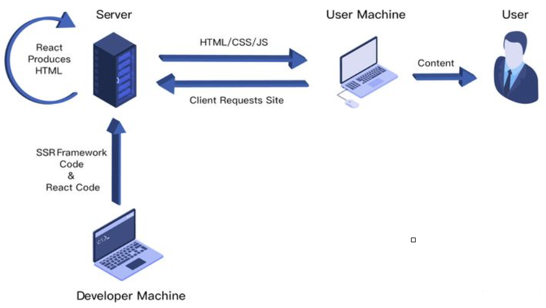
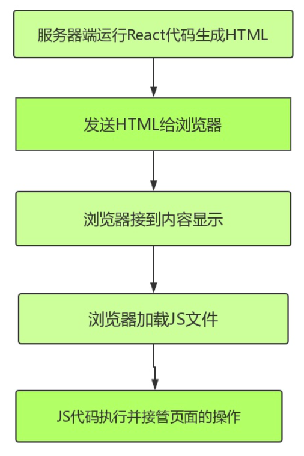

`react`服务端渲染怎么做？
原理是什么？

`react`服务端渲染

## 是什么
## 如何做
## 原理

## 一、是什么

在`SSR`中，
我们了解到`Server-Side Rendering`，
简称`SSR`，
意为服务端渲染。

指由服务侧完成页面的`HTML`结构`拼`接的页面处理技术，
发送到浏览器，
然后为其绑定状态与事件，
成为完全可交互页面的过程。



其解决的问题主要有两个：

- `SEO`，由于搜索引擎爬虫抓取工具可以直接查看`完全渲`染的页面。

- 加速首屏加载，`解`决首页`白`屏问题。

## 二、如何做

在`react`中，
实现`ssr`主要有两种形式：

- 手动搭建一个`SSR`框架。

- 使用成熟的`ssr`框架，如`next.js`。

这里主要以手动搭建一个`ssr`框架进行实现。

首先通过`express`启动一个`app.js`文件，
用于监听`3000`端口的请求，

当请求根目录时，
放回`html`，

如下：
```js
const express = require('express');
const app = express()
app.get('/', (req, res) => {
  `
    <html>
      <head>
        <title>ssr demo</title>
      </head>
      <body>
        Hello World
      </body>
    </html>
  `
})

app.listen(3000, () => console.log('Example app listening on port 3000!'))
```
然后在服务器中编写`react`代码，
在`app.js`中进行应引用。
```js
import React from 'react'

const Home = () => {
  return <div>home</div>
}

export default Home
```

为了让服务器能够识别`jsx`，
这里需要使用`webpack`对项目进行打包转换，
创建一个配置文件`webpack.server.js`并进行相关配置，
如下：

```js
const path = require('path') // node的path模块
const nodeExternals = require('webpack-node-externals')

module.exports = {
  target: 'node',
  mode: 'development', // 开发模式
  entry: './app.js', // 入口
  output: {
    filename: 'bundle.js', // 打包后的文件名
    path: path.resolve(__dirname, 'build') // 存放到根目录的build文件夹
  },
  externals: [nodeExternals()], // 保持node中require的引用方式
  module: {
    rules: [ // 打包规则
      {
        test: /\.js?$/, // 对所有js文件进行打包
        loader: 'babel-loader', // 使用babel-loader进行打包
        exclude: /node_modules/, // 不打包node_modules中的js文件
        options: {
          // loader时额外的打包规则，对react, jsx, es6进行转换
          presets: ['react', 'stage-0', ['env', { target: { browsers: ['last 2versions'] } }]] // 对主流浏览器最近两个版本进行兼容
        }
      }
    ]
  }
}

```
上面的过程中，
已经能够成功将组件`渲`染到了`页`面上。

但是像一些`事件`处理的方法，
是无法在服务端完成，
因此需要将组件代码在浏览器中再执行一遍，
这种服务器端和客户端共用一套代码的方式就称之为`同构`。

重构通俗讲就是一套`React`代码在服务器上运行`一`遍，
到达浏览器`又`运行`一`遍：

- `服`务端`渲`染完成页面结构。

- `浏`览器端`渲`染完成事件绑定。

浏览器实现事件绑定的方式为浏览器去拉取`js`文件执行，
让`js`代码来控制，
因此需要引入`script`标签。

通过`script`标签为页面`引`入`客`户端执行的`react`代码，
并通过`express`的`static`中间件为`js`文件配置路由，
修改如下：

```js
import express from 'express'
import React from 'react'
import { renderToString } from 'react-dom/server' // 引入renderToString方法
import Home from './src/containers/Home'

const app = express()
app.use(express.static('public'));

// 使用express提供的static中间件，
// 中间件会将所有静态文件的路由指向public文件夹。
const content = renderToString(<Home />) // 渲染成字符串

app.get('/', (req, res) => res.send(
  `
    <html>
      <head>
        <title>ssr demo</title>
      </head>

      <body>
        ${content}
        <script src="/index.js"></script>
      </body>
    </html>
  `
))
app.listen(3001, () => console.log('Example app listening on port 3001!'))
```
然后在客户端执行以下`react`代码，
新建`webpack.client.js`作为客户端`react`代码的`webpack`配置.

文件如下：
```js
const path = require('path') // node的path模块

module.exports = {
  mode: 'development', // 开发模式
  entry: './src/client/index.js',  // 入口
  output: { // 打包出口
    filename: 'index.js', // 打包后的文件名
    path: path.resolve(__dirname, 'public') // 存放的更目录的build文件夹
  },
  module: {
    rules: [{ // 打包规则
      test: /\.js?$/, // 对所有js文件进行打包
      loader: 'babel-loader', // 使用babel-loader进行打包
      exclude: /node_modules/, // 不打包node_modules中的js文件
      options: {
        // loader时额外的打包规则，这里对react,jsx进行转换
        presets: ['react', 'stage-0', ['env', { target: { browsers: ['last 2versions'] } }] // 对主流浏览器最近两个版本进行兼容。
      }
    }]
  }
}
```
这种方法就能够简单实现首页的`react`服务端渲染，
过程对应如下图：



在做完初始渲染的时候，
一个应用会存在`路由`的情况，
配置信息如下：

```js
import React from 'react' // 引入React以支持JSX
import { Route } from 'react-route-dom' // 引入路由
import Home from './containers/Home' // 引入Home组件

export default (
  <div>
      <Route path="/" exact component={Home}></Route>
  </div>
)
```

然后可以通过`index.js`引用路由信息，
如下：
```js
import React from 'react'
import ReactDom from 'react-dom'
import { BrowserRouter } from 'react-router-dom'
import Router from '../Routers'

const App = () => {
  return (
    <BrowserRouter>
      { Router }
    </BrowserRouter>
  )
}

ReactDom.hydrate(<App />, document.getElementById('root'))
```
这时候控制台会存在报错信息，
原因在于每个`Route`组件外面包裹着一层`div`，
但服务端返回的代码中并没有这个`div`。

解决方法只需要将路由信息在服务端执行一遍，
使用`StaticRouter`去替代`BrowserRouter`，
通过`context`进行参数传递。

```js
import express from 'express'
import React from 'react' // 引入React以支持JSX的语法
import { renderToString } from 'react-dom/server' // 引入renderToString方法
import { StaticRouter } from 'react-router' // 引入StaticRouter
import Router from './Routers'

const app = express()
app.use(express.static('public'));
// 使用express提供的static中间件，中间件会将所有静态文件的路由指向public文件夹。

app.get('/', (req, res) => {
  const content = renderToString(
    <StaticRouter context={{}} location={req.url}>{ Router }</StaticRouter>
  ) // 渲染成字符串
  res.send(`
    <html>
      <head>
        <title>ssr demo</title>
      </head>

      <body>
        ${content}
        <script src="/index.js"></script>
      </body>
    </html>
    `)
})

app.listen(3001, () => console.log('Example app listening on port 3001!'))
```
这样也就完成了路由的服务端渲染。

## 三、原理

整体`react`服务端渲染原理并不复杂，
具体如下：

`node server`接收客户端请求，
得到当前的请求`url`路径，
然后在已有的路由表内查找到对应的组件，
拿到需要请求的数据，
将数据作为`props`、`context`或者`store`形式传入组件。

然后基于`react`内置的服务端渲染方法`renderToString`把组件渲染为`html`字符串
再把最终的`html`进行输出前将数据注入到浏览器端。

浏览器开始进行渲染和节点对比，
然后执行完成组件内事件绑定和一些交互，
浏览器重用了服务端输出的`html`节点，
整个流程结束。