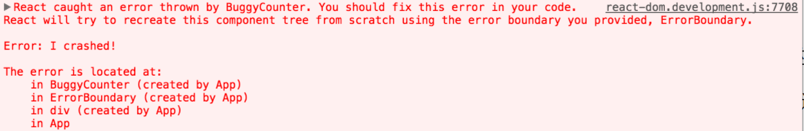

在`react`项目是如何捕获错误的？

`react`捕获异常

## 是什么
## 错误边界
## try...catch...

## 一、是什么

错误在我们日常编写代码是非常常见的。

举个例子，
在`react`项目中去编写组件内`JavaScript`代码错误会导致`React`的内部状态被破坏，
导致整个应用崩溃，
这是不应该出现的现象。

作为一个框架，
`react`也有自身对于错误的处理的解决方案。

## 二、如何做

为了解决出现的错误导致整个应用崩溃的问题，
`react16`引用了`错误边界`新的概念。

错误边界是一种`React`组件，
这种组件可以捕获发生在其子组件树任何位置的`JavaScript`错误，
并打印这些错误，
同时展示降级`UI`，
而并不会渲染那些发生崩溃的子组件树。

错误边界在渲染期间、
生命周期方法和整个组件树的构造函数中捕获错误。

形成错误边界组件的两个条件：

- 使用了`static getDerivedStateFromError()`。

- 使用了 `componentDidCatch()`。

抛出错误后，
请使用`static getDerivedStateFromError()`渲染备用`UI`，
使用`componentDidCatch()`打印错误信息，
如下：

```js
class ErrorBoundary extends React.Component {

  constructor(props) {
    super(props);
    this.state = { hasError: false };
  }

  static getDerivedStateFromError(error) {
    // 更新 state 使下一次渲染可以显示降级后的 UI
    return { hasError: true };
  }

  componentDidCatch(error, errorInfo) {
    logErrorToMyService(error, errorInfo);
  }

  render() {
    if (this.state.hasError) {
      // 你可以自定义降级后的 UI 并渲染
      return <h1>Something went wrong;</h1>;
    }
    return this.props.children;
  }
}
```
然后就可以把`自身组件`的作为错误边界的子组件，
如下：
```js
<ErrorBoundary>
  <MyWidget />
</ErrorBoundary>
```
下面这些情况无法捕获到异常：

- 事件处理。

- 异步代码。

- 服务端渲染。

- 自身抛出来的错误。

在`react 16`版本之后，
会把渲染期间发生的所有错误打印到控制台。

除了错误信息和`JavaScript`栈外，
`React 16`还提供了组件栈追踪。

现在你可以准确地查看发生在组件树内的错误信息：



可以看到在错误信息下方文字中存在一个组件栈，
便于我们追踪错误。

`对`于错误边界无法捕获的异常，
如`事件处理`过程中发生`问题`并`不`会`捕`获到，
是因为其`不`会在`渲染`期间`触`发，
并`不`会导`致`渲染时候`问题`。

这种情况可以使用`js`的`try...catch...`语法，
如下：
```js
class MyComponent extends React.Component {

  constructor(props) {
    super(props);
    this.state = { error: null };
    this.handleClick = this.handleClick.bind(this);
  }

  handleClick() {
    try {
      // 执行操作，如有错则会抛出
    } catch(error) {
      this.setState({ error });
    }
  }

  render() {
    if (this.state.error) {
      return <h1>Caught an error.</h1>
    }
    return <button onClick={this.handleClick}>Click Me</button>
  }
}
```
除此之外还可以通过`onerror`事件。

```js
window.addEventListener('error', function(event) { ... })
```


