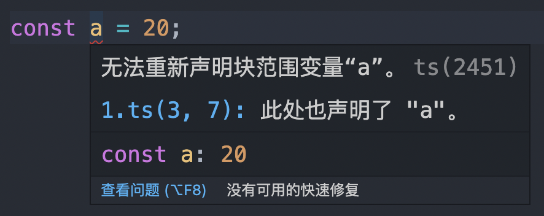

对ts中命名空间与模块的立即？
区别？

## 一、模块

ts与ecmaScript2015一样，任何包含顶级`import`或者`export`的文件都被当成一个模块。

相反地，一个文件不包含`import`或者`export`声明就是全局代码。

例如我们在一个ts工程下建立一个文件`1.ts`，声明一个变量`a`，如下：
```js
const a = 1;
```
然后在另一个文件同样声明一个变量a，这时候就会出现错误信息：
```js
const a = 20; // error: 'a' is already declared in the upper scope
```


提示重复声明a变量，但是所处的空间是全局的。

如果需要解决这个问题，则通过 import 或者 export 引入模块系统即可，如下：
```js
const a = 10;
export default a
```
在ts中，export关键字可以导出变量或者类型，用法与es6模块一致，如下：
```js
export const a = 1

export type Person = {
  name: String
}
```
通过`import`引入模块，如下：
```js
import { a, Person } from './export';
```

## 二、命名空间

命名空间一个最明确的目的就是解决重名问题。

命名空间定义了标识符的可见范围，一个标识符可在多个名字空间中定义，它在不同名字空间中的含义是互不相干的。

这样， 在一个新的名字空间中可定义任何标识符，它们不会与任何已有的标识符发生冲突，因为已有的定义都处于其他名字空间中。

`ts`中命名空间使用`namespace`来定义，语法格式如下：
```js
namespace SomeNameSpaceName {
  export interface ISomeInterfaceName {}
  export class SomeClassName {}
}
```
以上定义了一个命名空间`SomeNameSpaceName`，如果我们需要在外部可以调用`SomeNameSpaceName`中的类和接口，则需要在类和接口添加`export`关键字。

使用方式如下：
```js
SomeNameSpaceName.SomeClassName
```
命名空间本质上是一个对象，作用是将一系列相关的全局变量组织到一个对象的属性，如下：
```js
namespace Letter {
  export let a = 1;
  export let b = 2;
  export let c = 3;
  // ...
  export let z = 26;
}
```
编译成js如下：
```js
var Letter;
(function (Letter) {
  Letter.a = 1;
  Letter.b = 2;
  Letter.c = 3;
  // ...
  Letter.z = 26;
})(Letter || (Letter = {}));
```
## 三、区别

- 命名空间是位于全局命名空间下的一个普通的带有名字的js对象，使用起来十分容易。但就像其它的全局命名空间污染一样，它很难去识别组件之间的依赖关系，尤其是在大型的应用中。

- 像命名空间一样，模块可以包含代码和声明。不同的是模块可以声明它的依赖。

- 在正常的ts项目开发过程中并不建议用命名空间，但通常在通过`d.ts`文件标记`js`库类型的时候使用命名空间，主要通是给编译器编写代码的时候参考使用。