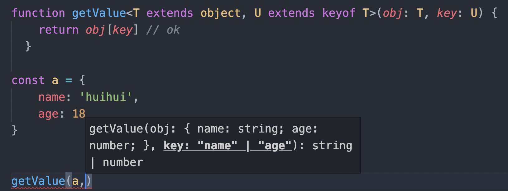

对ts中泛型的理解？
应用场景？

ts泛型

## 是什么
## 使用方式
## 应用场景

## 一、是什么

泛型程序设计（generic programming）是程序设计语言的一种风格或范式。

泛型允许我们在强类型程序设计语言中编写代码时使用一些以后才指定的类型，在实例化作为参数指明这些类型在ts中，定义函数、接口或者类的时候，不预先定义好具体的类型，而在使用的时候再指定类型的一种特性。

假设我们用一个函数，它可接受一个number参数并返回一个number参数，如下写法：
```js
function returnItem (para: number): number {
  return para
}
```
如果我们打算接受一个string类型，然后再返回string类型，则如下写法：
```js
function returnItem (para: string): string {
  return para
}
```
上述两种编写方式，存在一个最明显的问题在于，代码重复度比较高。

虽然可以使用any类型去替代，但也并不是很好的方案，因为我们的目的是接收什么类型的参数返回什么类型的参数，即在运行时传入参数我们才能确定类型。

这种情况就可以使用泛型，如下所示：
```js
function returnItem<T>(para: T): T {
  return para
}
```
可以看到，泛型基于开发者创造灵活、可重用代码的能力。

## 二、使用方式

泛型通过<>的形式进行表述，可以声明：

- 函数

- 接口

- 类

**函数声明**

声明函数的形式如下：

```js
function returnItem<T>(para: T): T {
  return para
}
```
定义泛型的时候，可以一次定义多个类型参数，比如我们可以同时定义泛型T和泛型U：
```js
function swap<T, U>(tuple: [T, U]): [U, T] {
  return [tuple[1], tuple[0]
}

swap([7, 'seven']); // [ 'seven', 7 ]
```
**接口声明**

声明接口的形式如下：
```js
interface ReturnItemFn<T> {
  (para: T): T
}
```
那么当我们想传入一个number作为参数的时候，就可以这样声明函数：
```js
const returnItem: ReturnItemFn<number> = para => para
```
**类声明**

使用泛型声明类的时候，既可以作用于类本身，也可以作用与类的成员函数。

下面简单实现一个元素同类型的栈结构，如下所示：
```js
class Stack<T> {
  private arr: T[] = []

  public push(item: T) {
    this.arr.push(item)
  }

  public pop() {
    this.arr.pop()
  }
}
```
使用方式如下：
```js
const stack = new Stack<number>()
```
如果上述只能传递string和number类型这个时候就可以使用<T extends xx>的方式猜实现约束泛型，如下所示：

除了上述的形式，泛型更高级的使用如下：

例如要设计一个函数，这个函数接受两个参数，一个参数为对象，另一个参数为对象上的属性，我们通过这两个参数返回这个属性的值。

这时候就设计到泛型的索引类型和约束类型共同实现。

**索引类型、约束类型**

keyof T

把传入的对象的属性类型取出生出一个联合类型，这里的泛型U被约束在这个联合类型中，如下所示：
```js
function getValue<T extends object, U extends keyof T>(obj: T, key: U) {
  return obj[key]
}
```
上述为什么需要使用泛型约束，而不是直接定义第一个参数为object类型，是因为默认情况object指的是{}，而我们接收的对象是各种各样的，一个泛型来表示传入的对象类型，比如T extends object

使用如下图所示：
```js
function getValue<T extends object, U extends keyof T>(obj: T, key: U) {
  return obj[key] // ok
}

const a = {
  name: 'jack',
  age: 18
}

getValue(a, 'name') // 把a带进去，自然而然会给你提示key这个值了。
```


**多类型约束**

例如如下需要实现两个接口的类型约束：

```js
interface FirstInterface {
  doSomething(): number
}

interface SecondInterface {
  doSomethingElse(): string
}
```
可以创建一个接口继承上述两个接口，如下：
```js
interface CombinedInterface extends FirstInterface, SecondInterface {}
```
正确使用如下：
```js
class Demo<T extends ChildInterface> {
  private genericProperty: T

  constructor(genericProperty: T) {
    this.genericProperty = genericProperty
  }

  useT() {
    this.genericProperty.doSomething()
    this.genericProperty.doSomethingElse()
  }
}
```
通过泛型约束就可以达到多类型约束的目的。

## 三、应用场景

通过上面初步的了解，后述在编写ts的时候，定义函数，接口或者类的时候，不预先定义好具体的类型，而在使用的时候在指定类型的一种特性的时候，这种情况下就可以使用泛型灵活的使用泛型定义类型，是掌握ts必经之路。