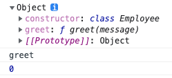

对ts装饰器的理解？
应用场景？

ts装饰器

## 是什么
## 使用方式
## 使用场景

## 一、是什么

装饰器是一种特殊类型的声明，它能够被附加到类声明，方法，访问符，属性或参数上。

是一种在`不改`变`原类`和`使用继承`的情况下，动态地`扩展`对象`功能`。

同样的，本质上也不是什么高大上的结构，就是一个普通的函数,`@expression`的形式其实是`Object.defineProperty`的语法糖。

`expression`求值后必须也是一个函数，它会在运行时被调用，被装饰的声明信息做为参数传入。

## 二、使用方式

由于ts是一个实验性特性，若要使用，需要在`tsconfig.json`文件启动，如下：
```js
{
  "compilerOptions": {
    "target": "ES5",
    "experimentalDecorators": true
  }
}
```
ts装饰器的使用和js基本一致。

类的装饰器可以装饰：

- 类

- 方法/属性

- 参数

- 访问器

**类装饰**

例如声明一个函数`addAge`去给`Class`的属性`age`添加年龄。
```js
function addAge(constructor: Function) {
  constructor.prototype.age = 18;
}

@addAge
class Person {
  name: string;
  age!: number;
  constructor() {
    this.name = "张三";
  }
}

let person = new Person();

console.log(person.age); // 18
```
上述代码，实际等同于以下形式：
```js
Person =  addAge(function Person() { ... })
```
上述可以看到，当装饰器作为装饰类的时候，会把构造器传递进去。`constructor.prototype.age`就是在每一个实例化对象上面添加一个`age`属性。

**方法/属性装饰**

同样，装饰器可以用于装饰类的方法，这时候装饰器接收的参数变成了：

- `target`：对象的原型。

- `propertyKey`：方法的名称。

- `descriptor`：方法的属性描述符。

可以看到，，这三个属性实际就是`Object.defineProperty`的三个参数，如果是类的属性，则没有传递第三个参数。

如下例子：

```js
// 声明装饰器修饰方法/属性
function method(target, propertyKey, descriptor) {
  console.log("target", target) // {constructor: f, say: f}
  console.log("propertyKey", propertyKey) // say
  console.log("descriptor", descriptor) // {value: ƒ, writable: false, enumerable: true, configurable: true}

  descriptor.writable = false;
};

function property(target: any, propertyKey: string) {
  console.log("target", target) // {constructor: f, say: f}
  console.log("propertyKey", propertyKey) // name
}

class Person{
  @property
  name: string;
  constructor() {
    this.name = "张三";
  }

  @method
  say() {
    return 'instance method';
  }

  @method
  static run() {
    return 'static method'
  }
}


const xmz = new Person();

// 修改实例方法say
xmz.say = function() {
  return 'edit'
}
```

输出如下图所示：


**参数装饰**

接收3个参数，分别是：

- target：当前对象的原型。

- propertyKey: 参数的名称

- index：参数数组中的位置。

```js
function logParameter(target: Object, propertyName: string, index: number) {
  console.log(target); // Employee {}
  console.log(propertyName); // greet
  console.log(index); // 0
}

class Employee {
  greet(@logParameter message: string): string {
    return `Hello, ${message}`;
  }
}

const emp = new Employee();
emp.greet("world"); // Hello, world
```

输入如下图：



**访问器装饰**

使用起来方式与方法装饰一致，如下：
```js
function modification(target: Object, propertyKey: string, descriptor: PropertyDescriptor) {
  console.log(target);
  console.log(propertyKey);
  console.log(descriptor);
};

class Person {
  _name: string;
  constructor() {
    this._name = "张三";
  }

  @modification
  get name() {
    return this._name;
  }
}
```

**装饰器工厂**

如果想要传递参数，使装饰器变成类似工厂函数，只需要在装饰器函数内部返回一个函数即可。如下：
```js
function addAge(age: number) {
  return function (constructor: Function) {
    constructor.prototype.age = age;
  };
}

@addAge(18)
class Person {
  name: string;
  age!: number;
  constructor() {
    this.name = "张三";
  }
}

let person = new Person();
```

**执行顺序**

当多个装饰器应用于一个声明上，将由上至下依次对装饰器表达式求值，求值的结果会被当作函数，由下至上一次调用，例如如下：

```js
function f() {
  console.log("f(): evaluated");

  return function (target, propertyKey: string, descriptor: PropertyDescriptor) {
    console.log("f(): called");
  }
}

function g() {
  console.log("g(): evaluated");

  return function (target, propertyKey: string, descriptor: PropertyDescriptor) {
    console.log("g(): called");
  }
}

class C {
  @f()
  @g()
  method() {}
}

// 输出
f(): evaluated
g(): evaluated
g(): called
f(): called
```

## 三、应用场景

可以看到，使用装饰器存在两个显著的优点：

- 代码可读性变强了，装饰器命名相当于一个注释。

- 在不改变原有代码情况下，对原来功能进行扩展。

后面的使用场景中，借助装饰器的特性，除了提高可读性之后，针对已经存在的类，可以通过装饰器的特性，在不改变原有代码情况下，对原来功能进行扩展。