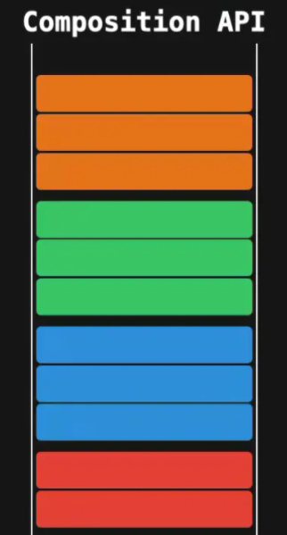

## vue3介绍

- vue3介绍。
- vue3新增特性。
- 非兼容变更。

## vue3

关于`vue3`的重构的原因，为什么。

- 新的js语言特性在主流浏览器中的受支持水平。
- 设计和架构的问题。

简要就是：

- 利用新的语言特性(es6)。
- 解决架构问题。

## 哪些变化

- 速度更快。
- 体积减少。
- 更易维护。
- 更接近原生。
- 更易使用。

## 速度更快

vue3 比 vue2 更快。
- 重写了虚拟`Dom`实现。
- 编译模板的优化。
- 更高效的组件初始化。
- `update`性能提高1.3~2倍。
- `SSR`速度提高了2-3倍。

## 体积更小

通过`webpack`的`tree-shaking`功能。
可以将无用模块"剪辑"。
仅打包需要的。

能够`tree-shaking`。
有两大好处。

- 对开发人员。
能够对`vue`实现更多其他的功能。
而不必担忧整体体积过大。

- 对使用者。
打包出来的包体积变小了。

`vue`可以开发出更多其他的功能。
而不必担忧`vue`打包出来的整体体积过多。

## 更易维护

composition Api

- 可与现有的`Options API`一起使用。
- 灵活的逻辑组合与复用。
- `Vue3`模块可以和其他框架一起使用。

## 更好支持ts

`vue3`是基于`ts`编写的。
可享受到自动的类型定义显示。

## 编译器重写

## 更接近原生。

```js
import { createRenderer } from '@vue/runtime-core'

const { render } = createRenderer({
  nodeOps,
  patchData
})
```
## 更易使用

响应式`Api`暴露出来。

```js
import { observable, effect } from 'vue'

const state = observable({
  count: 0
})

effect(() => {
  console.log(`count is : ${state.count}`)
}) // count is : 0

state.count++ // count is : 1
```
轻松识别组件重新渲染原因。

```js
const Comp = {
  render(props) {
    return h('div', props.count)
  },
  renderTriggered (event) {
    debugger
  }
}
```

## vue3 新特性

- framents
- Teleport
- composition Api
- createRenderer

### framents。
多根支持。

```html
<!-- Layout.vue -->
<template>
  <header>...</header>
  <main v-bind="$attrs">...</main>
  <footer>...</footer>
</template>
```
### Teleport

`Teleport`你就看成是多啦A梦的任意门。

`vue2`，`modals`,`toast`嵌套在`vue`某个组件内部。
处理嵌套组件的。
定位。
`z-index`。
样式。
比较难。

`vue3`。
通过`Teleport`。
就可以在组件的逻辑位置写模块代码。
在`Vue`应用范围之外渲染它。

```html
<button @click="showToast" class="btn">打开 toast</button>

<!-- to 属性就是目标位置 -->
<teleport to="#teleport-target">
  <div v-if="visible" class="toast-wrap">
    <div class="toast-msg">我是一个 Toast 文案</div>
  </div>
</teleport>
```

### createRenderer

通过`createRenderer`.
能够做自定义渲染器。
能够将`vue`的开发模型扩展到其他平台。

我们可以将其生成在`canvas`画布上。

关于`createRenderer`。
理解基本使用。

```js
import { createRenderer } from '@vue/runtime-core'

const { render, createApp } = createRenderer({
  patchProp,
  insert,
  remove,
  createElement,
  // ...
})

export { render, createApp }

export * from '@vue/runtime-core'
```
## composition Api

更容易维护代码。
将相同功能的变量。
进行集中式管理。



怎么用`composition api`。


简单用:
```js
export default {
  setup() {
    const count = ref(0)
    const double = computed(() => count.value * 2)

    function increment() {
      count.value++
    }

    onMounted(() => console.log('component mounted'))

    return {
      count,
      double,
      increment
    }
  }
}
```

## 非兼容变更

### Global API
- 全局`Vue API`已变更为使用程序实例。
- 全局和内部`API`已被重构为可`tree-shakable`。

### 模板指令
- 组件上`v-model`用法已变更。
- `<template v-for>`和非`v-for`节点上`key`用法已更改。
- 在同一元素上使用的`v-if`和`v-for`优先级已更改。
- `v-bind="object"`现在排序敏感。
- `v-for`中的`ref`不再注册`ref`数组。

### 组件
- 只能使用普通函数创建功能组件。
- `functional`属性在单文件组件`（SFC）`。
- 异步组件现在需要`defineAsyncComponent`方法来创建。

### 渲染函数

- 渲染函数`API`改变。
- `$scopedSlots` `property` 已删除。
所有插槽都通过`$slots`作为函数暴露。
- 自定义指令`API`已更改为组件生命周期一致。
- 一些转换`class`被重命名了：
  - `v-enter` -> `v-enter-from`
  - `v-leave` -> `v-leave-from`。
- 组件`watch`选项和实例方法`$watch`不再支持点分隔字符串路径。
请改用计算函数作为参数。
- 在`Vue2.x`中，应用根容器的`outerHTML`将替换为根组件模板。
（如果根组件没有模板/渲染选项，则最终编译为模板）。
`VUE3.x`现在使用应用程序容器的`innerHTML`。

### 其他 小改变

- `destroyed`生命周期选项被重命名为`unmounted`。
- `beforeDestroy`生命周期选项被重命名为`beforeUnmount`。
- `[prop default]`工厂函数不再有权访问`this`是上下文。

- 自定义指令`API`已更改为与组件生命周期一致。
- `data`应始终声明为函数。
- 来自`mixin`的`data`选项现在可简单地合并。

- `attribute`强制策略已更改。
- 一些过渡`class`被重命名。
- 组建`watch`选项和实例方法`$watch`。
不再支持以点分隔的字符串路径。
请改用计算属性函数作为参数。

- `<template>`没有特殊指令的标记(`v-if/else-if/else`、`v-for`或`v-slot`)。
现在被视为普通元素。
并将生成原生的`<template>`元素。
而不是渲染其内部内容。

- 在`Vue2.x`中。
应用根容器的`outerHTML`将替换为根组件模板。
（如果根组件没有模板/渲染选项。则最终编译为模板）。
`Vue3.x`现在使用应用容器的`innerHTML`。
意味着容器本身不再被视为模板的一部分。

## 移除API

- `keyCode`支持作为`v-on`的修饰符。
- `$on`, `$off`和`$once`实例方法。
- 过滤`filter`。
- 内联模板`attribute`。
- `$destroy`实例方法。
用户不应再手动管理单个`Vue`组件的生命周期。


