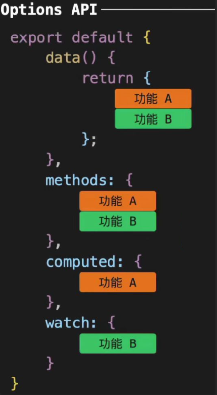
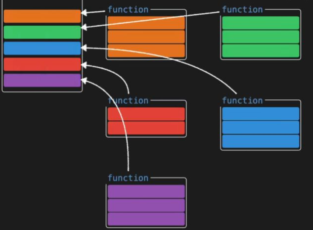
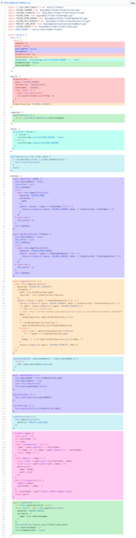

## 为啥推 composition

vue2有弊端。
- 组件越大，代码多，阅读差。
- 代码复用，存在缺点。
- ts支持不好。

composition 就来解决这些问题的。

## options 选项式

`Options API`。
通过定义`methods`、`computed`、`watch`、`data`。
等属性与方法。
共同处理页面逻辑。



options。
组件状态写`data`上。
方法写`methods`上。

组件的选项。
`data`。
`computed`。
`methods`。
`watch`。

组件变大。
列表会唱。

导致读难。

## composition api

高内聚，低耦合。



快速定位到这个功能。

## 对比。

- 逻辑组织。
- 逻辑复用。

### 逻辑组织。



碎片化，理解难，维护难。

选项的分离。需要不断地跳到相应的块。

### composition

相关代码放一个函数里。
就修改这个函数就好。
不用跳来跳去。

`count`属性放在一个函数里。
```js
function useCount() {
  let count = ref(10);
  let double = computed(() => count.value * 2);

  const handleCount = () => {
    count.value = count.value * 2;
  }

  console.log(count);

  return {
    count,
    double,
    handleCount
  }
}
```

组件上使用`count`。
```js
export default defineComponent({
  setup() {
    const { count, double, handleCount } = useCount();
    return {
      count,
      double,
      handleCount
    }
  }
})
```
对比图。


逻辑复用。

`vue2`用的是`mixin`。

`mixin.js`:
```js
export const MoveMixin = {
  data() {
    return {
      x: 0,
      y: 0
    }
  },
  methods: {
    handleKeyup(e) {
      console.log(e.code);
      // 上下左右 x y
      switch (e.code) {
        case 'ArrowUp':
          this.y--;
          break;
        case 'ArrowDown':
          this.y++;
          break;
        case 'ArrowLeft':
          this.x--;
          break;
        case 'ArrowRight':
          this.x++;
          break;
      }
    }
  },

  mounted() {
    window.addEventListener('keyup', this.handleKeyup);
  },

  unmounted() {
    window.removeEventListener('keyup', this.handleKeyup);
  }
}
```
在组件中用:

```js
<template>
  <div>
    Mouse position: x {{ x }} / y {{ y }}
  </div>
</template>
<script>
  import mousePositionMixin from './mouse';
  export default {
    mixins: [mousePositionMixin]
  }
</script>
```

没问题，但是混入不同的`mixins`时。
```js
mixins: [mousePositionMixin, fooMixin, barMixin, otherMixin]
```
存在问题。
1、命名冲突。
2、来源不清。

`composition`:
```js
import { onMounted, onUnmounted, reactive } from 'vue';

export function useMove() {
  const position = reactive({
    x: 0,
    y: 0,
  });

  const handleKeyup = (e) => {
    console.log(e.code);
    // 上下左右 x y
    switch (e.code) {
      case 'ArrowUp':
        // y.value--
        position.y--;
        break;
      case 'ArrowDown':
        // y.value++
        position.y++;
        break;
      case 'ArrowLeft':
        // x.value--
        position.x--;
        break;
      case 'ArrowRight':
        // x.value++
        position.x++;
        break;
    }
  }

  onMounted(() => {
    window.addEventListener('keyup', handleKeyup);
  });

  onUnmounted(() => {
    window.removeEventListener('keyup', handleKeyup);
  })

  return { position };
}
```
在组件中用：

```js
<template>
  <div>
    Mouse position: x {{ x }} / y {{ y }}
  </div>
</template>

<script>
import { useMove } from './useMove';
import { toRefs } from 'vue';
export default {
  setup() {
    const { position } = useMove();
    const { x, y } = toRefs(position)
    return {
      x,
      y
    }
  },
}
</script>
```
不会重名的冲突。
数据也很清晰。

### 小结

- 逻辑组织和复用，`composition`更好。
- `composition`都是函数，有更好的类型推断。
- 代码少。有`tree-shaking`。
- 不用`this`这种东西了。（少了`this`指向不明的情况）。

