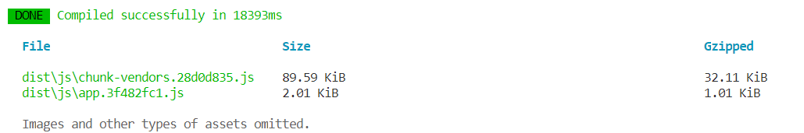
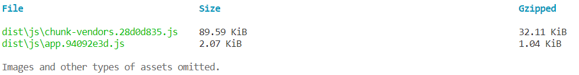
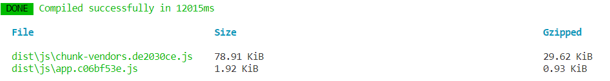
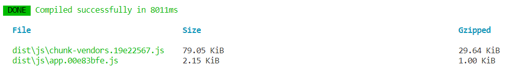

## 什么

清除多余代码。
打包技术。

去除无用代码。

`vue2` 打包后代码体积过大。
没用的也进去。
```js
import Vue from 'vue'

Vue.nextTick(() => {})
```
`vue3`搞了`tree shaking`。
将全局`api`分块。
不使用其他某些功能。
就不包含在里面。
要什么再用什么。
```js
import { nextTick, observable } from 'vue'
nextTick(() => {})
```

## how

用的是`import`和`exports`。
用的是`es6`的静态编译。

确定好依赖关系。
输入和输出变量。

`tree shaking`：
- `es6`判断哪些模块用了。
- 哪些没用，就删。

通过`vue-cli`装`vue2`和`vue3`项目。
```js
vue create vue-demo
```

### vue2

`data`属性:
```js
<script>
  export default {
    data: () => ({
      count: 1
    })
  }
</script>
```


加`computed` 和 `watch`。
```js
export default {
  data: () => ({
    question: '',
    count: 1
  }),
  computed: {
    double: function () {
      return this.count * 2
    }
  },
  watch: {
    question: function (newQuestion, oldQuestion) {
      this.answer = 'xxx'
    }
  }
}
```


`vue3`

```js
import { reactive, defineComponent } from 'vue';

export default defineComponent({
  setup() {
    const state = reactive({
      count: 1,
    });
    return {
      state,
    }
  }
})
```


在组件中引入`computed`和`watch`。
```js
import { } from 'vue'

export default defineComponent({
  setup() {
    const state = reactive({
      count: 1,
    });
    const double = computed(() => {
      return state.count * 2
    })
    watch(
      () => state.count,
      (count, preCount) => {
        console.log(count);
        console.log(preCount);
      }
    )
    return {
      state,
      double
    }
  }
})
```



体积可以看到大了。

## 作用。

`tree shaking`。
`vue3`。

- 体积更小。
- 更快。
- 架构好了。

