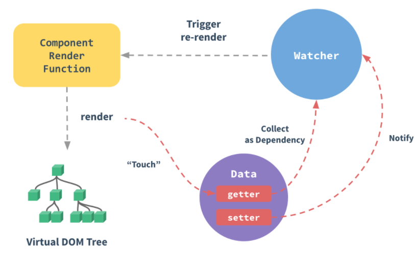
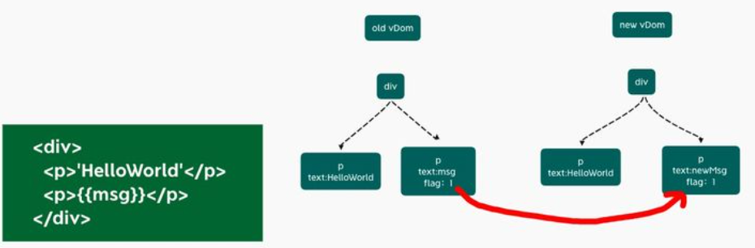

## 编译

看`vue2`。
每个组件实例都有一个`watcher`实例。

把用到的`property`记录为依赖。
依赖变，
触发`setter`。
通知`watcher`。
关联的组件都重新渲染。



```html
<template>
  <div id="content">
    <p class="text">静态文本</p>
    <p class="text">静态文本</p>
    <p class="text">{{ message }}</p>
    <p class="text">静态文本</p>
    ...
    <p class="text">静态文本</p>
  </div>
</template>
```
上面只有一个动态节点。
剩下全是死的。
`diff`和遍历是没必要的。
浪费。

`vue3`改了。
- `diff`算法优化。
- 静态提升。
- 事件监听缓存。
- `SSR`优化。

### diff算法

`vue3`加了静态标记。

为了在发生变化的地方标记`flag`

这样，静态节点`p`就不需要`diff`了。



静态类型:
```js
export const enum PatchFlags {
  TEXT = 1, // 动态的文本节点。
  CLASS = 1 << 1, // 2 动态的 class。
  STYLE = 1 << 2, // 4 动态的 style。
  PROPS = 1 << 3, // 8 动态的属性，不包括类名和样式。
  FULL_PROPS = 1 << 4, // 16 动态key，当key变化时需要完整的diff算法作比较。
  HYDRATE_EVENTS = 1 << 5, // 32 表示带有事件监听器的节点。
  STABLE_FRAGMENT = 1 << 6, // 64 一个不会改变子节点顺序的 Fragment。
  KEYED_FRAGMENT = 1 << 7, // 128 带有key属性的Fragment。
  UNKEYED_FRAGMENT = 1 << 8, // 256 子节点没有 key 的 Fragment。
  NEED_PATCH = 1 << 9, // 512
  DYNAMIC_SLOTS = 1 << 10, // 动态 slot
  HOISTED = -1, // 特殊标志是负整数表示永远不会用作 diff 。
  BAIL = -2 // 一个特殊的标志，指代差异算法。
}
```
### 静态提升

`Vue3`中对不参与更新的元素，做静态提升。
只创一次。
渲染时直接用。

优化内存占用。

```html
<span>你好</span>
<div>{{ message }}</div>
```
没有做静态提升之前。

```js
export function render(_ctx, _cache, $props, $setup, $data, $options) {
  return (_openBlock(), _createBlock(_Fragment, null, [
    _createVNode("span", null, "你好"),
    _createVNode("div", null, _toDisplayString(_ctx.message), 1 /* TEXT */)
  ], 64 /* STABLE_FRAGMENT */))
}
```

做了之后。
```js
const _hoisted_1 = /*#__PURE__*/_createVNode("span", null, "你好", -1 /* HOISTED */)

export function render(_ctx, _cache, $props, $setup, $data, $options) {
  return (_openBlock(), _createBlock(_Fragment, null, [
    _hoisted_1,
    _createVNode("div", null, _toDisplayString(_ctx.message), 1 /* TEXT */)
  ], 64 /* STABLE_FRAGMENT */))
}

// Check the console for the AST
```
静态内容`_hoisted_1`被放置在`render`函数外。
要用就取就好了。
不用每次都创。

同时`_hoisted_1`被打上`PatchFlag`，
也就是静态标记值是`-1`。

特殊标志是负整数。
表示永远不会被`diff`。

### 事件监听缓存

默认。
绑定事件为动态。
每次都去追踪。

```html
<div>
  <button @click="onClick">点我</button>
</div>
```
没开启缓存。
```js
export const render = /*#__PURE__*/_withId(function render(_ctx, _cache, $props, $setup, $data, $options) {
  return (_openBlock(), _createBlock("div", null, [
    _createVNode("button", { onClick: _ctx.onClick }, "点我", 8 /* PROPS */, ["onClick"])
                                             // PROPS=1<<3,// 8 //动态属性，但不包含类名和样式
  ]))
})
```
开启后。
```js
export function render(_ctx, _cache, $props, $setup, $data, $options) {
  return (_openBlock(), _createBlock("div", null, [
    _createVNode("button", {
      onClick: _cache[1] || (_cache[1] = (...args) => (_ctx.onClick(...args)))
    }, "点我")
  ]))
}
```
开启后。
没有了静态标记。
下次`diff`算法直接用。

### ssr优化

静态内容太大之后。
就用`createStaticVNode`去客户端生一个`static node`。

这些静态`node`。
直接`innerHtml`。
就不需要创建对象。

```html
<div>
	<div>
		<span>你好</span>
	</div>
	...  // 很多个静态属性
	<div>
		<span>{{ message }}</span>
	</div>
</div>
```
编译后。

```js
import { mergeProps as _mergeProps } from "vue"
import { ssrRenderAttrs as _ssrRenderAttrs, ssrInterpolate as _ssrInterpolate } from "@vue/server-renderer"

export function ssrRender(_ctx, _push, _parent, _attrs, $props, $setup, $data, $options) {
  const _cssVars = { style: { color: _ctx.color }}
  _push(`<div${
    _ssrRenderAttrs(_mergeProps(_attrs, _cssVars))
  }><div><span>你好</span>...<div><span>你好</span><div><span>${
    _ssrInterpolate(_ctx.message)
  }</span></div></div>`)
}
```
### 源码体积

除去了一些不常用的api。

最重要的是 `tree shaking`。

用到的函数，才打包，没用的都摇掉。
比如`ref`、`reactive`、`computed`等。
```js
import { computed, defineComponent, ref } from 'vue';

export default defineComponent({
  setup(props, context) {
    const age = ref(18)

    let state = reactive({
      name: 'test'
    })

    const readOnlyAge = computed(() => age.value++) // 19

    return {
      age,
      state,
      readOnlyAge
    }
  }
})
```

### 响应式系统

`vue2`采用`defineProperty`。
会深度遍历所有属性。
每个属性都加`getter`和`setter`。

`vue3`用`proxy`。
可对整个对象监听。
不需要深度遍历。
要可以配置。
- 属性 动态添加。
- 数组索引和length。
- 删除属性。
以上三点都可以监听。