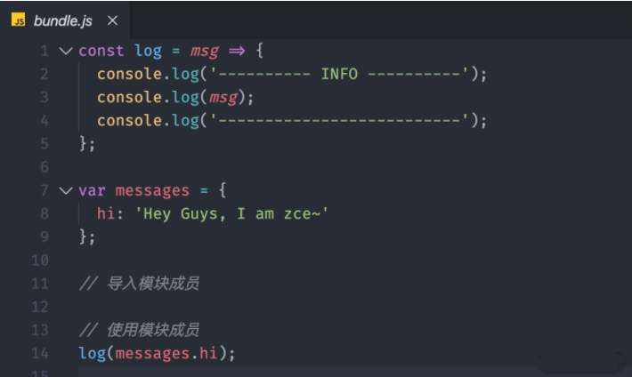
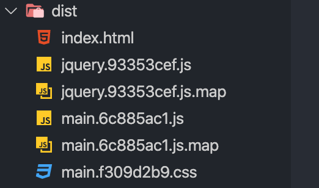
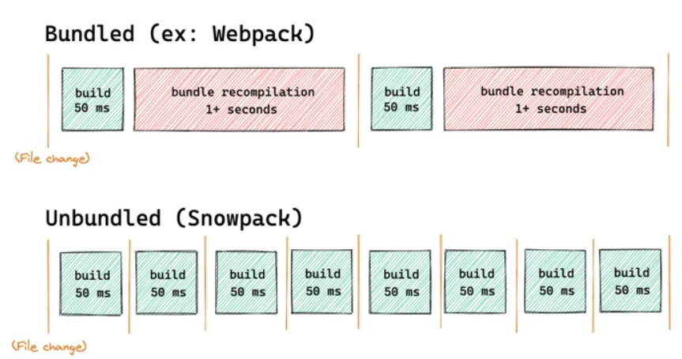
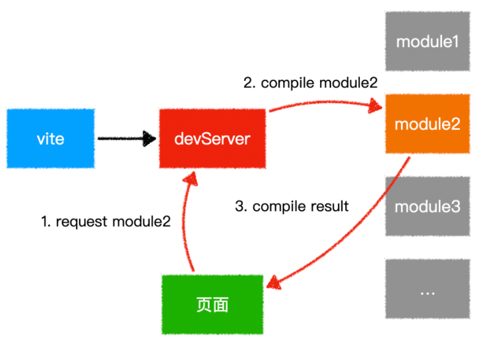

与webpack类似的工具还有哪些？区别？

打包构建工具：

## Rollup
## Parcel
## Snowpack
## Vite
## Webpack

## 一、模块化工具

模块化是一种`处理复杂系统`分解为更好的`可管理模块`的方式。

可以用来分割，组织和打包应用。

每个模块完成一个特定的子功能，
所有的模块按某种方法组装起来，
成为一个整体（`bundle`）。

在前端领域中，
并非只有`webpack`这一款优秀的模块打包工具，
还有其他类似的工具，
例如
`Rollup`、
`Parcel`、
`snowpack`，
以及最近风头无量的`Vite`。

通过这些模块打包工具，
能够提高我们的开发效率，
减少开发成本。

这里没有提及`gulp`、`grunt`是因为它们只是定义为构建工具，不能类比。

**Rollup**

`Rollup`是一款`ES Modules`打包器，
从作用上来看，
`Rollup`与`Webpack`非常类似。

不过相比于`Webpack`,
`Rollup`要小巧的多。

现在很多我们熟知的库`都使用`它进行`打包`，
比如：`Vue`、`React`和`three.js`等。

举个例子：

```js
// ./src/messages.js

export default {
  hi: 'Hey Guys, I am zce~'
}

// ./src/logger.js
export const log = msg => {
  console.log('--- INFO ---')
  console.log(msg)
  console.log('--- INFO ---')
}

export const error = msg => {
  console.log('--- ERROR ---')
  console.error(msg)
  console.log('--- ERROR ---')
}

// ./src/index.js
import { log } from './logger.js'
import messages from './messages.js'
log(messages.hi)
```
然后通过`rollup`进行打包。

`$ npx rollup ./src/index.js --file ./dist/bundle.js`

打包结果如下图：



可以看到，
代码非常简洁，
完成不像`webpack`那样存在`大量引导代码`和`模块函数`。

并且`error`方法由于没有被使用，
输出的结果中并无`error`方法，
可以看到，
`rollup`默认开始`Tree-shaking`优化输出结果。

因此，可以看到`Rollup`的优点：

- 代码效率更简洁、效率更高。
- 默认支持`Tree-shaking`。

但缺点也十分明显，
加载其他类型的资源文件或者支持导入`CommonJS`模块，
又或是编译`ES`新特性，
这些额外的需求`Rollup`需要使用插件去完成。

综合来看，
`rollup`并不适合开发应用使用，
因为需要使用第三方模块，
而目前第三方模块大多数使用`CommonJs`方式导出成员，
并且`rollup`不支持`HMR`，
使开发效率降低。

但是在用于打包`JavaScript`库时，
`rollup`比`webpack`更有优势，
因为其打包出来的代码更小、更快，
其存在的缺点可以忽略。

**Parcel**

`Parcel`，
是一款完全`零配置`的`前端打包器`，
它提供了"`傻瓜式`"的使用体验，
只需了解简单的命令，
就能`构建前端`应用程序。

`Parcel`跟`Webpack`一样都支持以任意类型文件作为打包入口，
但建议使用`HTML`文件作为入口，
该`HTML`文件像平时一样正常编写代码、引用资源。

如下所示：

```html
<!-- ./src/index.html -->
<!DOCTYPE html>
<html lang="en">

<head>
  <meta charset="UTF-8">
  <title>Parcel Tutorials</title>
</head>

<body>
  <script src="main.js"></script>
</body>

</html>
```

`main.js`文件通过`ES Module`方法导入其它模块成员。

```js
// ./src/main.js
import { log } from './logger'

log('Hello parcel')

// ./src/logger.js

export const log = msg => {
  console.log('--- INFO ---')
  console.log(msg)
}
```

运行之后，
使用命令打包。

```js
npx parcel src/index.html
```
执行命令后，
`Parcel`不仅打包了应用，
同时也启动了一个开发服务器，
跟`webpack Dev Server`一样。

跟`webpack`类似，
也支持模块热替换，
但用法更简单。

同时，
`Parcel`有个十分好用的功能：
支持`自动安装`依赖，
像`webpack`开发阶段突然使用`安装某个第三方依赖`，
必然会终止`dev server`然后安装再启动。
而`Parcel`则免了这繁琐的工作流程。

同时，
`Parcel`能够`零配置`加载`其他类型`的`资源`文件，
无须像`webpack`那样配置对应的`loader`。

打包命令如下：
```js
npx parcel src/index.html
```
由于`打包过程`是`多进程`同时工作，
构建速度会比`Webpack`快，
输出文件也会被压缩，
并且样式代码也会被单独提取到单个文件中。



可以感受到，
`Parcel`给开发者一种很大的自由度，
只管去实现业务代码，
其他事情用`Parcel`解决。

**Snowpack**

`Snowpack`，
是一种闪电般快速的前端构建工具，
专为现代`Web`设计，
较复杂的打包工具（如`Webpack`或`Parcel`）的替代方案，
利用`JavaScript`的本机模块系统，
避免不必要的工作并保持流畅的开发体验。


开发阶段，
每次保存单个文件时，
`Webpack`和`Parcel`都需要重新构建和重新打包应用程序的整个`bundle`。

而`Snowpack`为你的应用程序每个文件构建一次，
就可以永久缓存，
文件更改时，
`Snowpack`会`重新构建`该单个文件。

下面给出`webpack`与`snowpack`打包区别：



在`重新构建`每次`变更时`没有任何的`时间浪费`，
只需要在`浏览器`中进行`HMR`更新。

**Vite**

vite，
是一种新型前端构建工具，
能够显著提升前端开发体验。

它主要由两部分组成：

- 一个开发服务器，
它基于原生`ES`模块提供了丰富的`内建功能`，
如速度快到惊人的【模块热更新HMR】。

- 一套构建指令，
它使用`Rollup`打包你的代码，
并且它是预配置的，
可以输出用于生产环境的优化过的静态资源。

其作用类似`webpack`+`webpack-dev-server`，
其特点如下：

- 快速的冷启动。
- 即时的模块热更新。
- 真正的按需编译。

`vite`会直接启动开发服务器，
不需要进行打包操作，
也就不意味着不需要分析模块的依赖，
不需要编译，
因此启动速度非常快。

利用现代浏览器支持`ES Module`的特性，
当浏览器`请求某个模块`的时候，
再根据需要对模块的内容进行编译，
这种方式大大缩短了编译时间。

原理图如下所示：



在热模块`HMR`方面，
当修改一个模块的时候，
仅需让浏览器重新请求该模块即可，
无须像`webpack`那样需要把该模块的相关依赖模块全部编译一次，
效率更高。

**webpack**

相比上述的模块化工具，
`webpack`大而全，
很多常用的功能做到开箱即用。
有两大最核心的特点：`一切模块`和`按需加载`。

与其他构建工具相比，
有如下优势：

- 智能解析：对`CommonJS`、`AMD`、`ES6`的语法做了兼容。
- 万物模块：对`js`、`css`、`图片等资源文件`都支持打包。
- 开箱即用：`HRM`、`Tree-shaking`等功能。
- 代码分割：可以将代码切割成不同的`chunk`，实现`按需加载`，降低了初始化时间。
- 插件系统，具有强大的`Plugin`接口，具有更好的灵活性和扩展性。
- 易于调试：支持`SourceUrls`和`SourceMaps`。
- 快速运行：`webpack`使用异步`IO`并具有多级缓存，这使得`webpack`很快且在增量编译上更加快。
- 生态环境好：社区更丰富，出现的问题更容易解决。