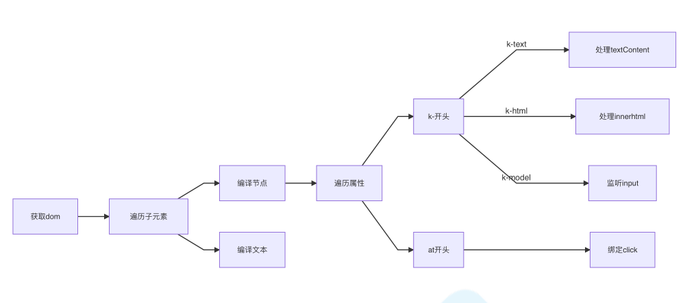
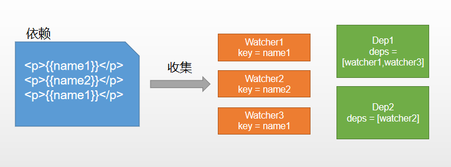

## 什么是双向绑定

更新view，model里面的data也跟着更新。\
model里面的data更新，view也会跟着更新。\
view和data，一个变，另一个也跟着变。

## 原理

`三部分:`
- 数据层 (Model);
- 视图层 (View);
- 业务层 (ViewModel);

**ViewModel:**

`作用：`
- 数据变，视图也得变。
- 视图变，数据也得变。

`内容：`
- 监听：对所有数据进行监听。
- 解析：对每个元素、节点、指令、进行扫描和解析。

## 双向绑定

1. new Vue() 初始化，对 data 执行 响应化处理，然后 发生 Observe（观察）。
2. 对模板编译。data的数据初始化画面。发生 Compile（编译）。
3. 定义 更新函数 和 Watcher。 data 变时，Watcher 调用 更新函数。
4. data 的 key 多次出现，但 用一个 Dep 去管理 多个 Watcher。
5. data 一旦变化， 找到对应的 Dep，通知所有 Watcher 执行 更新函数。

流程图：


## 实现

构造函数: 执行初始化，对 `data` 执行 响应化处理。

```js
class Vue {
  constructor(options) {
    this.$options = options;
    this.$data = options.data;

    // 对data进行响应化处理
    observe(this.$data);

    // 代理data到vm上
    proxy(this);

    // 编译模板
    new Compile(options.el, this);
}
```

对data进行响应化处理:

```js
function observe(obj) {
  if (typeof obj !== 'object' || obj == null) {
    return;
  }
  new Observer(obj);
}

class Observer {
  constructor(value) {
    this.value = value;
    this.walk(value);
  }
  walk(data) {
    Object.keys(data).forEach((key) => {
      deepReactive(data, key, data[key]);
    });
  }
}
```

编译Compile:

对每个元素、节点、指令，进行扫描和解析。

根据指令，对元素进行操作。



```js
class Compile {
  constructor(el, vm) {
    this.$vm = vm;
    this.$el = document.querySelector(el); // 获取dom

    if (this.$el) {
      this.compile(this.$el);
    }
  }

  compile(el) {
    compile(el) {
      const childNodes = el.childNodes;
      Array.from(childNodes).forEach((node) => { // 遍历子元素
        if (this.isElementNode(node)) { // 判断是否为节点
          console.log("编译元素" + node.nodeName);
        } else if (this.isInterpolation(node)) {
          console.log("编译插值文本" + node.textContent); // 判断是否为插值文本 {{}}
        }

        if (node.childNodes && node.childNodes.length) { // 判断是否有子元素
          this.compile(node); // 递归
        }
    }

    isElement(node) {
      return node.nodeType === 1;
    }

    isInterpolation(node) {
      return node.nodeType === 3 && /\{\{(.+?)\}\}/.test(node.textContent);
    }
  }
}
```

## 依赖收集

视图中会用到`data`中某`key`。称为依赖。

同一个`key`，会用到多次。

每次都需要收集出来用一个`Watcher`去维护它们。

多个Watcher，用一个Dep去维护。

更新时，Dep通知通知。



## 实现思路

1. `defineReactive` 时为每一个`key`创建一个`Dep`实例。
2. 初始化视图时读取某个`key`，例如`name1`，创建一个`watcher1`。
3. 由于触发`name1`的`getter`方法，便将`watcher1`添加到`name1`对应的`Dep`中。
4. 当`name1`更新，`setter`触发时，便可通过对应`Dep`通知其管理所有`watcher`跟新。

```js
// 负责更新视图
class Watcher {
  constructor(vm, key, updater) {
    this.vm = vm;
    this.key = key;
    this.updater = updater;

    // 创建实例时，把当前实例指定到Dep.target静态属性上
    Dep.target = this;
    // 读一下key，触发get
    vm[key]
    // 置空
    Dep.target = null;
  }

  // 未来执行dom更新函数，由dep调用的
  update() {
    this.updateFn.call(this.vm, this.vm[this.key]);
  }
}
```

声明`Dep`

```js
class Dep {
  constructor() {
    this.deps = []; // 依赖管理
  }

  addDep(dep) {
    this.deps.push(dep);
  }

  notify() {
    this.deps.forEach((dep) => dep.update());
  }
}
```

创建`watcher`时触发`getter`

```js
class Watcher {
  constructor(vm, key, updater) {
    Dep.target = this;
    this.vm[this.key];
    Dep.target = null;
  }
}
```

依赖收集，创建`Dep`实例

```js
function defineReactive(obj, key, val) {
  this.observe(val);
  const dep = new Dep();
  Object.defineProperty(obj, key, {
    get() {
      Dep.target && dep.addDep(Dep.target); // Dep.target为当前watcher
      return val;
    },
    set(newVal) {
      if (newVal === val) return;
      dep.notify(); // 通知Dep执行更新方法
    },
  });
}
```

