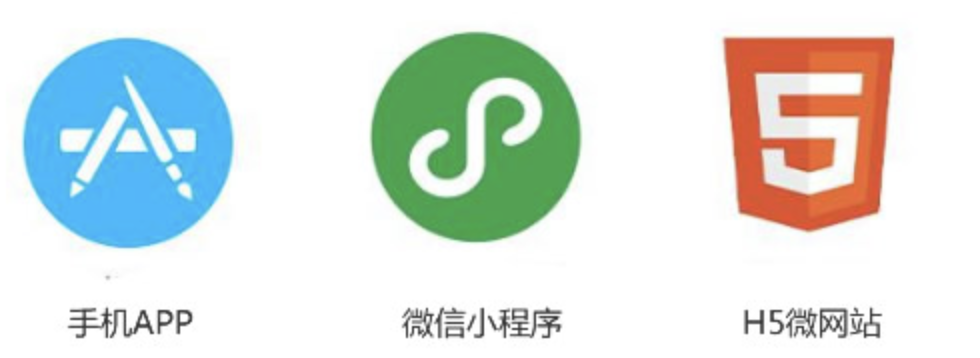

对理解小程序的理解？
优缺点？

## 一、是什么
## 二、背景
## 三、优缺点

## 一、是什么

2017年，微信正式推出了小程序，允许外部开发者在微信内部运行自己的代码，开展业务。

截至目前，小程序已经成为国内前端的一个重要业务，跟`Web`和手机`App`有着同等的重要性。

小程序是一种不需要下载安装即可使用的引用，它实现了应用“触手可及”的梦想，用户扫一扫或者搜一下即可打开应用。

也提现了“用完即走”的理念，用户不用关心是否安装太多应用的问题。应用将无处步子啊，随时可用，但又无需安装卸载。

注意的是，除了`微信`小程序，还有`百度`小程序、微信小程序、`支付宝`小程序、`抖音`小程序，都是每个平台自己开发的，都是有针对性平台的应用程序。

## 背景

小程序并非凭空冒出来的一个概念，当微信中的`WebView`逐渐成为移动`Web`的一个重要入口时，微信就有相关的`JS-SDK`。

`JS-SDK`解决了移动网页能力不足的问题，通过暴露微信的接口使得`web`开发者能够拥有跟多的能力，然而在更多的能力之外，`JS-SDK`的模式并没有解决使用移动网页遇到的体验不良的问题。

因此需要设计一个比较好的系统，使得所有开发者在微信中都能够获得比较好的体验：

- 快速的加载。

- 更强大的能力。

- 原生的体验。

- 易用且安全的微信数据开放。

- 高效和简单的开发。

这些是`JS-SDK`做不到的，需要设计一个全新的小程序系统。

对于小程序的开发，提供一个简单、高效的应用开发框架和丰富的组件及`API`，帮助开发者开发出具有原生体验的服务。

其中相比`H5`，小程序与其的区别有如下：

- 运行环境：小程序基于浏览器内核重构的内置解析器。

- 系统权限：小程序能获得更多的系统权限，如网络通信状态、数据缓存能力等。

- 渲染机制：小程序的逻辑层和渲染层是分开的。

小程序可以视为只能用微信打开你和浏览的`h5`，小程序和网页的技术模型是一样的，用到的。
`js`语言和`css`样式也是一样的，只是网页的`html`标签被稍微修改成了`wxml`的标签。

因此可以说，小程序页面本质上就是网页。

其中关于微信小程序的实现原理。

## 三、优缺点

优点：

- 随搜随用，用完就走：使得小程序可以代替许多`APP`，或是做`APP`的整体嫁接，或是作为阉割版功能的承载体。

- 流量大，易接受：小程序借助自身平台更加容易引入更多的流量。

- 安全。

- 开发门槛低。

- 降低兼容性限制。

缺点：

- 用户留存：及相关数据显示，小程序的平均次日留存在`13%`左右，但是双周留存骤降到仅有`1%`。

- 体积限制：微信小程序只有`2M`的大小，这样导致无法开发大型一些的小程序。

- 受控微信：比起`APP`，尤其是安卓版的高自由度，小程序要面对很多来自微信的限制，从功能接口，甚至到类别内容，都要接受微信的管控。

