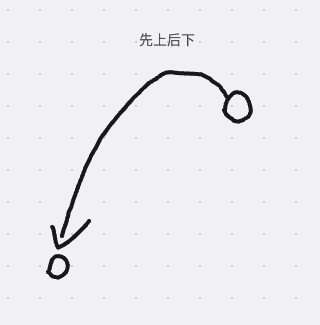
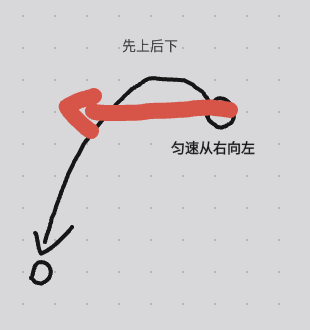

它其实是由两端运动来组成的。

因为我们知道抛物线嘛。

其实是两段运动。

它一段呢是横向的匀速运动。

一段呢是纵向的自由落体运动。

这两段运动叠加起来。

那么自然就是一个抛物线的运动了。

所以我们按照这样的思路。

来实现以下这个动画。

准备好一个小球。

我要把它做成抛物线。

那么它自然有两段运动。

一个是横向的匀速。

一个是纵向的自由落体。

当然，这个东西用js是可以做的。

你定一个横向的速度，

然后呢定一个纵向的向上的初速度，

那么两段运动进行叠加来运算这个小球，

当前应该所在的位置。

用js算行不行呢。

肯定是可以的哈。

不过呢算起来，

肯定是比较麻烦。

我们最好呢是能不能想个办法，

用css就直接做了得了。

那咱们来尝试一下哈。

---

我们首选在页面撒高耗能呢写一个动画。

```html
<html lang="en">
  <head>
    <style>
      .ball {
        border-radius: 50%;
        left: 100px;
        top: 300px;
        background: #fc5e56;
        /* animation: move 2s forwards; */
        animation: moveX 2s linear forwards, moveY 2s ease forwards; // 这个还达不到我们的效果，只是因为这两段动画啊。它改动的是同一个css属性，那么很明显，就会造成冲突。比方说第一个动画呢，你把颜色改为红色，第二个动画把颜色改成绿色。那你说最后这个颜色是红色还是绿色。是不是冲突了，明显有矛盾。因此呢，它就会造成这样的问题，别看这玩意是个非常小的效果啊。这边细节还是蛮多的。其实不仅仅是这个购物车的抛物线。还包括整个购物车的页面的各种逻辑功能。

        /* 来解决冲突：有两种方式，第一种方式是使用， Houdini API, 它可以解决这个问题，但是这个api有一个问题，就是有兼容性问题。毕竟是个比较新的api。这些相对比较就的浏览器就可能不支持。
        如果考虑到兼容性就建议考虑第二种方案，多元素动画。就是我们现在动画不是分为两端吗。而这两段我们不好控制。因为它是合并在一个css属性里面的，那么不妨呢，把它做成两个元素，一个元素负责这一段，另一个元素负责另一段。由于是两个元素，它就不存在css属性冲突。
        */
      }
      // 给动画，首先是个横向的移动。
      /* @keyframes move {
        to {
          transform: translate(200px, 400px); // 如果这里的话，效果是直接直角像(200px 400px)坐标走了。显然并不是我们想要的效果。我们想要的效果是横向的运动和纵向的运动呢它要分开。分开来控制。因为肯定是有些地方有差异的。横向是匀速的，纵向呢是别的时间函数。所以这里我们写两个动画得了。
        }
      } */

      // 写两个动画
      @keyframes moveX {
        to {
          transform: translateX(200px);
        }
      }
      @keyframes moveY {
        to {
          transform: translateY(400px);
        }
      }
    </style>
  </head>

  <body>
    <div class="ball"></div>
  </body>
</html>
```

```html
<html lang="en">
  <head>
    <style>
      .ball {
        position: relative;
        width: 50px;
        height: 50px;
        border-radius: 50%;
        left: 100px;
        top: 300px;
        border: 1px solid dashed; // 便于看清楚的。
        animation: moveX 2s linear forwards; // 父元素横向运动 2s钟 匀速的。
      }

      .inner {
        width: 100%;
        height: 100%; // 子元素宽度和高度和父元素一致。
        background: #fc5e56; // 父元素不要背景颜色了，子元素加上背景颜色。
        border-radius: 50%;
        /* animation: moveY 2s linear forwards; */
        animation: moveY 2s cubic-bezier(0.5, -1, 1, 1) forwards;
      }

      // 父元素带着子元素 匀速往右，子元素自身呢垂直往下，是不是可以合并成一个抛物线了，那么我们现在只需要去调整一下，子元素的时间函数。`cubic-bezier(0.5, -1, 1, 1)` 意味着它的动画一开始先反向，向下运动就先往上运动，是不是一个抛物线的感觉，

      // 将来做这种复合型动画的时候，如果说遇到了这样子的元素属性样式被覆盖的问题，或者相互冲突的问题，那么就可以考虑，使用多个元素来组合，完成动画。现在只需要把虚线的父元素，的虚线框给它去掉，就可以看到一个单独的抛物线效果了，

      // 写两个动画
      @keyframes moveX {
        to {
          transform: translateX(200px);
        }
      }
      @keyframes moveY {
        to {
          transform: translateY(400px);
        }
      }
    </style>
  </head>

  <body>
    <div class="ball">
      <div class="inner"></div>
    </div>
  </body>
</html>
```

---

这是一个极其常见的购物页面。
在这个购物页面里边呢。

有一个极其常见的购物效果。
就是当我点击这个加号的时候啊。
有一个抛物线的动画跳到了购物车上。

我们就单说这个购物先线的动画该如何来做。

我这里呢把整个页面简化了一下。
就三个元素。

一个是购物车，
一个是按钮，
一个是加号。

对应到页面上也就三个元素。

```html
<html lang="en">
  <head>
  </head>

  <body>
    <!-- 购物车 -->
    <div class="car"></div>

    <!-- 按钮 -->
    <button class="btn">Click Me!</button>

    <!-- 加号 -->
    <div class="plus">
      <i class="iconfont i-jiajianzujianjiahao"></i>
    </div>

    <script src="./index.js"></script>
  </body>
</html>
```
一开始我们先不考虑js，先来说一下这个css。如何把这个抛物线动画给他做出来，
怎么思考这个问题的。

首先第一个问题我要解决的是。我得把这个加号，放到按钮的位置。加号是从按钮点击的时候跳到购物车里面的。

所以说首先是位置。

但是由于在css里边，这个加号很难知晓这个按钮在哪。所以给加号设置一个style，然后使用css变量，比方说`--left: 300px;--top: 300px;`；
```html
<html lang="en">
  <head>
  </head>

  <body>
    <!-- 购物车 -->
    <div class="car"></div>

    <!-- 按钮 -->
    <button class="btn">Click Me!</button>

    <!-- 加号 -->
    <div class="plus" style="--left: 300px; --top: 300px;">
      <i class="iconfont i-jiajianzujianjiahao"></i>
    </div>

    <script src="./index.js"></script>
  </body>
</html>
```

然后到css里边去找到这个加号。
```css
.plus {
  left: var(--left);
  top: var(--top);
}
```
这样做的好处在于，将来我们可以使用js来给这些变量赋值。，就可以完成对位置的控制。
```html
<html lang="en">
  <head>
    <link rel="stylesheet" href="./index.css" />
  </head>

  <body>
    <!-- 购物车 -->
    <div class="car"></div>

    <!-- 按钮 -->
    <button class="btn">Click Me!</button>

    <!-- 加号 -->
    <div class="plus" style="--left: 300px; --top: 200px;">
      <i class="iconfont i-jiajianzujianjiahao"></i>
    </div>

    <script src="./index.js"></script>
  </body>
</html>
```
这个style里边，设置的left和top的变量，那么，css也会相应地跟着变化。
将来呢，好用js去控制它的位置。

那么接下来就是加号的动画了。
这个动画呢你要直接做，
你会发现这个很难完成，
因为它涉及到两个方向上的变化，
一个是横向的变化，
一个是纵向的变化，

如果说把两个方向做一个拆分的话，
这个抛物线，在纵向上的移动是这样的：先上然后再下，


它在横向上的移动是一个匀速的，从右向左。


那么我们如何来实现两个方向上的，分开移动呢？

```html
<html lang="en">
  <head>
    <link rel="stylesheet" href="./index.css" />
  </head>

  <body>
    <!-- 购物车 -->
    <div class="car"></div>

    <!-- 按钮 -->
    <button class="btn">Click Me!</button>

    <!-- 加号 -->

    <!-- 父元素 -->
    <div class="plus" style="--left: 300px; --top: 200px;">
      <i class="iconfont i-jiajianzujianjiahao"></i>
    </div>

    <script src="./index.js"></script>
  </body>
</html>
```
这里分别有一个父元素，
有一个子元素。
来看一下它的元素结构：
外边黑色边框是父元素的，
内部的i元素加号是子元素。

尝试给子元素加个移动。
```css
// transform: translateX 10个像素。

transform: translateX(10px);
```
当移动这个i元素是只是加号在左右动，
而当移动父元素的时候呢：
transform: translateY(10px);
就是整体在动，

让父元素搞定垂直方向上的移动，
让里面的i元素搞定横向的移动。
从而共同地实现两个方向上的移动。

沿着这样的思路。
就可以定制一个动画。
首先搞定垂直方向上的移动，
```css
@keyframes moveY {
}
```
但是呢，加号很难知道购物车的位置在哪里，
所以说这个玩意需要靠js去设置及控制。
沿用之前的思路，也是可以在元素上给他定义一个移动的目标y。
```html
<html lang="en">
  <head>
    <link rel="stylesheet" href="./index.css" />
  </head>

  <body>
    <!-- 购物车 -->
    <div class="car"></div>

    <!-- 按钮 -->
    <button class="btn">Click Me!</button>

    <!-- 加号 -->

    <!-- 父元素 -->
    <div class="plus" style="--left: 300px; --top: 200px; --y:400px;">
      <i class="iconfont i-jiajianzujianjiahao"></i>
    </div>

    <script src="./index.js"></script>
  </body>
</html>
```
那边这边就可以写了：
```css
@keyframes moveY {
  to {
    transform: translateY(var(--y));
  }
}
```
就定义了这么一个动画，搞定了垂直上的移动，于是呢我们就可以把这个动画呢，给他加到父元素上。应用到父元素上面去。

```css
.plus {
  animation: moveY 0.8s;
}
```
有一个纵向的移动。

有移动，但是这个移动它并不是先上后下。

所以我们得控制它的时间函数。
这个时间函数写成什么样子呢？

我们找到这个元素，
它里面的动画（去控制台的css里面去找），这里面可以设置它的时间函数`animation-timing-function`。

详细讲一下这个贝塞尔曲线。

起始值，
目标值。

它这个加号的运动方式是先原理目标值，再逼目标值。
所以呢，我们的曲线呢，大概要做成这个样子。
`cubiz-bezier(0.29, -0.3, 0.25, 1)`

先原理目标值，
再去逼近目标值。

那么这个值写出来呢。
大概就是：
```css
.plus {
  animation: moveY 0.8s cubic-bezier(0.5, -0.5, 1, 1);
}
```
我们设置好时间曲线之后呢，
再来刷新看一下。
就是有这个意思了。

其实，通过贝塞尔曲线来实现这个抛物线呢，并不是那么地完美。
它跟抛物线还是有些细节上的差别的。
你要真正实现一个完美的抛物线。
你还得用js。
不过呢，使用css动画，毕竟是一个非常简单的一种方案。

很多站点，
很多大厂都是这么干的，
并没有要求那么完美的抛物线。

css动画就够了哈。
好的，纵向搞定了，那么横向呢，我们再写一个动画，叫做`moveX`。
```css
@keyframes moveX {
  to {
    transform: translateX(var(--x));
  }
}
```
横向移动也不知道多少，搞不定就用变量，
给x赋值。
```html
<html lang="en">
  <head>
    <link rel="stylesheet" href="./index.css" />
  </head>

  <body>
    <!-- 购物车 -->
    <div class="car"></div>

    <!-- 按钮 -->
    <button class="btn">Click Me!</button>

    <!-- 加号 -->

    <!-- 父元素 -->
    <div class="plus" style="--left: 300px; --top: 200px; --y:400px; --x:200px;">
      <i class="iconfont i-jiajianzujianjiahao"></i>
    </div>

    <script src="./index.js"></script>
  </body>
</html>
```
于是这边呢我们使用变量x。
同样的，
找到class为plus的icon，给它一个x的动画。
```css
.plus .iconfont {
  animation: moveX 0.8s linear; // 由于横向是匀速运动，所以说这个时间函数是linear啊。抛物线嘛，就是横向匀速运动，纵向自由落地。
}
```
是不是有点意思了，
那个黑框框是父元素的纵向移动，
父元素的移动会带动子元素的纵向移动，
而子元素呢就又有一个横向运动，
最后把父元素的边框给它去掉。
那么动画就做好了。

剩下的就是js了。
那么js又要做啥呢？

js要做的事情，
无非就是点击的时候创建元素。
然后把这些变量的值给设置好，

到js里边去写一下。

其实像这个效果。

首先先把plus加号给注释掉。

```html
<html lang="en">
  <head>
    <link rel="stylesheet" href="./index.css" />
  </head>

  <body>
    <!-- 购物车 -->
    <div class="car"></div>

    <!-- 按钮 -->
    <button class="btn">Click Me!</button>

    <!-- 加号 -->

    <!-- 父元素 -->
    <!-- <div class="plus" style="--left: 300px; --top: 200px; --y:400px; --x:200px;">
      <i class="iconfont i-jiajianzujianjiahao"></i>
    </div> -->

    <script src="./index.js"></script>
  </body>
</html>
```
因为这个元素是点击按钮之后创建的，
所以说，要拿到的元素呢就这么几个。
一个是按钮。
一个是购物车。
```js
const car = document.querySelector(".car");
const btn = document.querySelector(".btn");

btn.onclick = function () {
  const div = document.createElement("div");
  div.className = "plus";
  div.innerHTML = `<i class="iconfont i-jiajianzujianjiahao"></i>`;

  document.body.appendChild(div);
}
```
这样既可以通过点击按钮创建加号了。
```js
const car = document.querySelector(".car");
const btn = document.querySelector(".btn");

btn.onclick = function () {
  const div = document.createElement("div");
  div.className = "plus";
  div.innerHTML = `<i class="iconfont i-jiajianzujianjiahao"></i>`;

  document.body.appendChild(div);
}
```
然后呢，我们得设置一下这个div的x和y。
这个加号的父元素的默认位置呢，
就根据按钮在哪我在哪。

通过`const btnRect = btn.getBoundingClientRect();` // 去找按钮的坐标和尺寸。

left呢`const left = btnRect.left + btnRect.width/2 - PLUS_SIZE/2;`

这个就是左边的宽度，加上按钮宽度的一半，加上加号自身宽度的一半。

最好是加个变量
`const PLUS_SIZE = 30;`

就给它设置到div的属性里边去。
`div.style.setProperty('--left', `${left}px`)`

这个加号的横坐标就搞掂了。
那么再设置纵坐标。

```js
const car = document.querySelector(".car");
const btn = document.querySelector(".btn");

btn.onclick = function () {
  const div = document.createElement("div");
  div.className = "plus";
  div.innerHTML = `<i class="iconfont i-jiajianzujianjiahao"></i>`;

  const btnRect = btn.getBoundingClientRect();
  const left = btnRect.left + btnRect.width / 2 - PLUS_SIZE / 2,
      top = btnRect.top + btnRect.height / 2 - PLUS_SIZE / 2;

  // 起始位置对了，那么接着就是目标位置了。
  // 那么就算 加号要移动的 横向移动的距离和纵向移动的距离
  // 横向，我要算出这个值，
  // 这个值怎么算呢
  // 横向移动的距离是 加号的left加上它自身宽度的一半，减去购物车的left加上它自身宽度的一半。
  const catRect = car.getBoundingClientRect();
  const x = (catRect.left + catRect.width / 2) - PlUS_SIZE/2-left;
  // 纵向移动的距离是 加号的top加上它自身高度的一半，减去购物车的top加上它自身高度的一半。
  const y = (catRect.top + catRect.height / 2) - PLUS_SIZE/2-top;

  div.style.setProperty("--left", `${left}px`);
  div.style.setProperty("--top", `${top}px`);
  div.style.setProperty("--x", `${x}px`);
  div.style.setProperty("--y", `${y}px`);

  document.body.appendChild(div);
}
```
然后就可以了，
然后可以把动画时间设短一点。
因为这两个是一样的。

定一个变量。
```css
.plus {
  --duration: 0.5s;
  animation: moveY var(--duration) cubic-bezier(0.5, -0.5, 1, 1);
}

.plus .iconfont {
  animation: moveX var(--duration) linear;
}
```

动画结束之后，把元素干掉；
```js
const car = document.querySelector(".car");
const btn = document.querySelector(".btn");

btn.onclick = function () {
  const div = document.createElement("div");
  div.className = "plus";
  div.innerHTML = `<i class="iconfont i-jiajianzujianjiahao"></i>`;

  const btnRect = btn.getBoundingClientRect();
  const left = btnRect.left + btnRect.width / 2 - PLUS_SIZE / 2,
      top = btnRect.top + btnRect.height / 2 - PLUS_SIZE / 2;

  // 起始位置对了，那么接着就是目标位置了。
  // 那么就算 加号要移动的 横向移动的距离和纵向移动的距离
  // 横向，我要算出这个值，
  // 这个值怎么算呢
  // 横向移动的距离是 加号的left加上它自身宽度的一半，减去购物车的left加上它自身宽度的一半。
  const catRect = car.getBoundingClientRect();
  const x = (catRect.left + catRect.width / 2) - PlUS_SIZE/2-left;
  // 纵向移动的距离是 加号的top加上它自身高度的一半，减去购物车的top加上它自身高度的一半。
  const y = (catRect.top + catRect.height / 2) - PLUS_SIZE/2-top;

  div.style.setProperty("--left", `${left}px`);
  div.style.setProperty("--top", `${top}px`);
  div.style.setProperty("--x", `${x}px`);
  div.style.setProperty("--y", `${y}px`);

  div.addEventListener("animationend", () => {
    div.remove();
  })

  document.body.appendChild(div);
}
```
按钮在哪，都能实现这个效果。
因为没有设置死，
加号跟着按钮走。

完毕！