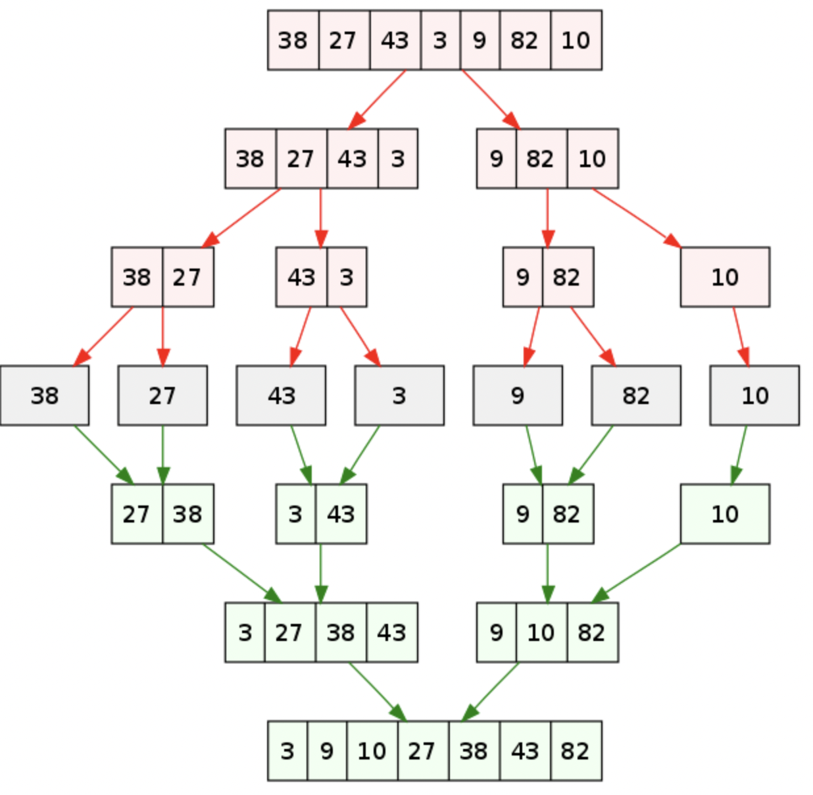

对`归并排序`的理解？
如何实现?
应用场景？

## 一、是什么

归并排序（`Merge Sort`）是建立归并操作上的一种有效，稳定的排序算法那，该算法是采用分治法的一个非常典型的应用。

将已有序的子序列合并，得到完全有序的序列，即先使每个子序列有序，再使子序列段间有序。

例如对于含有`n`个记录的无序表，首先默认表中每个记录各为一个有序表（只不过表的长度都为`1`）。

然后进行两两合并，使`n`个有序表变为`n/2`个长度为`2`或者`1`的有序表（例如`4`个小有序表合并为`2`个大的有序表）。

通过不断地进行两两合并，直到得到一个长度为`n`的有序表为止。

例如对无序表（`49，38，65，97，76， 13， 27`）进行归并排序分成了分、合两部分：

如下图所示：


归并合过程中，每次得到的新的子表本身有序，所以最终得到有序表。

上述分成两部分，则成为二路归并，如果分成三个部分则成为三路归并，依次类推。

## 二、如何实现

关于归并排序的算法思路如下：

- `分`：把数组`分`成两`半`，再`递归`对`子`数组进行`分`操作，直至到一个个单独数字。

- `合`：把`两`个数`合`成有序数组，再对有序数组进行`合`并操作，知道全部子数组合成一个完整的数组。

  - 合并操作可以新建一个数组，用于存放排序后的数组。

  - 比较两个有序数组的头部，较小者出队并且推入到上述新建的数组中。

  - 如果两个数组还有值，则重复上述第二步。

  - 如果只有一个数组有值，则将该数组的值出队并推入到上述新建的数组中。


用代码表示则如下图所示：
```js
function mergeSort(arr) {
  const len = arr.length;
  if (len < 2) { return arr };
}

function merge(left, right) {
  const result = [];

  while (left.length && right.length) {
    if (left[0] <= right[0]) {
      result.push(left.shift());
    } else {
      result.push(right.shift());
    }
  }

  while (left.length) {
    result.push(left.shift());
  }

  while (right.length) {
    result.push(right.shift());
  }

  return result;
}
```
上述归并分成了分、合两部分，在处理分过程中递归调用两个分的操作，所花费的时间为`2`乘`T(n/2)`，合的操作时间复杂度则为`O(n)`，因此可以得到以下公式：

总的执行时间 = `2` x 输入长度为`n/2`的`sort`函数的执行时间 + `merge`函数的执行时间`O(n)`

当只有一个元素时，`T(1) = O(1)`。

如果对`T(n) = 2 * T(n/2) + O(n)`进行左右/n的操作，得到`T(n)/n = (n/2) * T(n/2) + O(1)`。

现在令`S(n) = T(n)/n`，则`S(1) = O(1)`，然后利用表达式带入得到`S(n) = S(n/2) + O(1)`

所以可以得到： `S(n) = S(n/2) + O(1) = S(n/4) + O(2) = S(n/8) + O(3) = S(n/2^k) + O(k) = S(1) + O(logn) = O(logn)`

综上可得，`T(n) = n * log(n) = nlogn`

关于归并排序的稳定性，在进行合并过程，在`1`个或`2`个元素时，`1`个元素不会交换，`2`个元素如果大小相等也不会交换，由此可见归并排序是稳定的排序算法。

## 三、应用场景

在外排序中通常使用排序-归并的策略，外排序是指处理超过内存限度的数据的排序算法，通常将中间效果放在读写较慢的外存储器，如下分成两个阶段：

- 排序阶段：读入能够放进内存中的数据量，将其排序输出到临时文件，一次进行，将带排序数据组织为多个有序的临时文件。

- 归并阶段：将这些临时文件组合为大的有序文件。

例如，使用`100m`内存对`900m`的数据进行排序，过程如下：

- 读入`100m`数据内存，用常规方式排序。

- 将排序后的数据写入磁盘。

- 重复前两个步骤，得到`9`个`100m`的临时文件。

- 将`100m`的内存划分为`10`份，将`9`份为输入缓冲区，第`10`份为输出缓冲区。

- 进行九路归并排序，将结果输出到缓冲区。

  - 若输出缓冲区满，将数据写到目标文件，清空缓冲区。

  - 若缓冲区空，读入相应文件的下一份数据。