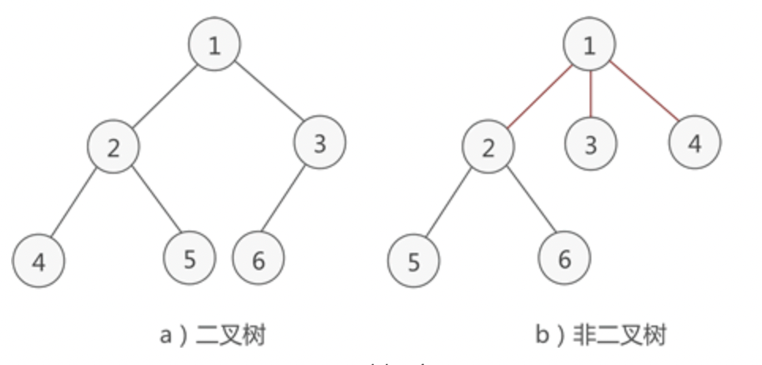
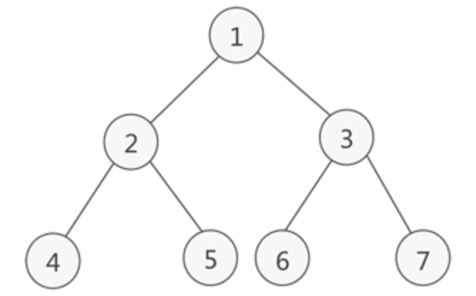
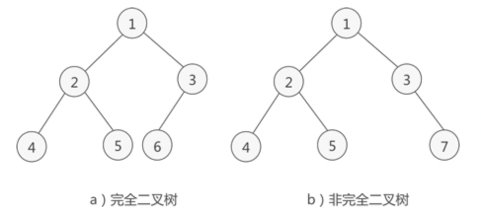

对树的理解？
相关的操作有哪些？

## 一、是什么
## 二、操作
## 三、总结

## 一、是什么

在计算机领域，树形数据结构是一类重要的非线性数据结构，可以表示数据之间一对多的关系。以树与二叉树最为常用，直观看来，树是以分支关系定义的层次结构。

二叉树满足以下两个条件：

- 本身是有序树。

- 树中包含的各个结点的不能超过2，即只能是0、1或者2。

如下图，左侧的为二叉树，而右侧的因为头结点的子节点超过`2`，因此不属于二叉树：


同时，`二叉树`可以继续进行分类，分成了满二叉树和完成二叉树：

- `满二叉树`：如果二叉树中除了叶子结点，每个节点的度都为2。


- 完成二叉树：如果二叉树中除去最后一层节点为满二叉树，且最后一层的节点依次从左到右分布。


## 二、操作

关于二叉树的遍历，常见的有：

- `前序`遍历

- `中序`遍历

- `后序`遍历

- `层序`遍历

**前序遍历**

前序遍历的实现思想是：

- 访问根节点

- 访问当前节点的左子树

- 若当前节点无左子树，

根据遍历特性，递归版本用代码表示则如下：
```js
const preOrder = (root) => {
  if (!root) { return }
  console.log(root)
  preOrder(root.left)
  preOrder(root.right)
}
```
如果不使用递归版本，可以借助栈先进后出的特性实现，先将根节点压入栈，再分别压入右节点和左节点，直到栈中没有元素，如下：
```js
const preOrder = (root) => {
  if (!root) { return }
  const stack = [root]
  while(stack.length) {
    const n = stack.pop()
    console.log(n.val)
    if(n.right) {
      stack.push(n.right)
    }
    if(n.left) {
      stack.push(n.left)
    }
  }
}
```
**中序遍历**

前序遍历的实现思想是：

- 访问当前节点的`左`子树。

- 访问`根`节点。

- 访问当前节点的右子。

递归版本很好理解，用代码表示则如下：
```js
const inOrder = (root) => {
  if (!root) { return }
  inOrder(root.left)
  console.log(root.val)
  inOrder(root.right)
}
```
`非递归版本`也是借助栈先进后出的特性，可以一直首先一直压入节点的左元素，当左节点没有后，才开始进行出栈操作，压入右节点，然后又依次亚茹左节点，如下：
```js
const inOrder = (root) => {
  if (!root) { return }
  const stack = [root]
  let p = root
  while(stack.length || p) {
    while(p) {
      stack.push(p)
      p = p.left
    }
    const n = stack.pop()
    console.log(n.val)
    p = n.right
  }
}
```
**后序遍历**

`前序遍历`的实现思想是：

- 访问当前节点的左子树。

- 访问当前节点的右子。

- 访问根节点。

递归版本，用代码表示则如下：
```js
const postOrder = (root) => {
  if (!root) { return}
  const stack = [root]
  const outPut = []
  while(stack.length) {
    const n = stack.pop()
    outPut.push(n.val)
    if (n.right) {
      stack.push(n.right)
    }
    if (n.left) {
      stack.push(n.left)
    }
  }
  while(outPut.length) {
    const n = outPut.pop()
    console.log(n.val)
  }
}
```

**层序遍历**

按照`二叉树`中的层次`从左到右`依次遍历每层中的结点。

借助队列`先进先出`的特性，从树的根节点开始，依次将其左孩子和右孩子入队。而后每次队列中一个节点出队，都将其左孩子和右孩子入队，直到树中所有节点都出队，出队结点的先后顺序就是层次遍历的最终结果。

用代码表示则如下：
```js
const levelOrder = (root) => {
  if(!root) { return [] }
  const queue = [[root, 0]]
  const res = []
  while(queue.length) {
    const n = queue.shift()
    const [node, level] = n
    if (!res[level]) {
      res[level] = [node.val]
    } else {
      res[level].push(node.val)
    }
    if (node.left) { queue.push([node.left, level + 1]) }
    if (node.right) { queue.push([node.right, level + 1]) }
  }
}
```

## 三、总结

树是一个非常重要的非线性结构，其中二叉树以二叉树最常见，二叉树的遍历方式可以分成前序遍历、中序遍历、后序遍历。

同时，二叉树又分成了完成二叉树和满二叉树。